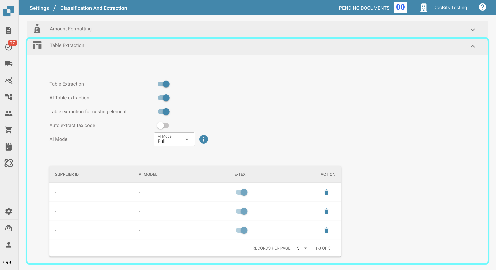
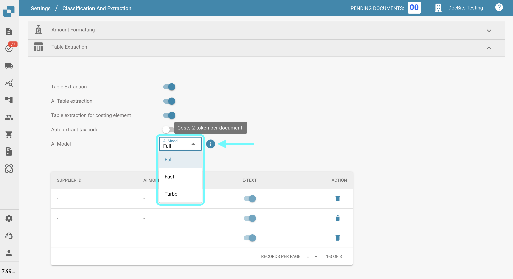
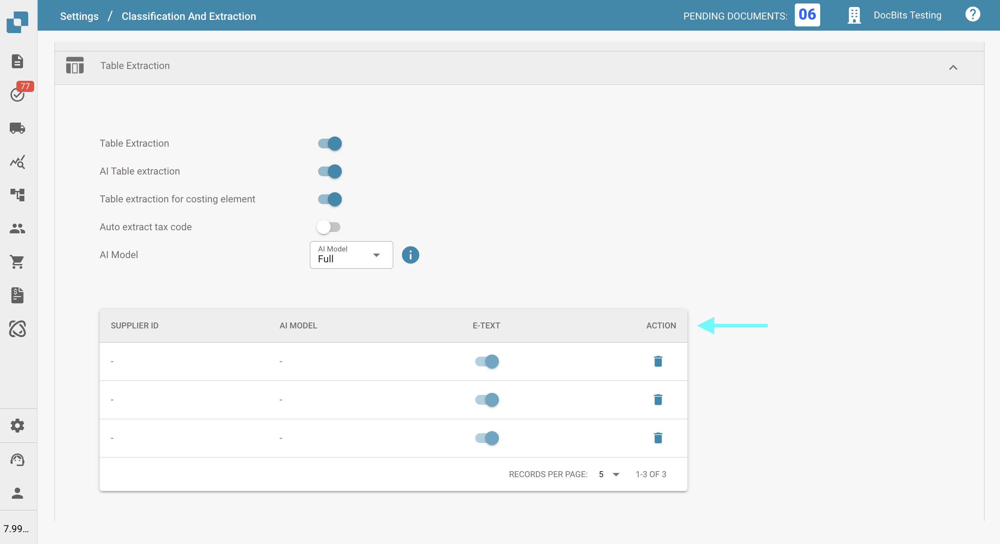
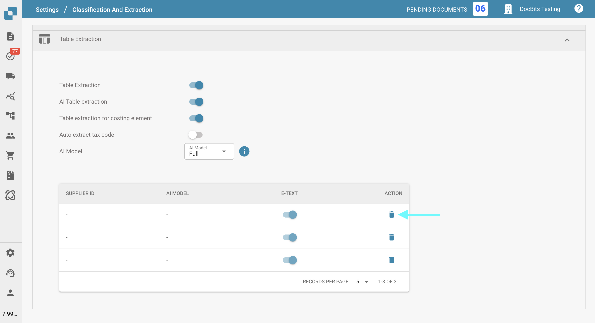
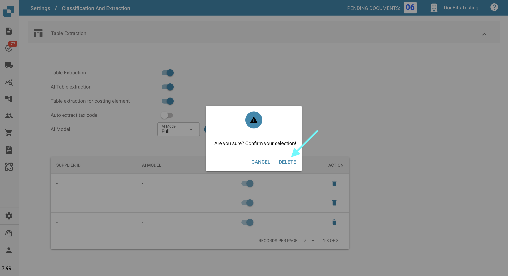

# AI Model

## Overview

The **AI Model** setting allows you to define which AI model is used by default for **field extraction** and **table extraction** during document processing.\
In this section, you can review the token cost for each model and see which model is currently assigned to each supplier.

## How to Access

1.  Navigate to **Settings** → **Document Processing** → **Classification and Extraction**

    <figure><figcaption></figcaption></figure>
2.  Scroll down to the **Table Extraction** section

    <figure><figcaption></figcaption></figure>

## AI Model Options

You can choose between the following AI models. Hover over the info icon in the interface to view the token cost per document for the selected AI model:

* **Full** – 2 tokens per document
* **Fast** – 1 token per document
* **Turbo** – 1 token per document

<figure><figcaption></figcaption></figure>

## AI Model Assignment Table

You can also configure **supplier-specific AI models** directly in the **Validation screen**.\
For more information, please refer to the corresponding documentation [here](../../../../end-user-and-partner-section/end-user-section/validation-screen/selecting-a-supplier-specific-ai-model-for-field-and-table-extraction.md).

The assignment table displays the AI model settings for each supplier and includes the following details:

* **Supplier ID** – The unique identifier of the supplier
* **AI Model** – The AI model currently assigned to the supplier
* **E-Text**: Indicates whether the E-Text feature is enabled
* **Action** – Contains the option to delete the entry

<figure><figcaption></figcaption></figure>

### Delete Entry – Reset Supplier-Specific Settings

To reset a supplier’s AI model setting to the default:

1.  Click the trashcan icon in the **Action** column next to the supplier entry.

    <figure><figcaption></figcaption></figure>
2.  A confirmation dialog will appear—confirm that you want to delete the entry.

    <figure><figcaption></figcaption></figure>

Once deleted, the supplier will revert to using the default **AI model** for **field extraction** and **table extraction**.
