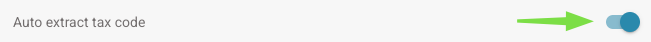
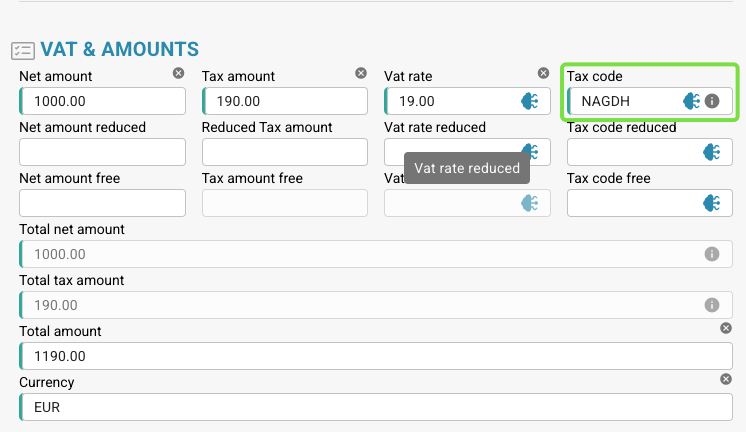

# Auto extract tax code

### **Where to Enable It**

1. Go to **Settings → Document Processing → Classification and Extraction**.
2. Enable **Auto extract tax code**.

<figure><figcaption></figcaption></figure>

### **What Does It Do?**

* When enabled, the system **automatically populates the tax code field** in the **Validation Screen**, provided that a **tax code field** is set up.

<figure><figcaption></figcaption></figure>

* The logic used to determine the tax code is outlined in the table below.

<table data-full-width="true"><thead><tr><th>Invoice Document type</th><th></th><th>Tax Code</th><th>Or in Text field</th><th>PO number</th><th>Country of supplier</th><th>Rule</th></tr></thead><tbody><tr><td>Cost Invoice</td><td>With Tax amount</td><td>NAGDH</td><td>LD + % (rounded to highest ABS amount)</td><td>empty</td><td>Can be the 2 first digits of the TaX  Id  or country of address of supplier tccom120.cadr  -->  tccom130.cadr field tcom130.ccty</td><td>When country is company country</td></tr><tr><td>Cost Invoice</td><td>Without Tax amount</td><td>NAGD0</td><td>LD + % (rounded to highest ABS amount)</td><td>empty</td><td>Can be the 2 first digits of the TaX  Id  or country of address of supplier tccom120.cadr  -->  tccom130.cadr field tcom130.ccty</td><td>When country is company country</td></tr><tr><td>Cost Invoice</td><td>Without Tax amount</td><td>EUDH</td><td>ED 0 %</td><td>empty</td><td>Can be the 2 first digits of the TaX  Id  or country of address of supplier tccom120.cadr  -->  tccom130.cadr field tcom130.ccty</td><td>When country is different from company country and EU country in country table (tcmcs010)</td></tr><tr><td>Order invoice</td><td>With Tax Amount</td><td>NAHGH</td><td>IG + % (rounded to highest ABS amount)</td><td>Not empty</td><td>Can be the 2 first digits of the TaX  Id  or country of address of supplier tccom120.cadr  -->  tccom130.cadr field tcom130.ccty</td><td>When country is company country</td></tr><tr><td>Order invoice</td><td>Without Tax Amount</td><td>NAHG0</td><td>IG + % (rounded to highest ABS amount)</td><td>Not empty</td><td>Can be the 2 first digits of the TaX  Id  or country of address of supplier tccom120.cadr  -->  tccom130.cadr field tcom130.ccty</td><td>When country is company country</td></tr><tr><td>Order invoice</td><td>With Tax Amount</td><td>EUGH</td><td>ED 0 %</td><td>Not empty</td><td>Can be the 2 first digits of the TaX  Id  or country of address of supplier tccom120.cadr  -->  tccom130.cadr field tcom130.ccty</td><td>When country is different from company country and EU country in country table (tcmcs010)</td></tr><tr><td>Cost Invoice</td><td>Without Tax amount</td><td>IMGD</td><td>ID 0 %</td><td>empty</td><td>Can be the 2 first digits of the TaX  Id  or country of address of supplier tccom120.cadr  -->  tccom130.cadr field tcom130.ccty</td><td>When country is different from company country and is not an EU member in the country table (tcmcs010)</td></tr><tr><td>Order invoice</td><td>With Tax Amount</td><td>IMHG</td><td>IG 0 %</td><td>Not empty</td><td>Can be the 2 first digits of the TaX  Id  or country of address of supplier tccom120.cadr  -->  tccom130.cadr field tcom130.ccty</td><td>When country is different from company country and is not an EU member in the country table (tcmcs010)</td></tr></tbody></table>
