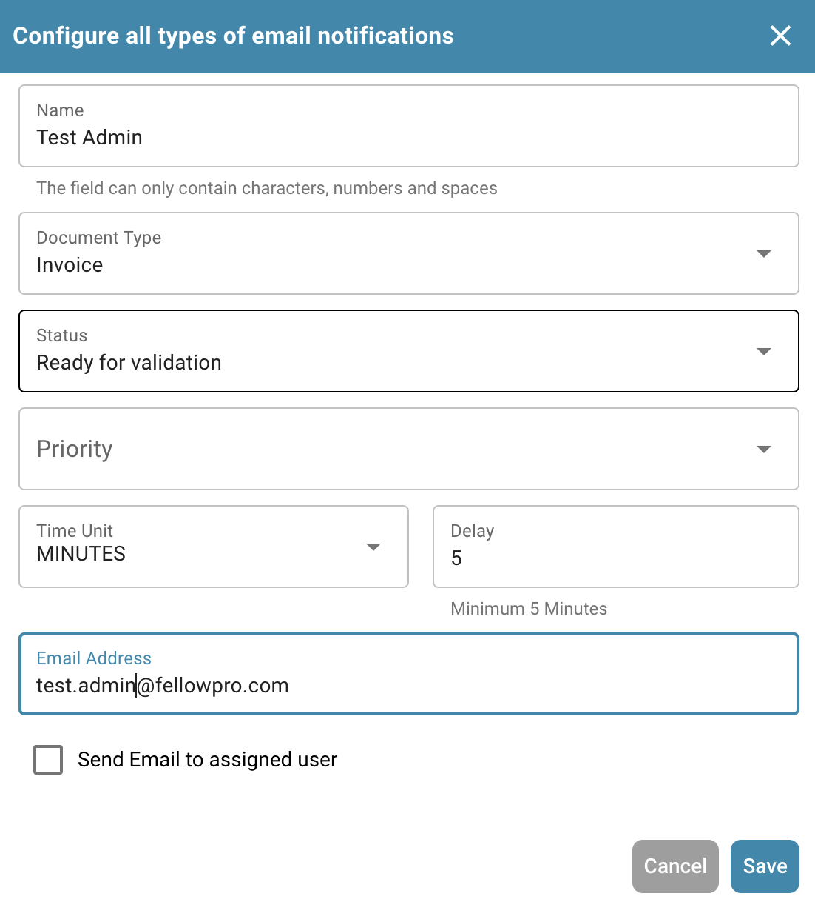
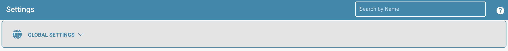

# Export

## Overview

The Export page displays all configured export setups, including whether they are active or inactive. From here, users can:

* View and manage existing export configurations
* Create new export connections (e.g., to **Infor**, **Infor & IDM**, **Webhook**, or **SFTP**)
* Edit or delete existing export configurations

## Where to Find It

You can find it under: **Settings** → **Document Processing** → **Export**

<figure><figcaption></figcaption></figure>

## **Using the Export Page**

When you open the Export page, you’ll see a list of all existing export configurations.

Each row in the list shows:

* **Status Indicator**
  * **Green** means the export is active
  * **Red** means the export is deactivated
* **Name** – the name of the export configuration
* **Document Type** – the type of document the export is configured for
* **Sub-Organization** – if the export is limited to a specific sub-organization
* **Export Method** – where the document will be sent (e.g., Infor, IDM, SFTP)
* **Actions** – buttons to **edit, delete** or **activate/deactivate** the configuration

<figure><figcaption></figcaption></figure>

#### **Important Rules for Export Configuration**

For each **document type** **within a given organization or sub-organization**, the following rules apply:

* You can have **only one active Infor export**
* You can have **only one active non-Infor export** (e.g., Webhook, SFTP)

However, it is possible to have:

* **One active Infor export** _and_ **one active non-Infor export** at the same time for the same document type
* **Different export configurations for different sub-organizations** — for example, one Infor export for Sub-Org A and another Infor export for Sub-Org B

## **Creating a New Export**

To create a new export:

1. Click on the **“New”** button.\
    (1) (1).png>)
2. Select the **Export Type** you want to configure (e.g., Infor, IDM, SFTP).
3. Fill in the required fields based on the export type.
4. Save the configuration.

## Export Options&#x20;

#### Webhook

Webhook

<figure><figcaption></figcaption></figure>

#### **Field Descriptions**

* **Title**\
  The name of the export configuration. This will appear in the export list.
* **Sub-Organization** _(optional)_\
  A dropdown with all available sub-organizations.
  * If left empty: applies to the main organization.
  * If selected: the export will only apply to the chosen sub-organization.
* **Document Type**\
  Dropdown listing all available document types.\
  This determines which type of document this export configuration applies to.
* **Export URL** \
  The destination URL where the document should be exported.

#### SFTP

SFTP

<figure><figcaption></figcaption></figure>

**Field Descriptions**

* **Title**\
  The name of the export configuration. This will appear in the export list.
* **Sub-Organization** _(optional)_\
  A dropdown with all available sub-organizations.
  * If left empty: applies to the main organization.
  * If selected: the export will only apply to the chosen sub-organization.
* **Document Type**\
  Dropdown listing all available document types.\
  This determines which type of document this export configuration applies to.

- **Username**\
  The username used to authenticate against the SFTP server.
- **Password**\
  The corresponding password for the SFTP account. Ensure the account has write access to the specified folder.
- **Server URL**\
  The hostname or IP address of the target SFTP server.
- **Port**\
  The port used to connect to the SFTP server.
- **Folder**\
  The path on the SFTP server where documents should be uploaded (e.g., `/incoming/invoices/`).\
  Must exist and be writable.
-   **XSLT File (Optional)**

    The **XSLT file** allows for transformation of the default DocBits export format.

    * **When to use:**\
      Only if the receiving system requires a different structure or specific formatting that differs from the DocBits default.
    * **Leave it empty** if the default export format meets the requirements.

#### Infor Export to SFTP

Infor Export to SFTP

<figure><figcaption></figcaption></figure>

**Field Descriptions**

* **Title**\
  The name of the export configuration. This will appear in the export list.
* **Sub-Organization** _(optional)_\
  A dropdown with all available sub-organizations.
  * If left empty: applies to the main organization.
  * If selected: the export will only apply to the chosen sub-organization.
* **Document Type**\
  Dropdown listing all available document types.\
  This determines which type of document this export configuration applies to.

- **IDM Mapping File**\
  Select a mapping file from the file manager.\
  [Need help creating one? View the IDM Mapping Guide](../../../infor-integration-and-configuration/exporting-to-infor/creating-an-idm-mapping-file.md)
- **BOD Mapping File**\
  Select a mapping file from the file manager.\
  [Need help creating one? View the BOD Mapping Guide](../../../infor-integration-and-configuration/exporting-to-infor/creating-a-bod-mapping-file.md)
- **Folder**\
  The path on the SFTP server where documents should be uploaded (e.g., `/incoming/invoices/`).\
  Must exist and be writable.

#### **SMB**

SMB

<figure><figcaption></figcaption></figure>

#### **Field Descriptions**

* **Title**\
  The name of the export configuration. This will appear in the export list.
* **Sub-Organization** _(optional)_\
  A dropdown with all available sub-organizations.
  * If left empty: applies to the main organization.
  * If selected: the export will only apply to the chosen sub-organization.
* **Document Type**\
  Dropdown listing all available document types.\
  This determines which type of document this export configuration applies to.

- **Username**\
  The username used to connect to the SMB share.
- **Password**\
  The corresponding password for SMB authentication.
- **Server URL**\
  The address of the SMB server.
- **Port**\
  Port number used to access the SMB share.
- **Folder**\
  The folder path within the SMB share where documents should be saved(e.g., `/incoming/invoices/`).\
  Must exist and be writable.
-   **JPL Mapping File (Optional)**

    The **JPL file** is used to define a transformation of the exported data before it is written to the SMB share.

    * **When to use:**\
      Only when the exported document data needs to be adjusted to match external formatting or system expectations.
    * **Leave it empty** if no transformation is necessary.

#### **Infor IDM**&#x20;

Infor IDM 

<figure><figcaption></figcaption></figure>

#### **Field Descriptions**

* **Title**\
  The name of the export configuration. This will appear in the export list.
* **Sub-Organization** _(optional)_\
  A dropdown with all available sub-organizations.
  * If left empty: applies to the main organization.
  * If selected: the export will only apply to the chosen sub-organization.
* **Document Type**\
  Dropdown listing all available document types.\
  This determines which type of document this export configuration applies to.

- **ION Mapping File**\
  Select a mapping file from the file manager.
- **IDM Mapping File**\
  Select a mapping file from the file manager.\
  [Need help creating one? View the IDM Mapping Guide](../../../infor-integration-and-configuration/exporting-to-infor/creating-an-idm-mapping-file.md)
- **Cloud / On-Prem Toggle**\
  A switch to indicate the Infor deployment type:
  * **Cloud**: Select this if  Infor CloudSuite customer.
  * **On-Prem**: Select this if Infor is self-hosted.

#### **Infor ION**

Infor ION

<figure><figcaption></figcaption></figure>

#### **Field Descriptions**

* **Title**\
  The name of the export configuration. This will appear in the export list.
* **Sub-Organization** _(optional)_\
  A dropdown with all available sub-organizations.
  * If left empty: applies to the main organization.
  * If selected: the export will only apply to the chosen sub-organization.
* **Document Type**\
  Dropdown listing all available document types.\
  This determines which type of document this export configuration applies to.

- **ION Mapping File**\
  Select a mapping file from the file manager.
- **BOD Mapping File**\
  Select a mapping file from the file manager.\
  [Need help creating one? View the BOD Mapping Guide](../../../infor-integration-and-configuration/exporting-to-infor/creating-a-bod-mapping-file.md)
- **Cloud / On-Prem Toggle**\
  A switch to indicate the Infor deployment type:
  * **Cloud**: Select this if  Infor CloudSuite customer.
  * **On-Prem**: Select this if Infor is self-hosted.

#### Infor IDM + ION BOD

Infor IDM + ION BOD

<figure><figcaption></figcaption></figure>

#### **Field Descriptions**

* **Title**\
  The name of the export configuration. This will appear in the export list.
* **Sub-Organization** _(optional)_\
  A dropdown with all available sub-organizations.
  * If left empty: applies to the main organization.
  * If selected: the export will only apply to the chosen sub-organization.
* **Document Type**\
  Dropdown listing all available document types.\
  This determines which type of document this export configuration applies to.

- **ION Mapping File**\
  Select a mapping file from the file manager.
- **IDM Mapping File**\
  Select a mapping file from the file manager.\
  [Need help creating one? View the IDM Mapping Guide](../../../infor-integration-and-configuration/exporting-to-infor/creating-an-idm-mapping-file.md)
- **BOD Mapping File**\
  Select a mapping file from the file manager.\
  [Need help creating one? View the BOD Mapping Guide](../../../infor-integration-and-configuration/exporting-to-infor/creating-a-bod-mapping-file.md)
- **Cloud / On-Prem Toggle**\
  A switch to indicate the Infor deployment type:
  * **Cloud**: Select this if  Infor CloudSuite customer.
  * **On-Prem**: Select this if Infor is self-hosted.

### For Infor CloudSuite customers

#### Infor IDM + LN&#x20;

Infor IDM + LN 

<figure><figcaption></figcaption></figure>

#### **Field Descriptions**

* **Title**\
  The name of the export configuration. This will appear in the export list.
* **Sub-Organization** _(optional)_\
  A dropdown with all available sub-organizations.
  * If left empty: applies to the main organization.
  * If selected: the export will only apply to the chosen sub-organization.
* **Document Type**\
  Dropdown listing all available document types.\
  This determines which type of document this export configuration applies to.

- **ION Mapping File**\
  Select a mapping file from the file manager.
- **IDM Mapping File**\
  Select a mapping file from the file manager.\
  [Need help creating one? View the IDM Mapping Guide](../../../infor-integration-and-configuration/exporting-to-infor/creating-an-idm-mapping-file.md)

* **LN Mapping File**\
  Select a mapping file from the file manager.\
  [Need help creating one? View the LN Mapping Example](../../../infor-integration-and-configuration/exporting-to-infor/ln/example-export-ln/)&#x20;

#### Infor IDM + M3&#x20;

Infor IDM + M3 

<figure><figcaption></figcaption></figure>

#### **Field Descriptions**

* **Title**\
  The name of the export configuration. This will appear in the export list.
* **Sub-Organization** _(optional)_\
  A dropdown with all available sub-organizations.
  * If left empty: applies to the main organization.
  * If selected: the export will only apply to the chosen sub-organization.
* **Document Type**\
  Dropdown listing all available document types.\
  This determines which type of document this export configuration applies to.

- **ION Mapping File**\
  Select a mapping file from the file manager.
- **IDM Mapping File**\
  Select a mapping file from the file manager.\
  [Need help creating one? View the IDM Mapping Guide](../../../infor-integration-and-configuration/exporting-to-infor/creating-an-idm-mapping-file.md)
- **M3 Mapping File**\
  Select a mapping file from the file manager.\
  [Need help creating one? View the M3 Mapping Example](../../../infor-integration-and-configuration/exporting-to-infor/m3/example-export-m3.md)&#x20;

#### Infor IDM + M3 (toml)

Infor IDM + M3 (toml)

<figure><figcaption></figcaption></figure>

#### **Field Descriptions**

* **Title**\
  The name of the export configuration. This will appear in the export list.
* **Sub-Organization** _(optional)_\
  A dropdown with all available sub-organizations.
  * If left empty: applies to the main organization.
  * If selected: the export will only apply to the chosen sub-organization.
* **Document Type**\
  Dropdown listing all available document types.\
  This determines which type of document this export configuration applies to.

- **ION Mapping File**\
  Select a mapping file from the file manager.
- **IDM Mapping File**\
  Select a mapping file from the file manager.\
  [Need help creating one? View the IDM Mapping Guide](../../../infor-integration-and-configuration/exporting-to-infor/creating-an-idm-mapping-file.md)
- **M3 toml Mapping File**\
  Select a mapping file from the file manager or use the select Toml option to use a toml created with the rule manager. \
  [Need help creating one? View the Rule Manager Guide](rule-manager/)

