# Importar

## Resumen

En los ajustes de **Importar**, puedes configurar opciones específicas para documentos para la importación, o configurar importaciones automáticas a través de FTP o correo electrónico. Esta página proporciona una visión general detallada de todos los ajustes disponibles.

## Cómo Acceder

1.  Navega a **Ajustes** -> **Procesamiento de documentos** -> **Importar**

    <figure>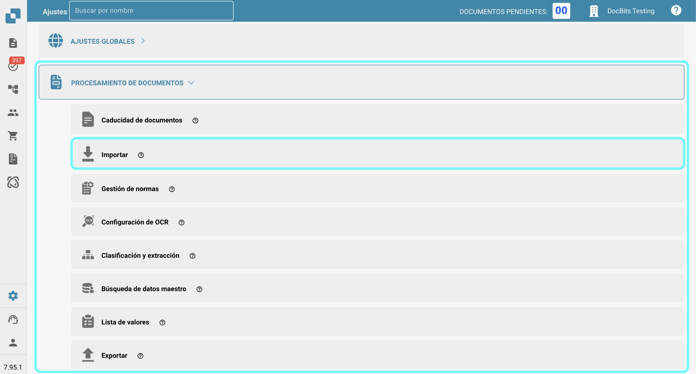<figcaption></figcaption></figure>

## **Restricción de importación de la página del documento**

* **Restringir a las páginas**: Esta configuración te permite limitar el procesamiento a un cierto número de páginas por documento. El valor predeterminado es **60 páginas**, lo que significa que los documentos que superen este límite se recortarán a **60 páginas**, y cualquier **página restante será descartada.**
* **Términos de pago días**: Define los términos de pago predeterminados (en días) que pueden aplicarse a los documentos.
* **Patrón de fecha**: Establece el patrón para cómo deben ser reconocidas y formateadas las fechas dentro de los documentos importados.

<figure>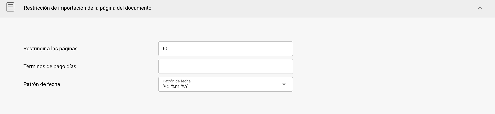<figcaption></figcaption></figure>

## **Importación ftp**

### Requisitos

Para usar FTP para importar datos automáticamente, asegúrate de que se cumplan los siguientes requisitos:

* Servidor FTP correctamente configurado y compatible con Linux
* Nombre de host FTP, Nombre de usuario y Contraseña
* Carpeta de Importación dedicada

### Agregar nueva conexión

1.  Para agregar una nueva conexión, haz clic en el botón **Agregar** en la sección FTP.

    <figure>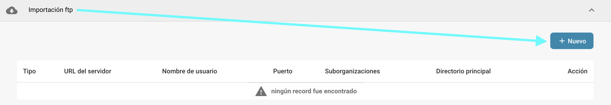<figcaption></figcaption></figure>
2.  Ingresa tus credenciales FTP en los campos designados. El campo de Clave API se llenará automáticamente.

    * **Tipo:** Especifica el protocolo FTP a utilizar. Puedes elegir entre **FTP**, **FTPS** o **SFTP**.
    * **Puerto:** Especifica el número de puerto que se utilizará para el protocolo FTP seleccionado.
    * **Nombre del servidor (requerido):** La dirección del servidor desde el cual se recuperarán los documentos.
    * **Nombre de usuario (requerido):** El nombre de inicio de sesión utilizado para acceder al servidor FTP.
    * **Contraseña (requerido):** La contraseña asociada con el nombre de usuario para acceder al servidor FTP.
    * **Patrones de coincidencia de nombre de archivo:** Para especificar qué archivos importar en función de sus nombres.
    * **Suborganizaciones:** Selecciona a qué suborganización debe aplicarse la importación FTP.
    * **Clave API (requerido):** Este campo se llenará automáticamente en función de la organización en la que hayas iniciado sesión.
    * **Directorio principal:** Especifica el directorio en el servidor FTP desde el cual se importarán los archivos.
    * **Directorio de importación:** Te permite especificar un subdirectorio dentro del directorio principal desde el cual se importarán los archivos.
    * **Archivar después de importar:** Te permite archivar archivos después de la importación. Una vez activado, puedes especificar el directorio donde se deben mover los archivos después de una importación exitosa.
    * **Incluir archivos de subcarpetas:** Cuando está habilitado, también se buscarán archivos en subdirectorios dentro del directorio principal.

    <figure>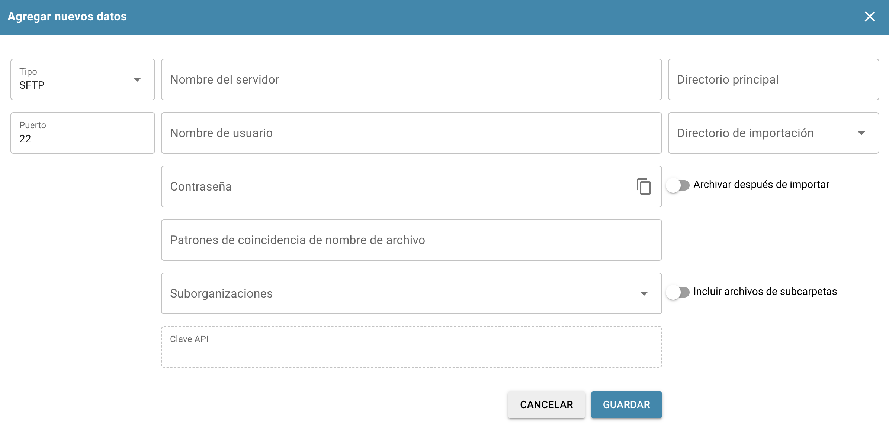<figcaption></figcaption></figure>
3. Una vez que hayas ingresado todos los detalles necesarios de tu FTP, haz clic en **Guardar**.
4. Después de guardar tu conexión, puedes activarla haciendo clic en los tres puntos en la columna de **Acción** de tu conexión, luego seleccionando **Activar**.

### Acciones para FTP

Puedes hacer clic en los tres puntos en la columna de **Acción** para acceder a las siguientes opciones para tu conexión:

<figure>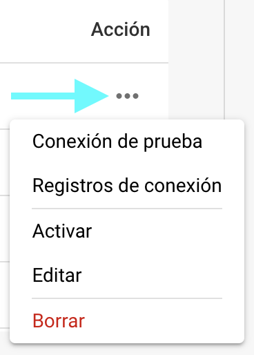<figcaption></figcaption></figure>

* **Conexión de prueba:** Prueba la conexión a tu servidor FTP.
* **Registros de conexión:** Abre los registros de tu conexión FTP, incluyendo mensajes de error si ocurren problemas.
* **Activar/Desactivar:** Activa/desactiva tu conexión.
* **Editar:** Te permite hacer cambios en tu conexión.
* **Borrar:** Elimina tu conexión.

## **Importación de correo electrónico**

Puedes configurar una importación de correo electrónico que importe automáticamente documentos de tu bandeja de entrada tan pronto como lleguen. Puedes elegir configurar una conexión IMAP o una conexión OAuth.

<mark style="color:red;">**Nota**</mark>: Solo se importarán documentos con los siguientes tipos de archivo:

* `.pdf`
* `.tiff` / `.tif`
* `.eml`
* `.dat`
* `.xml`
* `.edi`
* `.purchaseorder`

### Agregar nueva conexión IMAP

1.  Para agregar una nueva conexión IMAP, haz clic en el botón **Agregar** en la sección **Importación de correo electrónico**.

    <figure>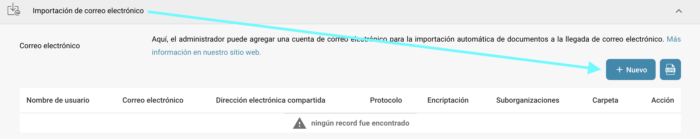<figcaption></figcaption></figure>
2. Selecciona IMAP como el protocolo.
3. Ingresa tus credenciales de correo electrónico en los campos designados. El campo de Clave API se llenará automáticamente.
   * **Encriptación:** Selecciona el tipo de encriptación a utilizar — ya sea **SSL** o **TLS**.
   * **Nombre del servidor:** La dirección del servidor de correo electrónico.
   * **Nombre de usuario:** El identificador utilizado para tu configuración de importación de correo en DocBits.
   * **Correo electrónico:** La dirección de correo electrónico utilizada para importar documentos en el sistema.
   * **Contraseña:** La contraseña asociada con la dirección de correo electrónico proporcionada.
   * **Suborganizaciones:** Selecciona la suborganización a la que debe aplicarse la importación de correo electrónico.
   * **Clave API:** Este campo se llenará automáticamente en función de la organización en la que hayas iniciado sesión.
   * **Enviar aviso de error de importación a esta dirección de correo electrónico:** Especifica una dirección de correo electrónico para recibir notificaciones de error si algo sale mal durante el proceso de importación.
   * **Puerto:** Especifica el número de puerto que se utilizará para la configuración de importación de correo electrónico seleccionada.
   * **Carpeta:** Selecciona una carpeta desde la cual se importarán los documentos.\
     <mark style="color:red;">**Nota**</mark>: La opción **Carpeta** se vuelve disponible solo después de que hayas creado exitosamente una conexión IMAP. Para agregar una carpeta después de la creación, haz clic en los tres puntos en la columna de **Acción**, luego selecciona **Editar**. La opción debería estar disponible ahora.
   * **Mover correos electrónicos a otra carpeta:** Cuando está habilitado, te permite especificar una carpeta donde se moverán los correos electrónicos después de una importación exitosa.\
     <mark style="color:red;">**Nota**</mark>: La opción **Mover correos electrónicos a otra carpeta** se vuelve disponible solo después de que hayas creado exitosamente una conexión IMAP. Para activar esta configuración, haz clic en los tres puntos en la columna de **Acción**, luego selecciona **Editar**. La opción debería estar disponible ahora.
   * **Fusionar documentos adjuntos:** Combina múltiples documentos adjuntos en un solo documento.
   * **Enviar correo electrónico al remitente después de la importación:** Envía un correo electrónico de confirmación al remitente original después de que la importación esté completa. Una vez activado, puedes especificar el asunto y el cuerpo del correo electrónico.
   * **Bloquear la importación de nombres de archivos duplicados:** Previene la importación si ya existe un documento con el mismo nombre.
4. Después de guardar tu conexión, puedes activarla haciendo clic en los tres puntos en la columna de **Acción** de tu conexión, luego seleccionando **Activar**.

### Acciones para IMAP

Puedes hacer clic en los tres puntos en la columna de **Acción** para acceder a las siguientes opciones para tu conexión:

<figure>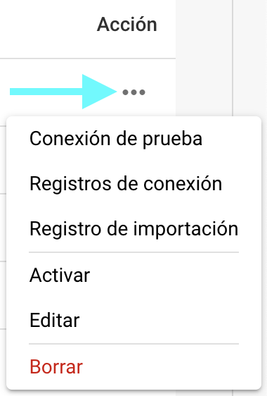<figcaption></figcaption></figure>

* **Conexión de prueba:** Prueba la conexión a tu cliente IMAP.
* **Registros de conexión:** Abre los registros de tu conexión de correo electrónico, incluyendo cualquier mensaje de error que ocurra durante el proceso.
* **Registro de importación:** Abre los registros de importaciones pasadas para la conexión respectiva, incluyendo cualquier mensaje de error que ocurrió durante el proceso.
* **Activar/Desactivar:** Activa/desactiva tu conexión.
* **Editar:** Te permite hacer cambios en tu conexión.
* **Borrar:** Elimina tu conexión.

### Agregar nueva conexión OAuth Office365

1.  Para agregar una nueva conexión OAuth Office365, haz clic en el botón **Agregar** en la sección **Importación de correo electrónico**.

    <figure><figcaption></figcaption></figure>
2.  Selecciona **OAuth Office365** como el protocolo, luego haz clic en **Autenticar**.

    <figure>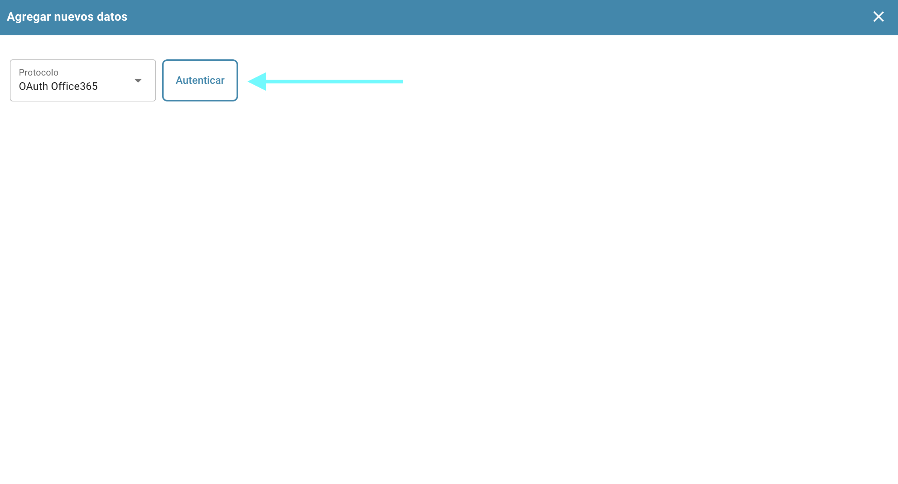<figcaption></figcaption></figure>
3.  Serás redirigido a una página de Microsoft donde se te pedirá que ingreses un código. Para recuperar este código, regresa a DocBits—el código se mostrará allí, como se muestra a continuación. Copia el código e ingrésalo en la página de Microsoft. Después, se te pedirá que ingreses tus credenciales de Microsoft.

    <figure>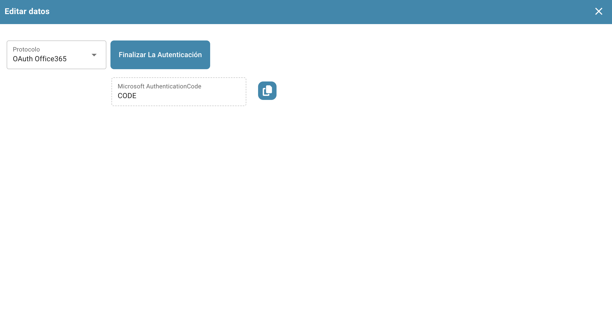<figcaption></figcaption></figure>
4. Sigue los pasos en la página de Microsoft. Una vez que hayas terminado, regresa a DocBits y haz clic en **Finalizar autenticación**.
5.  Ahora puedes configurar los siguientes ajustes:

    * **Suborganizaciones:** Selecciona la suborganización a la que debe aplicarse la importación de correo electrónico.
    * **Usar carpeta:** Selecciona una carpeta desde la cual se importarán los documentos.
    * **Usar buzón compartido:** Especifica la dirección de correo electrónico compartida desde la cual se deben importar los documentos.
    * **Mover correo a otra carpeta:** Especifica una carpeta a la que se deben mover los correos electrónicos después de una importación exitosa.
    * **Enviar aviso de error de importación a esta dirección de correo electrónico:** Especifica una dirección de correo electrónico para recibir notificaciones de error si algo sale mal durante el proceso de importación.

    <figure>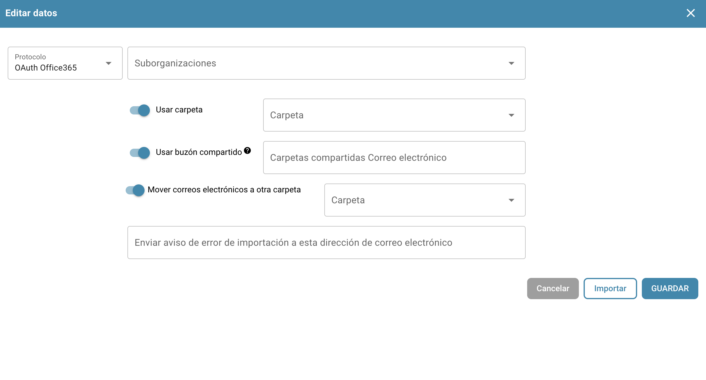<figcaption></figcaption></figure>
6. Una vez que hayas configurado el comportamiento deseado, puedes comenzar a importar correos electrónicos haciendo clic en **Importar** o guardar tus cambios haciendo clic en **Guardar**.
7. Después de guardar tu conexión, puedes activarla haciendo clic en los tres puntos en la columna de **Acción** de tu conexión, luego seleccionando **Activar**.

### Acciones para OAuth Office365

Puedes hacer clic en los tres puntos en la columna de **Acción** para acceder a las siguientes opciones para tu conexión:

<figure>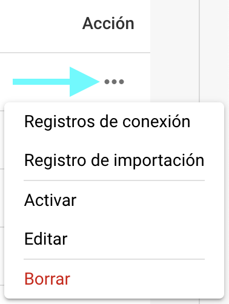<figcaption></figcaption></figure>

* **Registros de conexión:** Abre los registros de tu conexión de correo electrónico, incluyendo cualquier mensaje de error que ocurra durante el proceso.
* **Registro de importación:** Abre los registros de importaciones pasadas para la conexión respectiva, incluyendo cualquier mensaje de error que ocurrió durante el proceso.
* **Activar/Desactivar:** Activa/desactiva tu conexión.
* **Editar:** Te permite hacer cambios en tu conexión.
* **Borrar:** Elimina tu conexión.

### Registro de importación

Puedes ver el registro de importación de todas las conexiones de correo electrónico creadas, incluyendo cualquier mensaje de error que ocurrió durante el proceso, haciendo clic en el botón **Registro de importación** en la esquina superior derecha de la sección de Importación de correo electrónico.

<figure>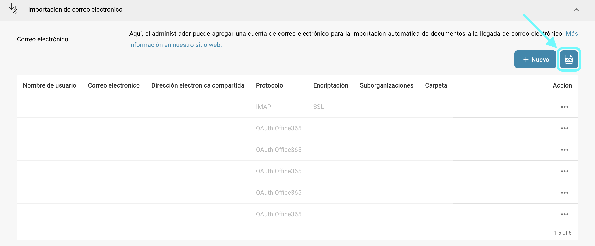<figcaption></figcaption></figure>

Puedes filtrar los registros por asunto o remitente, ordenar columnas en orden ascendente o descendente haciendo clic en los encabezados de las columnas, y reorganizar columnas usando arrastrar y soltar.
