# Import

## Przegląd

W ustawieniach **Import** możesz skonfigurować opcje specyficzne dla dokumentów dotyczące importu lub ustawić automatyczne importy za pośrednictwem FTP lub e-maila. Ta strona zawiera szczegółowy przegląd wszystkich dostępnych ustawień.

## Jak uzyskać dostęp

1.  Przejdź do **Ustawienia** -> **Przetwarzanie dokumentów** -> **Import**

    <figure>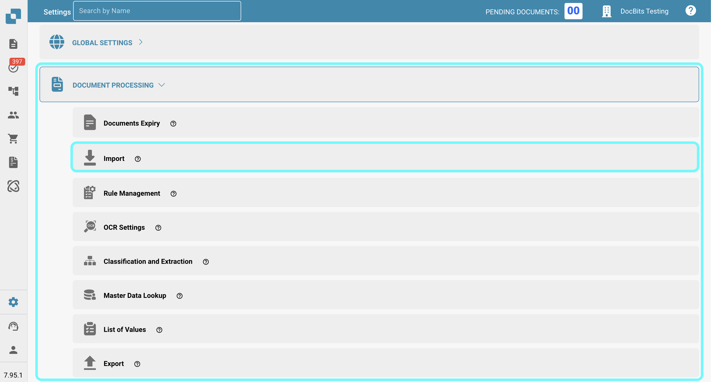<figcaption></figcaption></figure>

## **Ustawienia dokumentu**

* **Ogranicz do stron**: To ustawienie pozwala ograniczyć przetwarzanie do określonej liczby stron na dokument. Domyślnie to **60 stron**, co oznacza, że dokumenty przekraczające ten limit będą przycinane do **60 stron**, a wszelkie **pozostałe strony zostaną odrzucone.**
* **Terminy płatności (dni)**: Definiuje domyślne terminy płatności (w dniach), które mogą być stosowane do dokumentów.
* **Wzór daty**: Ustala wzór, według którego daty powinny być rozpoznawane i formatowane w importowanych dokumentach.

<figure>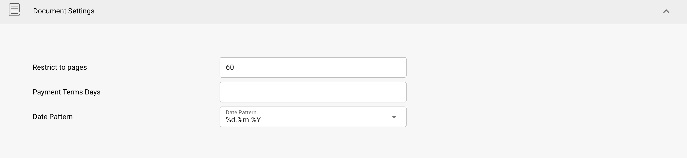<figcaption></figcaption></figure>

## **Import FTP**

### Wymagania

Aby używać FTP do automatycznego importowania danych, upewnij się, że spełnione są następujące wymagania:

* Poprawnie skonfigurowany, kompatybilny z Linuxem serwer FTP
* Nazwa hosta FTP, nazwa użytkownika i hasło
* Dedykowany folder importu

### Dodaj nowe połączenie

1.  Aby dodać nowe połączenie, kliknij przycisk **Dodaj** w sekcji FTP.

    <figure>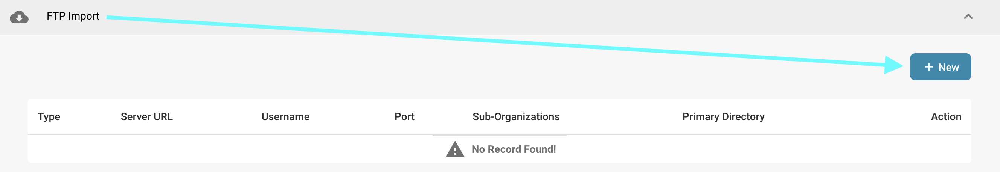<figcaption></figcaption></figure>
2.  Wprowadź swoje dane logowania FTP w wyznaczonych polach. Pole klucza API zostanie wypełnione automatycznie.

    * **Typ:** Określa protokół FTP do użycia. Możesz wybrać między **FTP**, **FTPS** lub **SFTP**.
    * **Port:** Określa numer portu, który ma być używany dla wybranego protokołu FTP.
    * **Nazwa serwera (wymagana):** Adres serwera, z którego będą pobierane dokumenty.
    * **Nazwa użytkownika (wymagana):** Nazwa logowania używana do uzyskania dostępu do serwera FTP.
    * **Hasło (wymagane):** Hasło powiązane z nazwą użytkownika do uzyskania dostępu do serwera FTP.
    * **Wzory dopasowania nazw plików:** Aby określić, które pliki importować na podstawie ich nazw.
    * **Podorganizacje:** Wybierz, do której podorganizacji powinien być stosowany import FTP.
    * **Klucz API (wymagany):** To pole zostanie automatycznie wypełnione na podstawie organizacji, do której jesteś zalogowany.
    * **Główny katalog:** Określa katalog na serwerze FTP, z którego będą importowane pliki.
    * **Katalog importu:** Pozwala określić podkatalog w obrębie głównego katalogu, z którego będą importowane pliki.
    * **Archiwizuj po imporcie:** Pozwala archiwizować pliki po imporcie. Po aktywacji możesz określić katalog, do którego pliki powinny być przenoszone po pomyślnym imporcie.
    * **Uwzględnij pliki z podfolderów:** Po włączeniu, podkatalogi w obrębie głównego katalogu będą również przeszukiwane w poszukiwaniu plików do importu.

    <figure>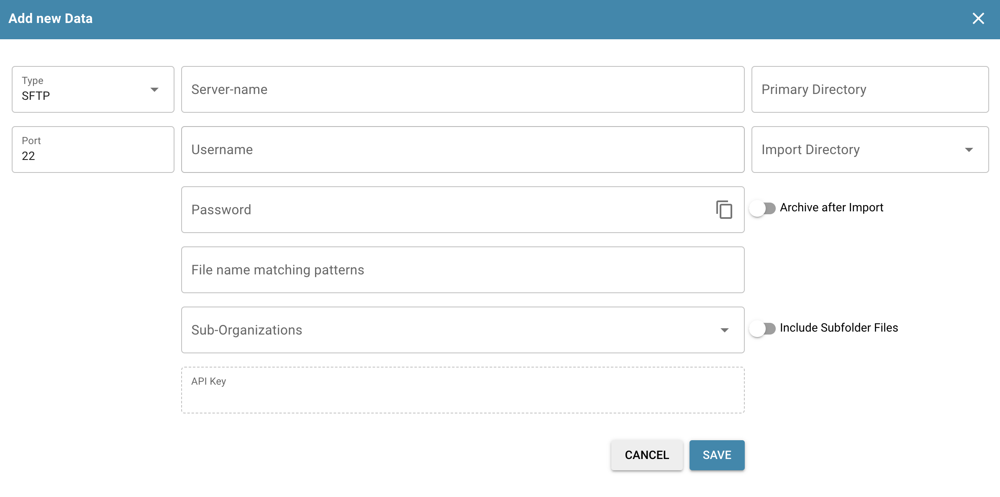<figcaption></figcaption></figure>
3. Po wprowadzeniu wszystkich niezbędnych danych dotyczących FTP, kliknij **ZAPISZ**.
4. Po zapisaniu połączenia możesz je aktywować, klikając trzy kropki w kolumnie **Akcja** swojego połączenia, a następnie wybierając **Aktywuj**.

### Akcje dla FTP

Możesz kliknąć trzy kropki w kolumnie **Akcja**, aby uzyskać dostęp do następujących opcji dla swojego połączenia:

<figure>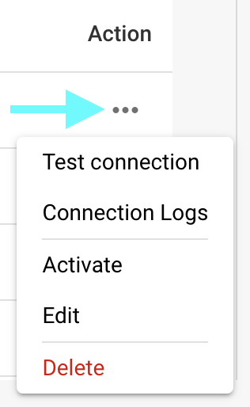<figcaption></figcaption></figure>

* **Testuj połączenie:** Testuje połączenie z serwerem FTP.
* **Logi połączenia:** Otwiera logi dla twojego połączenia FTP, w tym komunikaty o błędach, jeśli wystąpią jakiekolwiek problemy.
* **Aktywuj/Dezaktywuj:** Aktywuje/dezaktywuje twoje połączenie.
* **Edytuj:** Pozwala wprowadzać zmiany w twoim połączeniu.
* **Usuń:** Usuwa twoje połączenie.

## **Import e-mail**

Możesz skonfigurować import e-mail, który automatycznie importuje dokumenty z twojej skrzynki odbiorczej, gdy tylko przyjdą. Możesz wybrać skonfigurowanie połączenia IMAP lub OAuth.

### Dodaj nowe połączenie IMAP

1.  Aby dodać nowe połączenie IMAP, kliknij przycisk **Dodaj** w sekcji **Import e-mail**.

    <figure>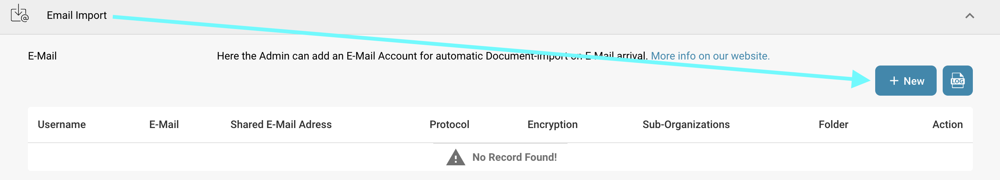<figcaption></figcaption></figure>
2. Wybierz IMAP jako protokół.
3. Wprowadź swoje dane logowania e-mail w wyznaczonych polach. Pole klucza API zostanie wypełnione automatycznie.
   * **Szyfrowanie:** Wybierz typ szyfrowania do użycia — **SSL** lub **TLS**.
   * **Nazwa serwera:** Adres serwera e-mail.
   * **Nazwa użytkownika:** Identyfikator używany do konfiguracji importu poczty w DocBits.
   * **E-mail:** Adres e-mail używany do importowania dokumentów do systemu.
   * **Hasło:** Hasło powiązane z podanym adresem e-mail.
   * **Podorganizacje:** Wybierz podorganizację, do której powinien być stosowany import e-mail.
   * **Klucz API:** To pole zostanie automatycznie wypełnione na podstawie organizacji, do której jesteś zalogowany.
   * **Wyślij powiadomienie o błędzie importu na ten adres e-mail:** Określ adres e-mail, na który będą wysyłane powiadomienia o błędach, jeśli coś pójdzie nie tak podczas procesu importu.
   * **Port:** Określa numer portu, który ma być używany dla wybranej konfiguracji importu e-mail.
   *   **Folder:** Wybierz folder, z którego będą importowane dokumenty.

       <mark style="color:red;">**Uwaga**</mark>: Opcja **Folder** staje się dostępna dopiero po pomyślnym utworzeniu połączenia IMAP. Aby dodać folder po utworzeniu, kliknij trzy kropki w kolumnie **Akcja**, a następnie wybierz **Edytuj**. Opcja powinna być teraz dostępna.
   * **Przenieś e-maile do innego folderu:** Po włączeniu pozwala określić folder, do którego e-maile będą przenoszone po pomyślnym imporcie.\
     <mark style="color:red;">**Uwaga**</mark>: Opcja **Przenieś e-maile do innego folderu** staje się dostępna dopiero po pomyślnym utworzeniu połączenia IMAP. Aby aktywować to ustawienie, kliknij trzy kropki w kolumnie **Akcja**, a następnie wybierz **Edytuj**. Opcja powinna być teraz dostępna.
   * **Scal załączone dokumenty:** Łączy wiele załączonych dokumentów w jeden dokument.
   * **Wyślij e-mail do nadawcy po imporcie:** Wysyła e-mail potwierdzający do oryginalnego nadawcy po zakończeniu importu. Po aktywacji możesz określić temat i treść e-maila.
   * **Zablokuj import plików o tej samej nazwie:** Zapobiega importowi, jeśli dokument o tej samej nazwie już istnieje.
4. Po zapisaniu połączenia możesz je aktywować, klikając trzy kropki w kolumnie **Akcja** swojego połączenia, a następnie wybierając **Aktywuj**.

### Akcje dla IMAP

Możesz kliknąć trzy kropki w kolumnie **Akcja**, aby uzyskać dostęp do następujących opcji dla swojego połączenia:

<figure>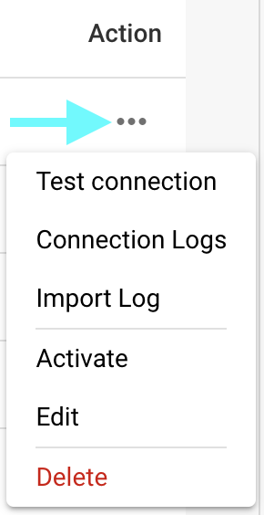<figcaption></figcaption></figure>

* **Testuj połączenie:** Testuje połączenie z klientem IMAP.
* **Logi połączenia:** Otwiera logi dla twojego połączenia e-mail, w tym wszelkie komunikaty o błędach, które wystąpiły podczas procesu.
* **Log importu:** Otwiera logi przeszłych importów dla danego połączenia, w tym wszelkie komunikaty o błędach, które wystąpiły podczas procesu.
* **Aktywuj/Dezaktywuj:** Aktywuje/dezaktywuje twoje połączenie.
* **Edytuj:** Pozwala wprowadzać zmiany w twoim połączeniu.
* **Usuń:** Usuwa twoje połączenie.

### Dodaj nowe połączenie OAuth Office365

1.  Aby dodać nowe połączenie OAuth Office365, kliknij przycisk **Dodaj** w sekcji **Import e-mail**.

    <figure><figcaption></figcaption></figure>
2.  Wybierz **OAuth Office365** jako protokół, a następnie kliknij "Autoryzuj."

    <figure>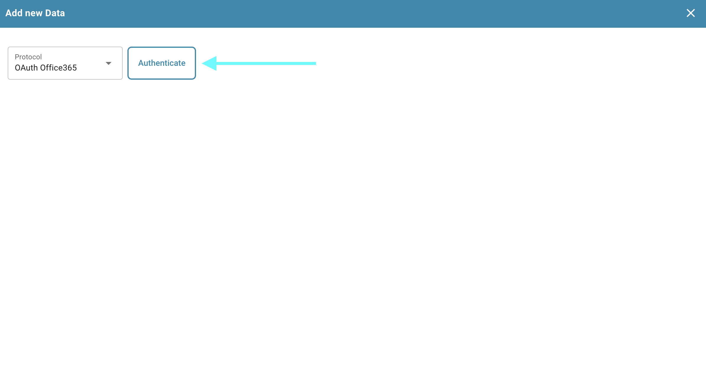<figcaption></figcaption></figure>
3.  Zostaniesz przekierowany na stronę Microsoft, gdzie zostaniesz poproszony o wprowadzenie kodu. Aby uzyskać ten kod, wróć do DocBits — kod zostanie tam wyświetlony, jak pokazano poniżej. Skopiuj kod i wprowadź go na stronie Microsoft. Następnie zostaniesz poproszony o wprowadzenie swoich danych logowania do Microsoft.

    <figure>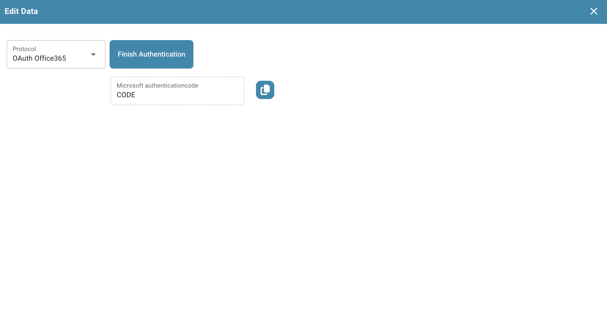<figcaption></figcaption></figure>
4. Postępuj zgodnie z instrukcjami na stronie Microsoft. Po zakończeniu wróć do DocBits i kliknij **Zakończ autoryzację**.
5.  Teraz możesz skonfigurować następujące ustawienia:

    * **Podorganizacje:** Wybierz podorganizację, do której powinien być stosowany import e-mail.
    * **Użyj folderu:** Wybierz folder, z którego będą importowane dokumenty.
    * **Użyj wspólnej skrzynki pocztowej:** Określ wspólny adres e-mail, z którego powinny być importowane dokumenty.
    * **Przenieś e-mail do innego folderu:** Określ folder, do którego e-maile powinny być przenoszone po pomyślnym imporcie.
    * **Wyślij powiadomienie o błędzie importu na ten adres e-mail:** Określ adres e-mail, na który będą wysyłane powiadomienia o błędach, jeśli coś pójdzie nie tak podczas procesu importu.

    <figure>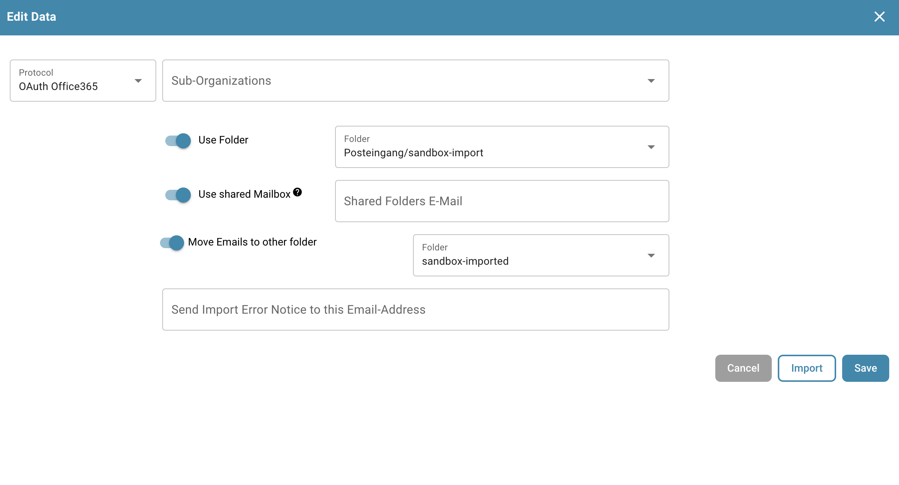<figcaption></figcaption></figure>
6. Gdy skonfigurujesz pożądane zachowanie, możesz rozpocząć importowanie e-maili, klikając **Importuj**, lub zapisać zmiany, klikając **Zapisz**.
7. Po zapisaniu połączenia możesz je aktywować, klikając trzy kropki w kolumnie **Akcja** swojego połączenia, a następnie wybierając **Aktywuj**.

### Akcje dla OAuth Office365

Możesz kliknąć trzy kropki w kolumnie **Akcja**, aby uzyskać dostęp do następujących opcji dla swojego połączenia:

<figure>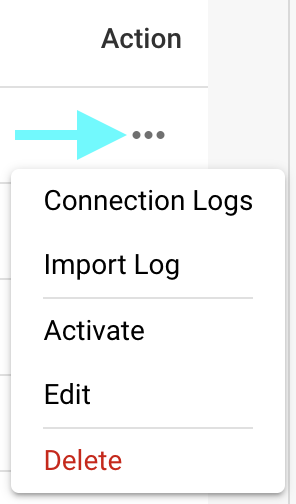<figcaption></figcaption></figure>

* **Logi połączenia:** Otwiera logi dla twojego połączenia e-mail, w tym wszelkie komunikaty o błędach, które wystąpiły podczas procesu.
* **Log importu:** Otwiera logi przeszłych importów dla danego połączenia, w tym wszelkie komunikaty o błędach, które wystąpiły podczas procesu.
* **Aktywuj/Dezaktywuj:** Aktywuje/dezaktywuje twoje połączenie.
* **Edytuj:** Pozwala wprowadzać zmiany w twoim połączeniu.
* **Usuń:** Usuwa twoje połączenie.

### Log importu

Możesz wyświetlić log importu wszystkich utworzonych połączeń e-mail, w tym wszelkie komunikaty o błędach, które wystąpiły podczas procesu, klikając przycisk **Log importu** w prawym górnym rogu sekcji Import e-mail.

<figure>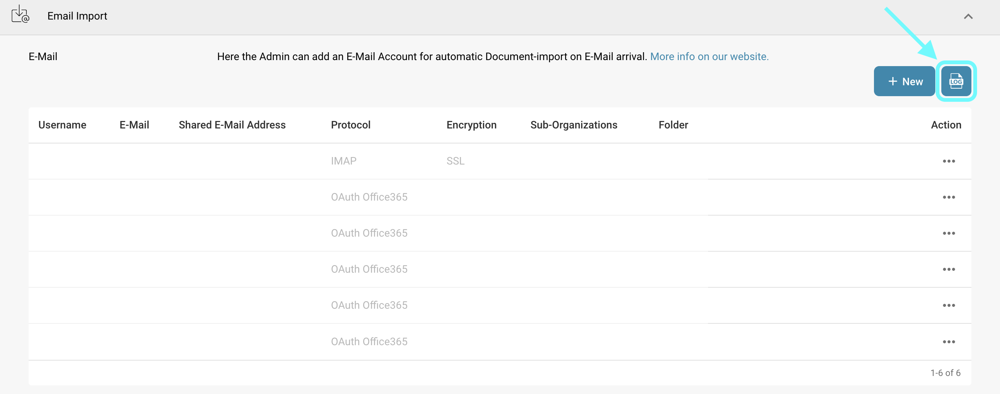<figcaption></figcaption></figure>

Możesz filtrować logi według tematu lub nadawcy, sortować kolumny w porządku rosnącym lub malejącym, klikając nagłówki kolumn, oraz przestawiać kolumny za pomocą przeciągania i upuszczania.
