# Importer

## Aperçu

Dans les paramètres **Importer**, vous pouvez configurer des options spécifiques aux documents pour l'importation, ou mettre en place des importations automatisées via FTP ou e-mail. Cette page fournit un aperçu détaillé de tous les paramètres disponibles.

## Comment accéder

1.  Accédez à **Paramètres** -> **Traitement des documents** -> **Importer**

    <figure>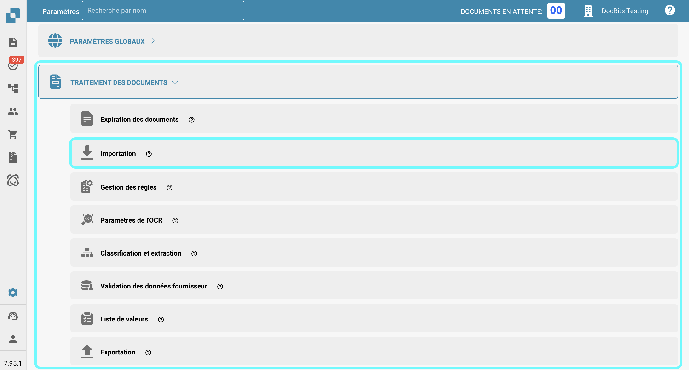<figcaption></figcaption></figure>

## **Restriction de l'importation de la page du document**

* **Restreindre aux Pages** : Ce paramètre vous permet de limiter le traitement à un certain nombre de pages par document. La valeur par défaut est **60 pages**, ce qui signifie que les documents dépassant cette limite seront réduits à **60 pages**, et toutes les **pages restantes seront supprimées.**
* **Délais de paiement (jours)** : Définit les délais de paiement par défaut (en jours) qui peuvent être appliqués aux documents.
* **Modèle de date** : Définit le modèle selon lequel les dates doivent être reconnues et formatées dans les documents importés.

<figure>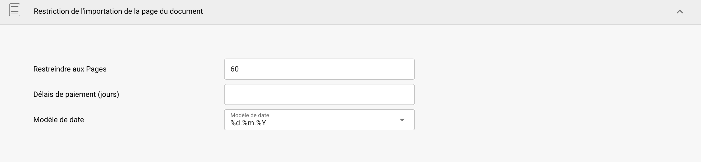<figcaption></figcaption></figure>

## **Importation FTP**

### Exigences

Pour utiliser FTP pour importer des données automatiquement, assurez-vous que les exigences suivantes sont remplies :

* Serveur FTP correctement configuré et compatible avec Linux
* Nom d'hôte FTP, Nom d'utilisateur et Mot de passe
* Dossier d'importation dédié

### Ajouter une nouvelle connexion

1.  Pour ajouter une nouvelle connexion, cliquez sur le bouton **Ajouter** dans la section FTP.

    <figure>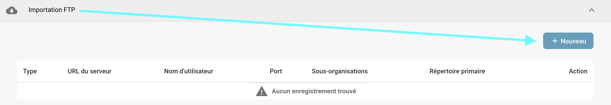<figcaption></figcaption></figure>
2.  Entrez vos identifiants FTP dans les champs désignés. Le champ Clé API sera rempli automatiquement.

    * **Type :** Spécifie le protocole FTP à utiliser. Vous pouvez choisir entre **FTP**, **FTPS** ou **SFTP**.
    * **Port :** Spécifie le numéro de port à utiliser pour le protocole FTP sélectionné.
    * **Nom du serveur (obligatoire) :** L'adresse du serveur à partir duquel les documents seront récupérés.
    * **Nom d'utilisateur (obligatoire) :** Le nom de connexion utilisé pour accéder au serveur FTP.
    * **Mot de passe (obligatoire) :** Le mot de passe associé au nom d'utilisateur pour accéder au serveur FTP.
    * **Patrons de correspondance de noms de fichier :** Pour spécifier quels fichiers importer en fonction de leurs noms.
    * **Sous-organisations :** Sélectionnez à quelle sous-organisation l'importation FTP doit s'appliquer.
    * **Clé API (obligatoire) :** Ce champ sera automatiquement rempli en fonction de l'organisation à laquelle vous êtes connecté.
    * **Répertoire primaire :** Spécifie le répertoire sur le serveur FTP à partir duquel les fichiers seront importés.
    * **Répertoire des importations :** Vous permet de spécifier un sous-répertoire dans le répertoire primaire à partir duquel les fichiers seront importés.
    * **Archiver après l'importation :** Vous permet d'archiver les fichiers après importation. Une fois activé, vous pouvez spécifier le répertoire où les fichiers doivent être déplacés après une importation réussie.
    * **Inclure les fichiers des sous-dossiers :** Lorsqu'il est activé, les sous-répertoires dans le répertoire principal seront également recherchés pour les fichiers à importer.

    <figure>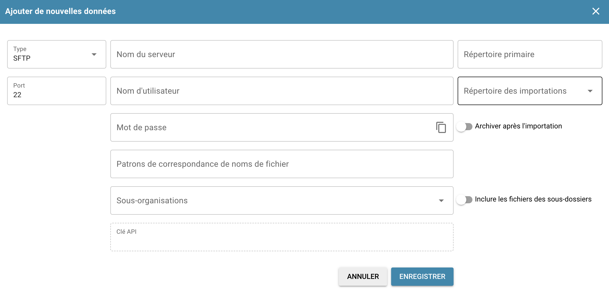<figcaption></figcaption></figure>
3. Une fois que vous avez entré tous les détails nécessaires de votre FTP, cliquez sur **ENREGISTRER**.
4. Après avoir enregistré votre connexion, vous pouvez l'activer en cliquant sur les trois points dans la colonne **Action** de votre connexion, puis en sélectionnant **Activer**.

### Actions pour FTP

Vous pouvez cliquer sur les trois points dans la colonne **Action** pour accéder aux options suivantes pour votre connexion :&#x20;

<figure>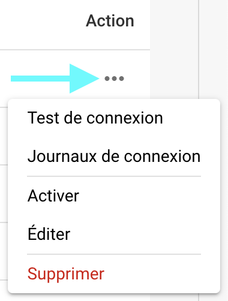<figcaption></figcaption></figure>

* **Test de connexion :** Teste la connexion à votre serveur FTP.
* **Journaux de connexion :** Ouvre les journaux de votre connexion FTP, y compris les messages d'erreur s'il y a des problèmes.
* **Activer/Désactiver :** Active/désactive votre connexion.
* **Éditer :** Vous permet de modifier votre connexion.
* **Supprimer :** Supprime votre connexion.

## **Importation d'e-mails**

Vous pouvez configurer une importation d'e-mails qui importe automatiquement des documents de votre boîte de réception dès qu'ils arrivent. Vous pouvez choisir de configurer soit une connexion IMAP, soit une connexion OAuth.

### Ajouter une nouvelle connexion IMAP

1.  Pour ajouter une nouvelle connexion IMAP, cliquez sur le bouton **Ajouter** dans la section **Importation d'e-mails**.

    <figure>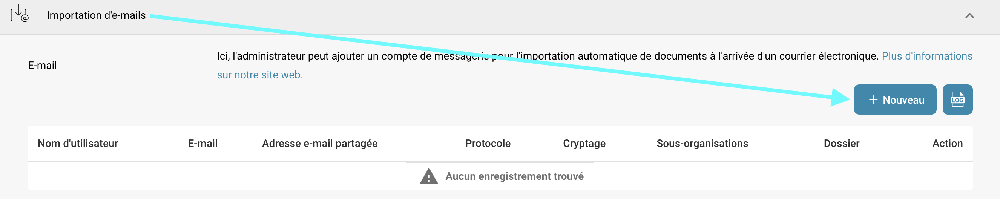<figcaption></figcaption></figure>
2. Sélectionnez IMAP comme protocole.
3. Entrez vos identifiants de messagerie dans les champs désignés. Le champ Clé API sera rempli automatiquement.
   * **Cryptage :** Sélectionnez le type de cryptage à utiliser — soit **SSL**, soit **TLS**.
   * **Nom du serveur :** L'adresse du serveur de messagerie.
   * **Nom d'utilisateur :** L'identifiant utilisé pour votre configuration d'importation de mails dans DocBits.
   * **E-mail :** L'adresse e-mail utilisée pour importer des documents dans le système.
   * **Mot de passe :** Le mot de passe associé à l'adresse e-mail fournie.
   * **Sous-organisations :** Sélectionnez la sous-organisation à laquelle l'importation d'e-mails doit s'appliquer.
   * **Clé API :** Ce champ sera automatiquement rempli en fonction de l'organisation à laquelle vous êtes connecté.
   * **Envoyer l'avis d'erreur d'importation à cette adresse électronique :** Spécifiez une adresse e-mail pour recevoir des notifications d'erreur si quelque chose ne va pas pendant le processus d'importation.
   * **Port :** Spécifie le numéro de port à utiliser pour la configuration d'importation d'e-mails sélectionnée.
   *   **Dossier :** Sélectionnez un dossier à partir duquel les documents seront importés.

       <mark style="color:red;">**Remarque**</mark> : L'option **Dossier** devient disponible uniquement après que vous avez créé avec succès une connexion IMAP. Pour ajouter un dossier après la création, cliquez sur les trois points dans la colonne **Action**, puis sélectionnez **Éditer**. L'option devrait maintenant être disponible.
   * **Déplacer les e-mails vers un autre dossier :** Lorsqu'il est activé, vous permet de spécifier un dossier où les e-mails seront déplacés après une importation réussie.\
     <mark style="color:red;">**Remarque**</mark> : L'option **Déplacer les e-mails vers un autre dossier** devient disponible uniquement après que vous avez créé avec succès une connexion IMAP. Pour activer ce paramètre, cliquez sur les trois points dans la colonne **Action**, puis sélectionnez **Éditer**. L'option devrait maintenant être disponible.
   * **Fusionner les documents joints :** Combine plusieurs documents joints en un seul document.
   * **Envoyer un Email après l'importation :** Envoie un e-mail de confirmation à l'expéditeur d'origine après que l'importation soit terminée. Une fois activé, vous pouvez spécifier le sujet et le corps de l'e-mail.
   * **Bloquer l'importation de noms de fichiers en double :** Empêche l'importation si un document avec le même nom existe déjà.
4. Après avoir enregistré votre connexion, vous pouvez l'activer en cliquant sur les trois points dans la colonne **Action** de votre connexion, puis en sélectionnant **Activer**.

### Actions pour IMAP

Vous pouvez cliquer sur les trois points dans la colonne **Action** pour accéder aux options suivantes pour votre connexion :&#x20;

<figure>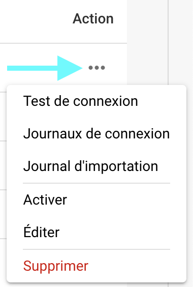<figcaption></figcaption></figure>

* **Test de connexion :** Teste la connexion à votre client IMAP.
* **Journaux de connexion :** Ouvre les journaux de votre connexion e-mail, y compris les messages d'erreur qui se produisent pendant le processus.
* **Journal d'importation :** Ouvre les journaux des importations passées pour la connexion respective, y compris les messages d'erreur qui se sont produits pendant le processus.
* **Activer/Désactiver :** Active/désactive votre connexion.
* **Éditer :** Vous permet de modifier votre connexion.
* **Supprimer :** Supprime votre connexion.

### Ajouter une nouvelle connexion OAuth Office365

1.  Pour ajouter une nouvelle connexion OAuth Office365, cliquez sur le bouton **Ajouter** dans la section **Importation d'e-mails**.

    <figure><figcaption></figcaption></figure>
2.  Sélectionnez **OAuth Office365** comme protocole, puis cliquez sur "Authentifier."

    <figure>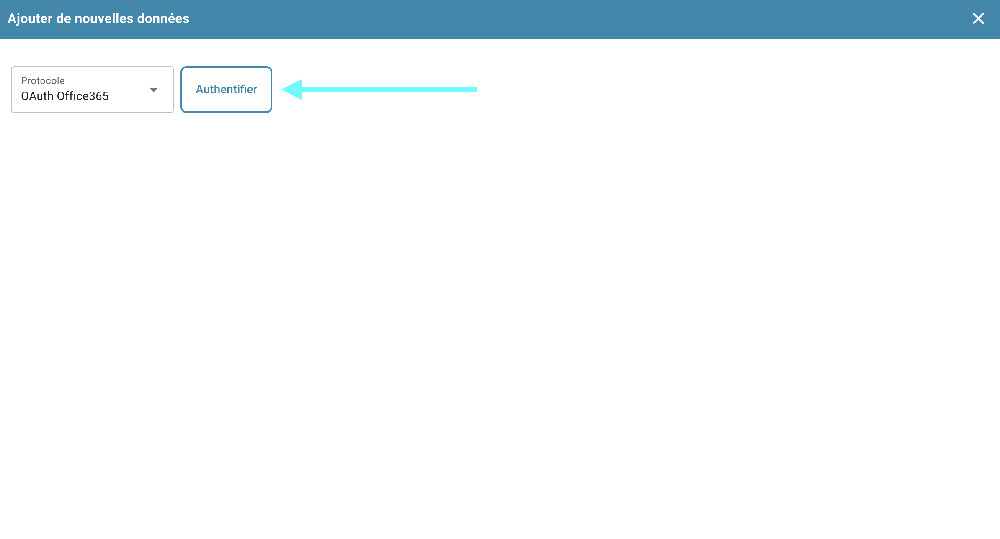<figcaption></figcaption></figure>
3.  Vous serez redirigé vers une page Microsoft où l'on vous demandera d'entrer un code. Pour récupérer ce code, revenez à DocBits — le code sera affiché là, comme indiqué ci-dessous. Copiez le code et entrez-le sur la page Microsoft. Ensuite, vous serez invité à entrer vos identifiants Microsoft.

    <figure><figcaption></figcaption></figure>
4. Suivez les étapes sur la page Microsoft. Une fois que vous avez terminé, revenez à DocBits et cliquez sur **Terminer l'authentification**.
5.  Vous pouvez maintenant configurer les paramètres suivants :

    * **Sous-organisations :** Sélectionnez la sous-organisation à laquelle l'importation d'e-mails doit s'appliquer.
    * **Utiliser le dossier :** Sélectionnez un dossier à partir duquel les documents seront importés.
    * **Utiliser la boîte aux lettres partagée :** Spécifiez l'adresse e-mail partagée à partir de laquelle les documents doivent être importés.
    * **Déplacer l'e-mail vers un autre dossier :** Spécifiez un dossier vers lequel les e-mails doivent être déplacés après une importation réussie.
    * **Envoyer l'avis d'erreur d'importation à cette adresse électronique :** Spécifiez une adresse e-mail pour recevoir des notifications d'erreur si quelque chose ne va pas pendant le processus d'importation.

    <figure>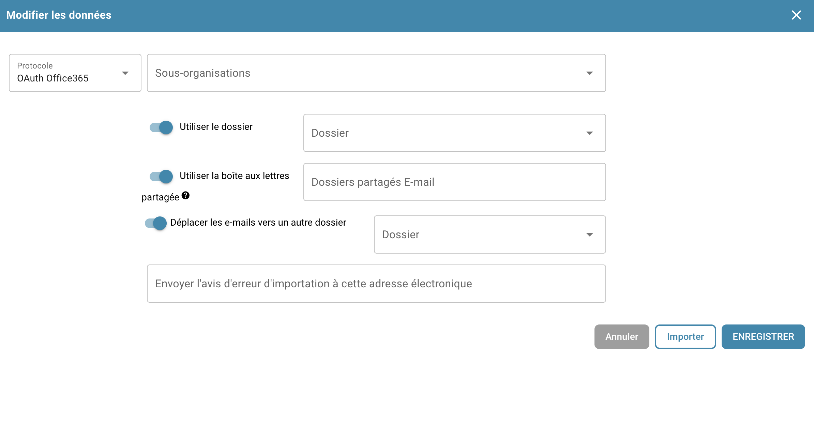<figcaption></figcaption></figure>
6. Une fois que vous avez configuré le comportement souhaité, vous pouvez soit commencer à importer des e-mails en cliquant sur **Importer**, soit enregistrer vos modifications en cliquant sur **Enregistrer**.
7. Après avoir enregistré votre connexion, vous pouvez l'activer en cliquant sur les trois points dans la colonne **Action** de votre connexion, puis en sélectionnant **Activer**.

### Actions pour OAuth Office365

Vous pouvez cliquer sur les trois points dans la colonne **Action** pour accéder aux options suivantes pour votre connexion :&#x20;

<figure>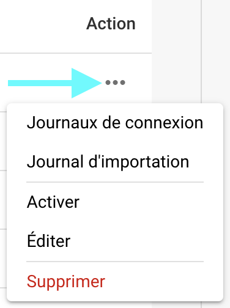<figcaption></figcaption></figure>

* **Journaux de connexion :** Ouvre les journaux de votre connexion e-mail, y compris les messages d'erreur qui se produisent pendant le processus.
* **Journal d'importation :** Ouvre les journaux des importations passées pour la connexion respective, y compris les messages d'erreur qui se sont produits pendant le processus.
* **Activer/Désactiver :** Active/désactive votre connexion.
* **Éditer :** Vous permet de modifier votre connexion.
* **Supprimer :** Supprime votre connexion.

### Journal d'importation

Vous pouvez consulter le journal d'importation de toutes les connexions e-mail créées, y compris les messages d'erreur qui se sont produits pendant le processus, en cliquant sur le bouton **Journal d'importation** dans le coin supérieur droit de la section Importation d'e-mails.

<figure>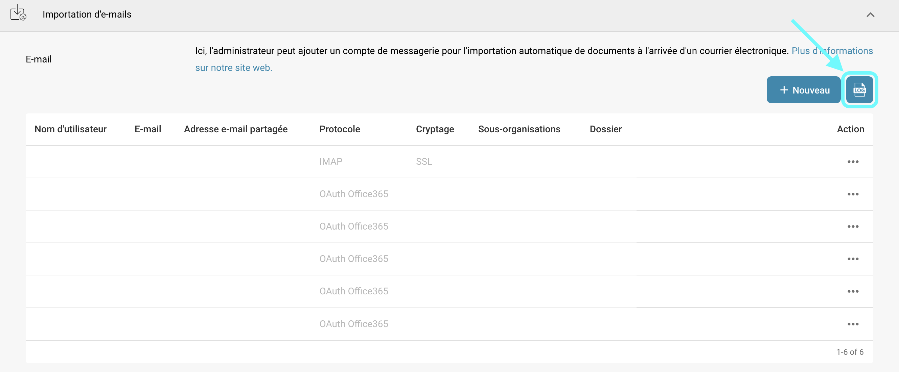<figcaption></figcaption></figure>

Vous pouvez filtrer les journaux par sujet ou expéditeur, trier les colonnes par ordre croissant ou décroissant en cliquant sur les en-têtes de colonne, et réorganiser les colonnes en utilisant le glisser-déposer.
