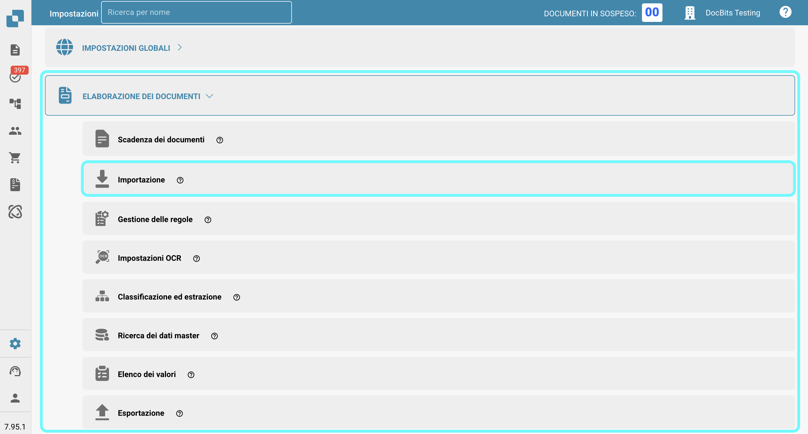
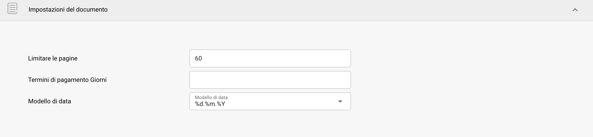
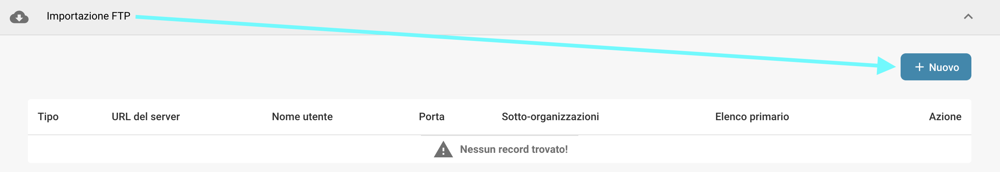
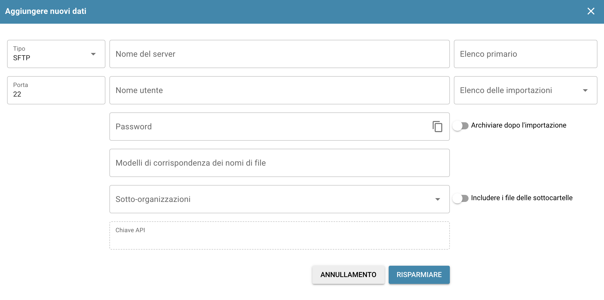
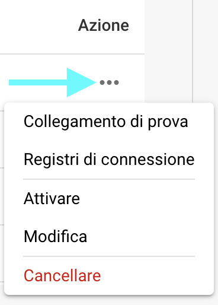
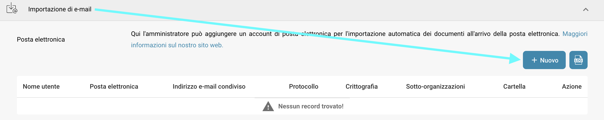
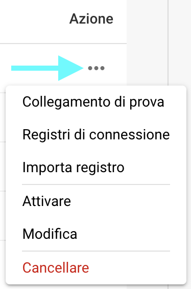
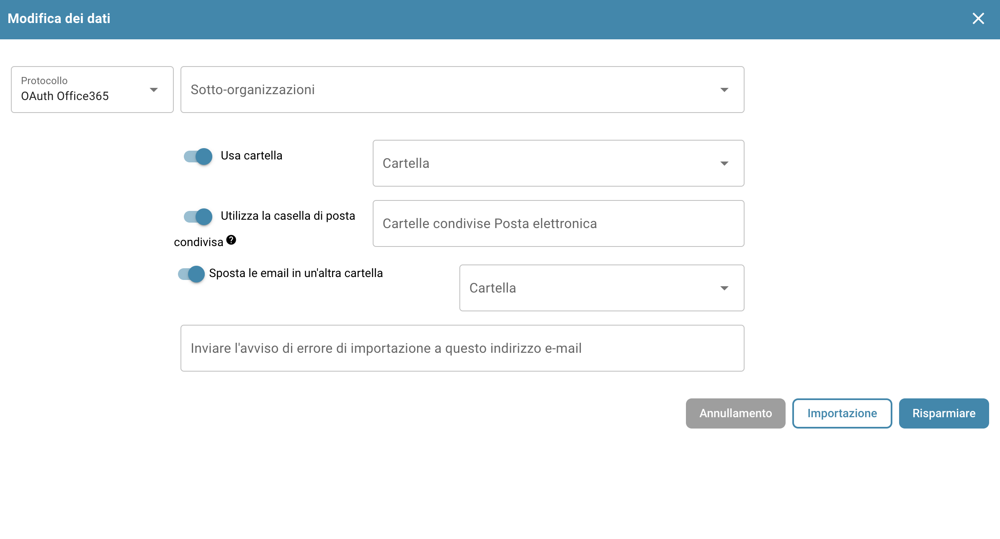
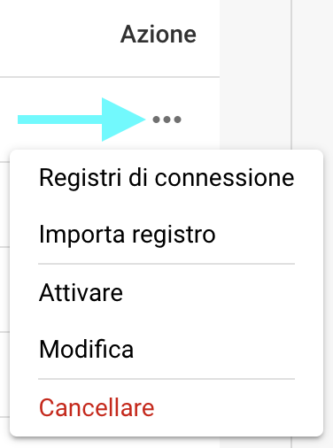
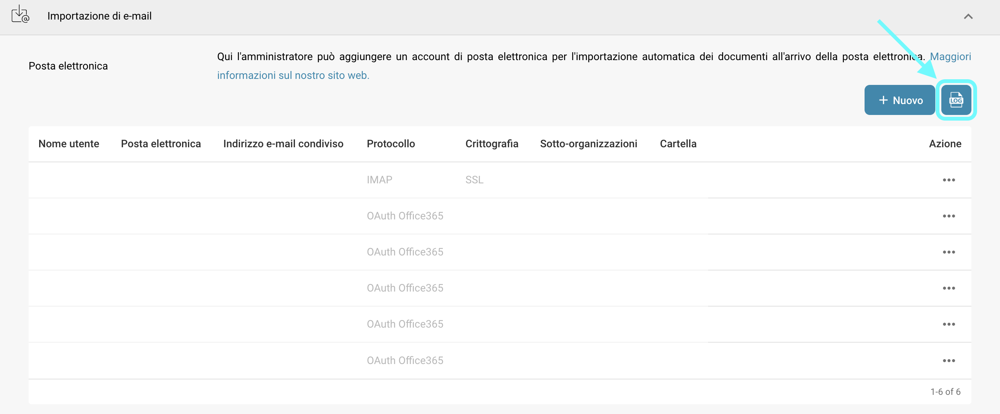

# Importazione

## Panoramica

Nelle impostazioni di **Importazione**, puoi configurare opzioni specifiche per i documenti per l'importazione o impostare importazioni automatiche tramite FTP o email. Questa pagina fornisce una panoramica dettagliata di tutte le impostazioni disponibili.

## Come Accedere

1.  Naviga su **Impostazioni** -> **Elaborazione dei documenti** -> **Importazione**

    <figure><figcaption></figcaption></figure>

## **Impostazioni del documento**

* **Limitare le pagine**: Questa impostazione consente di limitare l'elaborazione a un certo numero di pagine per documento. Il valore predefinito è **60 pagine**, il che significa che i documenti che superano questo limite verranno ridotti a **60 pagine**, e tutte le **pagine rimanenti verranno scartate.**
* **Termini di pagamento Giorni**: Definisce i termini di pagamento predefiniti (in giorni) che possono essere applicati ai documenti.
* **Modello di data**: Imposta il modello per come le date devono essere riconosciute e formattate all'interno dei documenti importati.

<figure><figcaption></figcaption></figure>

## **Importazione FTP**

### Requisiti

Per utilizzare FTP per importare dati automaticamente, assicurati che siano soddisfatti i seguenti requisiti:

* Server FTP configurato correttamente e compatibile con Linux
* Nome host FTP, Nome utente e Password
* Cartella di importazione dedicata

### Aggiungi nuova connessione

1.  Per aggiungere una nuova connessione, fai clic sul pulsante **Aggiungi** nella sezione FTP.

    <figure><figcaption></figcaption></figure>
2.  Inserisci le tue credenziali FTP nei campi designati. Il campo Chiave API verrà compilato automaticamente.

    * **Tipo:** Specifica il protocollo FTP da utilizzare. Puoi scegliere tra **FTP**, **FTPS** o **SFTP**.
    * **Porta:** Specifica il numero di porta da utilizzare per il protocollo FTP selezionato.
    * **Nome del server (obbligatorio):** L'indirizzo del server da cui verranno recuperati i documenti.
    * **Nome utente (obbligatorio):** Il nome di accesso utilizzato per accedere al server FTP.
    * **Password (obbligatoria):** La password associata al nome utente per accedere al server FTP.
    * **Modelli di corrispondenza dei nomi di file:** Per specificare quali file importare in base ai loro nomi.
    * **Sotto-organizzazioni:** Seleziona a quale sotto-organizzazione dovrebbe applicarsi l'importazione FTP.
    * **Chiave API (obbligatoria):** Questo campo verrà compilato automaticamente in base all'organizzazione a cui sei connesso.
    * **Elenco primario:** Specifica la directory sul server FTP da cui verranno importati i file.
    * **Elenco delle importazioni:** Ti consente di specificare una sottodirectory all'interno dell'elenco primario da cui verranno importati i file.
    * **Archiviare dopo l'importazione:** Ti consente di archiviare i file dopo l'importazione. Una volta attivato, puoi specificare la directory in cui i file devono essere spostati dopo un'importazione riuscita.
    * **Includere i file delle sottocartelle:** Quando abilitato, le sottodirectory all'interno della directory principale verranno cercate anche per i file da importare.

    <figure><figcaption></figcaption></figure>
3. Una volta inseriti tutti i dettagli necessari del tuo FTP, fai clic su **RISPARMIA**.
4. Dopo aver salvato la tua connessione, puoi attivarla facendo clic sui tre punti nella colonna **Azione** della tua connessione, quindi selezionando **Attivare**.

### Azioni per FTP

Puoi fare clic sui tre punti nella colonna **Azione** per accedere alle seguenti opzioni per la tua connessione:

<figure><figcaption></figcaption></figure>

* **Collegamento di prova:** Testa la connessione al tuo server FTP.
* **Registri di connessione:** Apre i registri per la tua connessione FTP, inclusi i messaggi di errore se si verificano problemi.
* **Attiva/Disattiva:** Attiva/disattiva la tua connessione.
* **Modifica:** Ti consente di apportare modifiche alla tua connessione.
* **Cancellare:** Elimina la tua connessione.

## **Importazione di e-mail**

Puoi impostare un'importazione di email che importa automaticamente documenti dalla tua casella di posta non appena arrivano. Puoi scegliere di configurare una connessione IMAP o OAuth.

### Aggiungi nuova connessione IMAP

1.  Per aggiungere una nuova connessione IMAP, fai clic sul pulsante **Aggiungi** nella sezione **Importazione di e-mail**.

    <figure><figcaption></figcaption></figure>
2. Seleziona IMAP come protocollo.
3. Inserisci le tue credenziali email nei campi designati. Il campo Chiave API verrà compilato automaticamente.
   * **Crittografia:** Seleziona il tipo di crittografia da utilizzare — **SSL** o **TLS**.
   * **Nome del server:** L'indirizzo del server email.
   * **Nome utente:** L'identificatore utilizzato per la tua configurazione di importazione email in DocBits.
   * **Posta elettronica:** L'indirizzo email utilizzato per importare documenti nel sistema.
   * **Password:** La password associata all'indirizzo email fornito.
   * **Sotto-organizzazioni:** Seleziona la sotto-organizzazione a cui dovrebbe applicarsi l'importazione email.
   * **Chiave API:** Questo campo verrà compilato automaticamente in base all'organizzazione a cui sei connesso.
   * **Invia l'avviso di errore di importazione a questo indirizzo e-mail:** Specifica un indirizzo email per ricevere notifiche di errore se qualcosa va storto durante il processo di importazione.
   * **Porta:** Specifica il numero di porta da utilizzare per la configurazione di importazione email selezionata.
   *   **Cartella:** Seleziona una cartella da cui verranno importati i documenti.

       <mark style="color:red;">**Nota:**</mark> L'opzione **Cartella** diventa disponibile solo dopo aver creato con successo una connessione IMAP. Per aggiungere una cartella dopo la creazione, fai clic sui tre punti nella colonna **Azione**, quindi seleziona **Modifica**. L'opzione dovrebbe ora essere disponibile.
   * **Sposta le email in un'altra cartella:** Quando abilitato, consente di specificare una cartella in cui le email verranno spostate dopo un'importazione riuscita.\
     <mark style="color:red;">**Nota:**</mark> L'opzione **Sposta le email in un'altra cartella** diventa disponibile solo dopo aver creato con successo una connessione IMAP. Per attivare questa impostazione, fai clic sui tre punti nella colonna **Azione**, quindi seleziona **Modifica**. L'opzione dovrebbe ora essere disponibile.
   * **Unire documenti allegati:** Combina più documenti allegati in un unico documento.
   * **Inviare l'e-mail al mittente dopo l'importazione:** Invia un'e-mail di conferma al mittente originale dopo che l'importazione è completata. Una volta attivato, puoi specificare l'oggetto e il corpo dell'e-mail.
   * **Blocca l'importazione di nomi di file duplicati:** Impedisce l'importazione se un documento con lo stesso nome esiste già.
4. Dopo aver salvato la tua connessione, puoi attivarla facendo clic sui tre punti nella colonna **Azione** della tua connessione, quindi selezionando **Attivare**.

### Azioni per IMAP

Puoi fare clic sui tre punti nella colonna **Azione** per accedere alle seguenti opzioni per la tua connessione:

<figure><figcaption></figcaption></figure>

* **Collegamento di prova:** Testa la connessione al tuo client IMAP.
* **Registri di connessione:** Apre i registri per la tua connessione email, inclusi eventuali messaggi di errore che si verificano durante il processo.
* **Importa registro:** Apre i registri delle importazioni passate per la rispettiva connessione, inclusi eventuali messaggi di errore che si sono verificati durante il processo.
* **Attiva/Disattiva:** Attiva/disattiva la tua connessione.
* **Modifica:** Ti consente di apportare modifiche alla tua connessione.
* **Cancellare:** Elimina la tua connessione.

### Aggiungi nuova connessione OAuth Office365

1.  Per aggiungere una nuova connessione OAuth Office365, fai clic sul pulsante **Aggiungi** nella sezione **Importazione di e-mail**.

    <figure><figcaption></figcaption></figure>
2.  Seleziona **OAuth Office365** come protocollo, quindi fai clic su "Autenticare."

    <figure><figcaption></figcaption></figure>
3.  Verrai reindirizzato a una pagina Microsoft dove ti verrà chiesto di inserire un codice. Per recuperare questo codice, torna a DocBits—il codice verrà visualizzato lì, come mostrato di seguito. Copia il codice e inseriscilo nella pagina Microsoft. Successivamente, ti verrà chiesto di inserire le tue credenziali Microsoft.

    <figure><figcaption></figcaption></figure>
4. Segui i passaggi sulla pagina Microsoft. Una volta completato, torna a DocBits e fai clic su **Completa autenticazione**.
5.  Ora puoi configurare le seguenti impostazioni:

    * **Sotto-organizzazioni:** Seleziona la sotto-organizzazione a cui dovrebbe applicarsi l'importazione email.
    * **Usa Cartella:** Seleziona una cartella da cui verranno importati i documenti.
    * **Usa Casella di posta condivisa:** Specifica l'indirizzo email condiviso da cui dovrebbero essere importati i documenti.
    * **Sposta Email in un'altra cartella:** Specifica una cartella in cui le email dovrebbero essere spostate dopo un'importazione riuscita.
    * **Invia l'avviso di errore di importazione a questo indirizzo e-mail:** Specifica un indirizzo email per ricevere notifiche di errore se qualcosa va storto durante il processo di importazione.

    <figure><figcaption></figcaption></figure>
6. Una volta configurato il comportamento desiderato, puoi iniziare a importare email facendo clic su **Importa** o salvare le tue modifiche facendo clic su **Salva**.
7. Dopo aver salvato la tua connessione, puoi attivarla facendo clic sui tre punti nella colonna **Azione** della tua connessione, quindi selezionando **Attivare**.

### Azioni per OAuth Office365

Puoi fare clic sui tre punti nella colonna **Azione** per accedere alle seguenti opzioni per la tua connessione:

<figure><figcaption></figcaption></figure>

* **Registri di connessione:** Apre i registri per la tua connessione email, inclusi eventuali messaggi di errore che si verificano durante il processo.
* **Importa registro:** Apre i registri delle importazioni passate per la rispettiva connessione, inclusi eventuali messaggi di errore che si sono verificati durante il processo.
* **Attiva/Disattiva:** Attiva/disattiva la tua connessione.
* **Modifica:** Ti consente di apportare modifiche alla tua connessione.
* **Cancellare:** Elimina la tua connessione.

### Importa registro

Puoi visualizzare il registro di importazione di tutte le connessioni email create, inclusi eventuali messaggi di errore che si sono verificati durante il processo, facendo clic sul pulsante **Importa registro** nell'angolo in alto a destra della sezione Importazione di e-mail.

<figure><figcaption></figcaption></figure>

Puoi filtrare i registri per oggetto o mittente, ordinare le colonne in ordine crescente o decrescente facendo clic sulle intestazioni delle colonne e riordinare le colonne utilizzando il drag-and-drop.
