# Importeren

## Overzicht

In de **Importeren** instellingen kunt u document-specifieke opties voor importeren configureren, of geautomatiseerde imports via FTP of e-mail instellen. Deze pagina biedt een gedetailleerd overzicht van alle beschikbare instellingen.

## Toegang

1.  Navigeer naar **Instellingen** -> **Documentverwerking** -> **Importeren**

    <figure>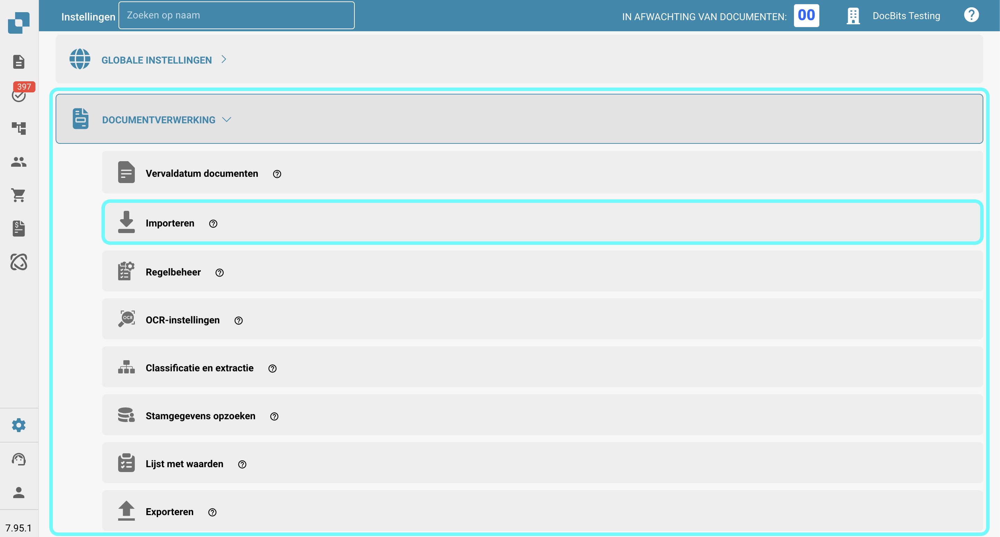<figcaption></figcaption></figure>

## **Documentinstellingen**

* **Beperken tot pagina's**: Deze instelling stelt u in staat om de verwerking te beperken tot een bepaald aantal pagina's per document. De standaard is **60 pagina's**, wat betekent dat documenten die deze limiet overschrijden, zullen worden ingekort tot **60 pagina's**, en eventuele **overige pagina's zullen worden weggegooid.**
* **Betalingsvoorwaarden Dagen**: Definieert de standaard betalingsvoorwaarden (in dagen) die op documenten kunnen worden toegepast.
* **Datumpatroon**: Stelt het patroon in voor hoe datums moeten worden herkend en opgemaakt binnen geïmporteerde documenten.

<figure>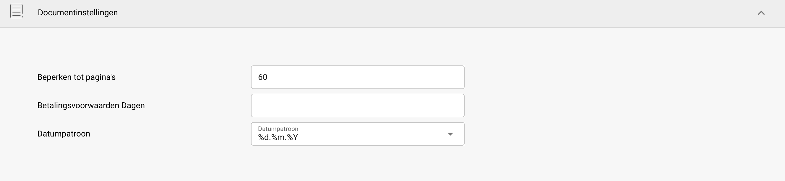<figcaption></figcaption></figure>

## **FTP-import**

### Vereisten

Om FTP te gebruiken voor het automatisch importeren van gegevens, zorg ervoor dat aan de volgende vereisten is voldaan:

* Correct geconfigureerde, Linux-compatibele FTP-server
* FTP-hostnaam, Gebruikersnaam en Wachtwoord
* Toegewijde importmap

### Nieuwe verbinding toevoegen

1.  Om een nieuwe verbinding toe te voegen, klik op de **Toevoegen** knop in de FTP-sectie.

    <figure>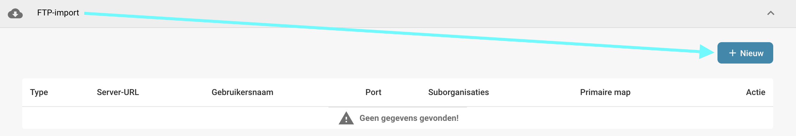<figcaption></figcaption></figure>
2.  Voer uw FTP-gegevens in de aangewezen velden in. Het veld API-sleutel wordt automatisch ingevuld.

    * **Type:** Specificeert het te gebruiken FTP-protocol. U kunt kiezen tussen **FTP**, **FTPS** of **SFTP**.
    * **Port:** Specificeert het poortnummer dat moet worden gebruikt voor het geselecteerde FTP-protocol.
    * **Servernaam (vereist):** Het adres van de server waar documenten van zullen worden opgehaald.
    * **Gebruikersnaam (vereist):** De inlognaam die wordt gebruikt om toegang te krijgen tot de FTP-server.
    * **Wachtwoord (vereist):** Het wachtwoord dat aan de gebruikersnaam is gekoppeld voor toegang tot de FTP-server.
    * **Patronen voor het matchen van bestandsnamen:** Om op te geven welke bestanden moeten worden geïmporteerd op basis van hun namen.
    * **Suborganisaties:** Selecteer welke suborganisatie de FTP-import moet toepassen.
    * **API-sleutel (vereist):** Dit veld wordt automatisch ingevuld op basis van de organisatie waar u bent ingelogd.
    * **Primaire map:** Specificeert de map op de FTP-server waaruit bestanden zullen worden geïmporteerd.
    * **Importeer directory:** Hiermee kunt u een subdirectory binnen de primaire map opgeven waaruit bestanden zullen worden geïmporteerd.
    * **Archiveren na importeren:** Hiermee kunt u bestanden archiveren na importeren. Zodra deze optie is geactiveerd, kunt u de map opgeven waar bestanden na een succesvolle import naartoe moeten worden verplaatst.
    * **Inclusief submapbestanden:** Wanneer ingeschakeld, worden submappen binnen de hoofdmap ook doorzocht naar bestanden om te importeren.

    <figure>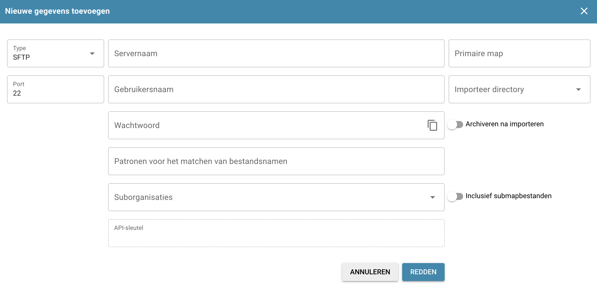<figcaption></figcaption></figure>
3. Zodra u alle noodzakelijke gegevens van uw FTP hebt ingevoerd, klikt u op **REDEN**.
4. Na het opslaan van uw verbinding, kunt u deze activeren door op de drie stippen in de **Actie** kolom van uw verbinding te klikken en vervolgens **Activeren** te selecteren.

### Acties voor FTP

U kunt op de drie stippen in de **Actie** kolom klikken om toegang te krijgen tot de volgende opties voor uw verbinding:

<figure>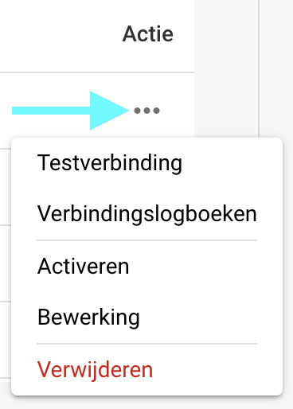<figcaption></figcaption></figure>

* **Testverbinding:** Test de verbinding met uw FTP-server.
* **Verbindingslogboeken:** Opent de logboeken voor uw FTP-verbinding, inclusief foutmeldingen als er problemen optreden.
* **Activeren/Deactiveren:** Activeert/deactiveert uw verbinding.
* **Bewerking:** Hiermee kunt u wijzigingen aanbrengen in uw verbinding.
* **Verwijderen:** Verwijdert uw verbinding.

## **E-mail importeren**

U kunt een e-mailimport instellen die automatisch documenten uit uw inbox importeert zodra ze aankomen. U kunt ervoor kiezen om een IMAP- of OAuth-verbinding te configureren.

<mark style="color:red;">**Opmerking**</mark>: Alleen documenten met de volgende bestandstypen worden geïmporteerd:

* `.pdf`
* `.tiff` / `.tif`
* `.eml`
* `.dat`
* `.xml`
* `.edi`
* `.purchaseorder`

### Nieuwe IMAP-verbinding toevoegen

1.  Om een nieuwe IMAP-verbinding toe te voegen, klik op de **Toevoegen** knop in de **E-mail importeren** sectie.

    <figure>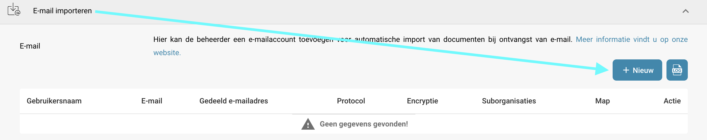<figcaption></figcaption></figure>
2. Selecteer IMAP als protocol.
3. Voer uw e-mailgegevens in de aangewezen velden in. Het veld API-sleutel wordt automatisch ingevuld.
   * **Encryptie:** Selecteer het type encryptie dat moet worden gebruikt — ofwel **SSL** of **TLS**.
   * **Servernaam:** Het adres van de e-mailserver.
   * **Gebruikersnaam:** De identificatie die wordt gebruikt voor uw mailimportconfiguratie in DocBits.
   * **E-mail:** Het e-mailadres dat wordt gebruikt voor het importeren van documenten in het systeem.
   * **Wachtwoord:** Het wachtwoord dat aan het opgegeven e-mailadres is gekoppeld.
   * **Suborganisaties:** Selecteer de suborganisatie waarop de e-mailimport moet worden toegepast.
   * **API-sleutel:** Dit veld wordt automatisch ingevuld op basis van de organisatie waar u bent ingelogd.
   * **Stuur een importfoutmelding naar dit e-mailadres:** Geef een e-mailadres op om foutmeldingen te ontvangen als er iets misgaat tijdens het importproces.
   * **Port:** Specificeert het poortnummer dat moet worden gebruikt voor de geselecteerde e-mailimportconfiguratie.
   * **Map:** Selecteer een map waaruit de documenten zullen worden geïmporteerd.\
     <mark style="color:red;">**Opmerking**</mark>: De **Map** optie wordt alleen beschikbaar nadat u met succes een IMAP-verbinding heeft gemaakt. Om een map toe te voegen na creatie, klikt u op de drie stippen in de **Actie** kolom en selecteert u **Bewerking**. De optie zou nu beschikbaar moeten zijn.
   * **E-mails naar een andere map verplaatsen:** Wanneer ingeschakeld, kunt u een map opgeven waar e-mails na een succesvolle import naartoe worden verplaatst.\
     <mark style="color:red;">**Opmerking**</mark>: De **E-mails naar een andere map verplaatsen** optie wordt alleen beschikbaar nadat u met succes een IMAP-verbinding heeft gemaakt. Om deze instelling te activeren, klikt u op de drie stippen in de **Actie** kolom en selecteert u **Bewerking**. De optie zou nu beschikbaar moeten zijn.
   * **Bijgevoegde documenten samenvoegen:** Combineert meerdere bijgevoegde documenten tot één document.
   * **E-mail naar afzender verzenden na import:** Stuurt een bevestigingsmail naar de oorspronkelijke afzender nadat de import is voltooid. Zodra deze optie is geactiveerd, kunt u het onderwerp en de inhoud van de e-mail opgeven.
   * **Importeren van dubbele bestandsnamen blokkeren:** Voorkomt importeren als een document met dezelfde naam al bestaat.
4. Na het opslaan van uw verbinding, kunt u deze activeren door op de drie stippen in de **Actie** kolom van uw verbinding te klikken en vervolgens **Activeren** te selecteren.

### Acties voor IMAP

U kunt op de drie stippen in de **Actie** kolom klikken om toegang te krijgen tot de volgende opties voor uw verbinding:

<figure>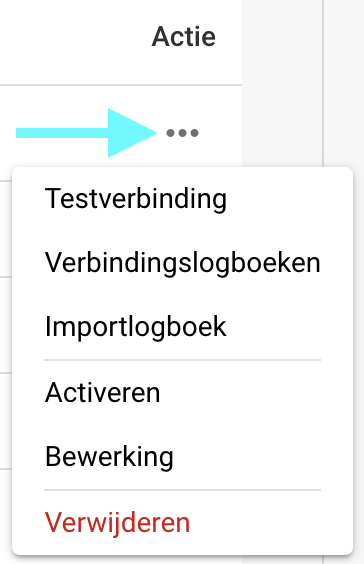<figcaption></figcaption></figure>

* **Testverbinding:** Test de verbinding met uw IMAP-client.
* **Verbindingslogboeken:** Opent de logboeken voor uw e-mailverbinding, inclusief eventuele foutmeldingen die tijdens het proces optreden.
* **Importlogboek:** Opent de logboeken van eerdere imports voor de respectieve verbinding, inclusief eventuele foutmeldingen die tijdens het proces zijn opgetreden.
* **Activeren/Deactiveren:** Activeert/deactiveert uw verbinding.
* **Bewerking:** Hiermee kunt u wijzigingen aanbrengen in uw verbinding.
* **Verwijderen:** Verwijdert uw verbinding.

### Nieuwe OAuth Office365-verbinding toevoegen

1.  Om een nieuwe OAuth Office365-verbinding toe te voegen, klik op de **Toevoegen** knop in de **E-mail importeren** sectie.

    <figure><figcaption></figcaption></figure>
2.  Selecteer **OAuth Office365** als protocol en klik vervolgens op **Authenticeren**.

    <figure>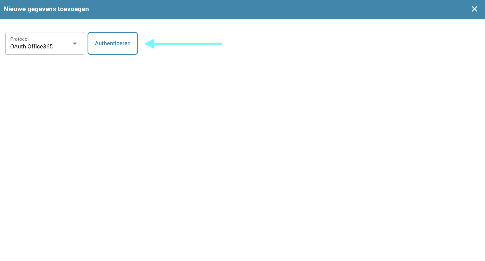<figcaption></figcaption></figure>
3.  U wordt doorgestuurd naar een Microsoft-pagina waar u wordt gevraagd een code in te voeren. Om deze code te verkrijgen, keert u terug naar DocBits—de code wordt daar weergegeven, zoals hieronder weergegeven. Kopieer de code en voer deze in op de Microsoft-pagina. Daarna wordt u gevraagd uw Microsoft-gegevens in te voeren.

    <figure>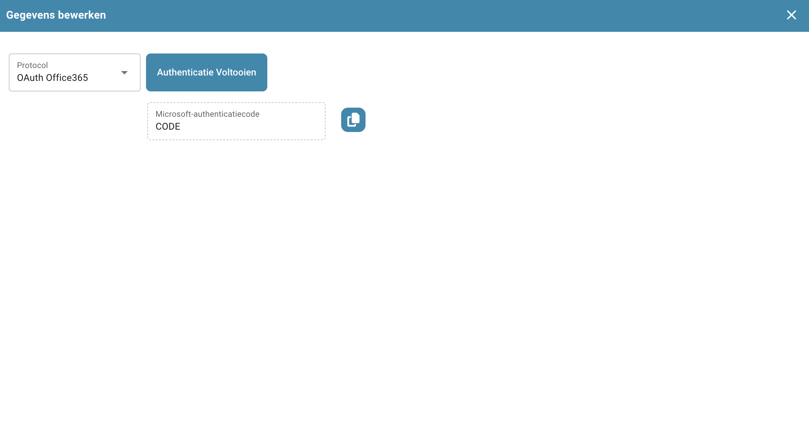<figcaption></figcaption></figure>
4. Volg de stappen op de Microsoft-pagina. Zodra u klaar bent, keert u terug naar DocBits en klikt u op **Authenticatie Voltooien**.
5.  U kunt nu de volgende instellingen configureren:

    * **Suborganisaties:** Selecteer de suborganisatie waarop de e-mailimport moet worden toegepast.
    * **Gebruik Map:** Selecteer een map waaruit de documenten zullen worden geïmporteerd.
    * **Gebruik Gedeelde Postvak:** Geef het gedeelde e-mailadres op waaruit documenten moeten worden geïmporteerd.
    * **Verplaats E-mail naar andere map:** Geef een map op waar e-mails na een succesvolle import naartoe moeten worden verplaatst.
    * **Stuur een importfoutmelding naar dit e-mailadres:** Geef een e-mailadres op om foutmeldingen te ontvangen als er iets misgaat tijdens het importproces.

    <figure><figcaption></figcaption></figure>
6. Zodra u het gewenste gedrag hebt geconfigureerd, kunt u e-mails importeren door op **Importeren** te klikken of uw wijzigingen opslaan door op **Opslaan** te klikken.
7. Na het opslaan van uw verbinding, kunt u deze activeren door op de drie stippen in de **Actie** kolom van uw verbinding te klikken en vervolgens **Activeren** te selecteren.

### Acties voor OAuth Office365

U kunt op de drie stippen in de **Actie** kolom klikken om toegang te krijgen tot de volgende opties voor uw verbinding:

<figure>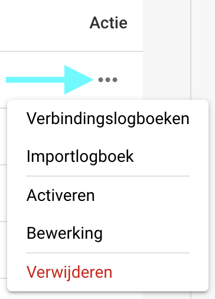<figcaption></figcaption></figure>

* **Verbindingslogboeken:** Opent de logboeken voor uw e-mailverbinding, inclusief eventuele foutmeldingen die tijdens het proces optreden.
* **Importlogboek:** Opent de logboeken van eerdere imports voor de respectieve verbinding, inclusief eventuele foutmeldingen die tijdens het proces zijn opgetreden.
* **Activeren/Deactiveren:** Activeert/deactiveert uw verbinding.
* **Bewerking:** Hiermee kunt u wijzigingen aanbrengen in uw verbinding.
* **Verwijderen:** Verwijdert uw verbinding.

### Importlogboek

U kunt het importlogboek van alle gemaakte e-mailverbindingen bekijken, inclusief eventuele foutmeldingen die tijdens het proces zijn opgetreden, door op de **Importlogboek** knop in de rechterbovenhoek van de E-mail importeren sectie te klikken.

<figure>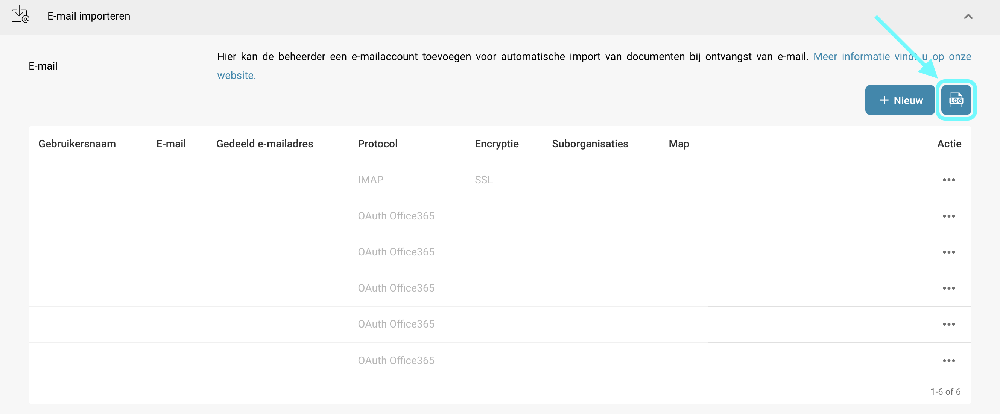<figcaption></figcaption></figure>

U kunt de logboeken filteren op onderwerp of afzender, kolommen sorteren in oplopende of aflopende volgorde door op de kolomkoppen te klikken, en kolommen herschikken met slepen en neerzetten.
