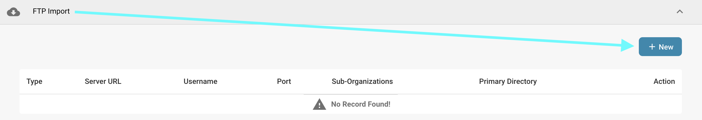
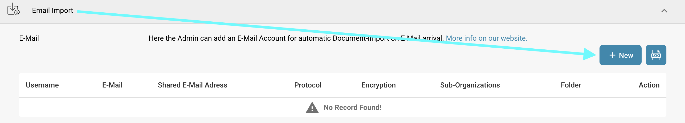
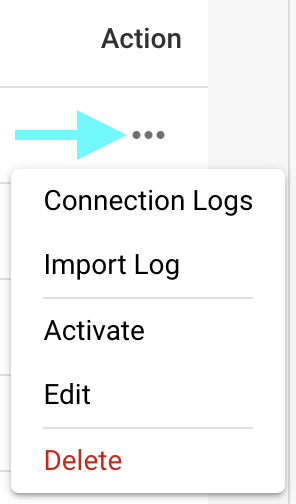

# İçe Aktar

## Genel Bakış

**İçe Aktar** ayarlarında, içe aktarma için belgeye özgü seçenekleri yapılandırabilir veya FTP veya e-posta yoluyla otomatik içe aktarımları ayarlayabilirsiniz. Bu sayfa, mevcut tüm ayarların ayrıntılı bir genel bakışını sağlar.

## Nasıl Erişilir

1. **Ayarlar** -> **Belge İşleme** -> **İçe Aktar**'a gidin

    <figure><figcaption></figcaption></figure>

## **Belge Ayarları**

* **Sayfaları sınırla**: Bu ayar, belge başına işlemeyi belirli bir sayfa sayısıyla sınırlamanıza olanak tanır. Varsayılan **60 sayfadır**, yani bu sınırı aşan belgeler **60 sayfaya** kırpılacak ve **kalan sayfalar atılacaktır.**
* **Ödeme Koşulları Günleri**: İçe aktarılan belgelere uygulanabilecek varsayılan ödeme koşullarını (gün cinsinden) tanımlar.
* **Tarih Deseni**: İçe aktarılan belgelerde tarihlerin nasıl tanınması ve biçimlendirilmesi gerektiğine dair deseni ayarlar.

<figure><figcaption></figcaption></figure>

## **FTP İçe Aktarma**

### Gereksinimler

Verileri otomatik olarak içe aktarmak için FTP kullanmak üzere aşağıdaki gereksinimlerin karşılandığından emin olun:

* Doğru yapılandırılmış, Linux uyumlu FTP Sunucusu
* FTP Ana Bilgisayar Adı, Kullanıcı Adı ve Şifre
* Özel İçe Aktarma klasörü

### Yeni bağlantı ekle

1. Yeni bir bağlantı eklemek için FTP bölümündeki **Ekle** düğmesine tıklayın.

    <figure><figcaption></figcaption></figure>
2. FTP kimlik bilgilerinizi ilgili alanlara girin. API Anahtarı alanı otomatik olarak doldurulacaktır.

    * **Tür:** Kullanılacak FTP protokolünü belirtir. **FTP**, **FTPS** veya **SFTP** arasında seçim yapabilirsiniz.
    * **Port:** Seçilen FTP protokolü için kullanılacak port numarasını belirtir.
    * **Sunucu Adı (gerekli):** Belgelerin alınacağı sunucunun adresi.
    * **Kullanıcı Adı (gerekli):** FTP sunucusuna erişmek için kullanılan oturum açma adı.
    * **Şifre (gerekli):** FTP sunucusuna erişmek için kullanıcı adıyla ilişkili şifre.
    * **Dosya adı eşleştirme desenleri:** Dosyaları adlarına göre içe aktarmak için belirtin.
    * **Alt Organizasyonlar:** FTP içe aktarımının hangi alt organizasyon için geçerli olacağını seçin.
    * **API Anahtarı (gerekli):** Bu alan, oturum açtığınız organizasyona göre otomatik olarak doldurulacaktır.
    * **Birincil Dizin:** Dosyaların içe aktarılacağı FTP sunucusundaki dizini belirtir.
    * **İçe Aktarma Dizini:** Dosyaların içe aktarılacağı birincil dizin içinde bir alt dizin belirtmenize olanak tanır.
    * **İçe Aktarmadan Sonra Arşivle:** İçe aktarmadan sonra dosyaları arşivlemenize olanak tanır. Etkinleştirildiğinde, başarılı bir içe aktarmadan sonra dosyaların taşınacağı dizini belirtebilirsiniz.
    * **Alt Klasör Dosyalarını Dahil Et:** Etkinleştirildiğinde, ana dizin içindeki alt dizinler de içe aktarılacak dosyalar için aranacaktır.

    <figure><figcaption></figcaption></figure>
3. FTP'nizin gerekli tüm ayrıntılarını girdikten sonra **KAYDET**'e tıklayın.
4. Bağlantınızı kaydettikten sonra, bağlantınızın **Eylem** sütunundaki üç noktaya tıklayarak ve ardından **Etkinleştir**'i seçerek etkinleştirebilirsiniz.

### FTP için Eylemler

Bağlantınız için aşağıdaki seçeneklere erişmek üzere **Eylem** sütunundaki üç noktaya tıklayabilirsiniz:

<figure><figcaption></figcaption></figure>

* **Bağlantıyı Test Et:** FTP sunucunuza olan bağlantıyı test eder.
* **Bağlantı Günlükleri:** Herhangi bir sorun oluşursa hata mesajları da dahil olmak üzere FTP bağlantınızın günlüklerini açar.
* **Etkinleştir/Devre Dışı Bırak:** Bağlantınızı etkinleştirir/devre dışı bırakır.
* **Düzenle:** Bağlantınızda değişiklik yapmanıza olanak tanır.
* **Sil:** Bağlantınızı siler.

## **E-posta İçe Aktarma**

Belgeler gelen kutunuza gelir gelmez otomatik olarak içe aktaran bir e-posta içe aktarımı ayarlayabilirsiniz. Bir IMAP veya OAuth bağlantısı yapılandırmayı seçebilirsiniz.

<mark style="color:red;">**Not**</mark>: Yalnızca aşağıdaki dosya türlerine sahip belgeler içe aktarılacaktır:

* `.pdf`
* `.tiff` / `.tif`
* `.eml`
* `.dat`
* `.xml`
* `.edi`
* `.purchaseorder`

### Yeni IMAP bağlantısı ekle

1. Yeni bir IMAP bağlantısı eklemek için **E-posta İçe Aktarma** bölümündeki **Ekle** düğmesine tıklayın.

    <figure><figcaption></figcaption></figure>
2. Protokol olarak IMAP'i seçin.
3. E-posta kimlik bilgilerinizi ilgili alanlara girin. API Anahtarı alanı otomatik olarak doldurulacaktır.
   * **Şifreleme:** Kullanılacak şifreleme türünü seçin — **SSL** veya **TLS**.
   * **Sunucu adı:** E-posta sunucusunun adresi.
   * **Kullanıcı Adı:** DocBits'teki posta içe aktarma yapılandırmanız için kullanılan tanımlayıcı.
   * **E-posta:** Belgeleri sisteme içe aktarmak için kullanılan e-posta adresi.
   * **Şifre:** Sağlanan e-posta adresiyle ilişkili şifre.
   * **Alt Organizasyonlar:** E-posta içe aktarımının hangi alt organizasyon için geçerli olacağını seçin.
   * **API Anahtarı:** Bu alan, oturum açtığınız organizasyona göre otomatik olarak doldurulacaktır.
   * **İçe Aktarma Hata Bildirimini Bu E-posta Adresine Gönder:** İçe aktarma işlemi sırasında bir şeyler ters giderse hata bildirimleri almak için bir e-posta adresi belirtin.
   * **Port:** Seçilen e-posta içe aktarma yapılandırması için kullanılacak port numarasını belirtir.
   * **Klasör:** Belgelerin içe aktarılacağı bir klasör seçin.
     <mark style="color:red;">**Not**</mark>: **Klasör** seçeneği, yalnızca bir IMAP bağlantısını başarıyla oluşturduktan sonra kullanılabilir hale gelir. Oluşturduktan sonra bir klasör eklemek için **Eylem** sütunundaki üç noktaya tıklayın, ardından **Düzenle**'yi seçin. Seçenek şimdi kullanılabilir olmalıdır.
   * **E-postaları Diğer Klasöre Taşı:** Etkinleştirildiğinde, başarılı bir içe aktarmadan sonra e-postaların taşınacağı bir klasör belirtmenize olanak tanır.
     <mark style="color:red;">**Not**</mark>: **E-postaları Diğer Klasöre Taşı** seçeneği, yalnızca bir IMAP bağlantısını başarıyla oluşturduktan sonra kullanılabilir hale gelir. Bu ayarı etkinleştirmek için **Eylem** sütunundaki üç noktaya tıklayın, ardından **Düzenle**'yi seçin. Seçenek şimdi kullanılabilir olmalıdır.
   * **Ekli Belgeleri Birleştir:** Birden fazla ekli belgeyi tek bir belgede birleştirir.
   * **İçe Aktarmadan Sonra Gönderene E-posta Gönder:** İçe aktarma tamamlandıktan sonra orijinal gönderene bir onay e-postası gönderir. Etkinleştirildiğinde, e-postanın konusunu ve gövdesini belirtebilirsiniz.
   * **Yinelenen Dosya Adı İçe Aktarımını Engelle:** Aynı ada sahip bir belge zaten mevcutsa içe aktarmayı engeller.
4. Bağlantınızı kaydettikten sonra, bağlantınızın **Eylem** sütunundaki üç noktaya tıklayarak ve ardından **Etkinleştir**'i seçerek etkinleştirebilirsiniz.

### IMAP için Eylemler

Bağlantınız için aşağıdaki seçeneklere erişmek üzere **Eylem** sütunundaki üç noktaya tıklayabilirsiniz:

<figure><figcaption></figcaption></figure>

* **Bağlantıyı Test Et:** IMAP istemcinize olan bağlantıyı test eder.
* **Bağlantı Günlükleri:** İşlem sırasında oluşan hata mesajları da dahil olmak üzere e-posta bağlantınızın günlüklerini açar.
* **İçe Aktarma Günlüğü:** İşlem sırasında oluşan hata mesajları da dahil olmak üzere ilgili bağlantı için geçmiş içe aktarımların günlüklerini açar.
* **Etkinleştir/Devre Dışı Bırak:** Bağlantınızı etkinleştirir/devre dışı bırakır.
* **Düzenle:** Bağlantınızda değişiklik yapmanıza olanak tanır.
* **Sil:** Bağlantınızı siler.

### Yeni OAuth Office365 bağlantısı ekle

1. Yeni bir OAuth Office365 bağlantısı eklemek için **E-posta İçe Aktarma** bölümündeki **Ekle** düğmesine tıklayın.

    <figure><figcaption></figcaption></figure>
2. Protokol olarak **OAuth Office365**'i seçin, ardından **Kimlik Doğrula**'ya tıklayın.

    <figure><figcaption></figcaption></figure>
3. Bir kod girmenizin isteneceği bir Microsoft sayfasına yönlendirileceksiniz. Bu kodu almak için DocBits'e geri dönün; kod, aşağıda gösterildiği gibi orada görüntülenecektir. Kodu kopyalayın ve Microsoft sayfasına girin. Daha sonra Microsoft kimlik bilgilerinizi girmeniz istenecektir.

    <figure><figcaption></figcaption></figure>
4. Microsoft sayfasındaki adımları izleyin. İşiniz bittiğinde DocBits'e dönün ve **Kimlik Doğrulamayı Bitir**'e tıklayın.
5. Şimdi aşağıdaki ayarları yapılandırabilirsiniz:

    * **Alt Organizasyonlar:** E-posta içe aktarımının hangi alt organizasyon için geçerli olacağını seçin.
    * **Klasör Kullan:** Belgelerin içe aktarılacağı bir klasör seçin.
    * **Paylaşılan Posta Kutusu Kullan:** Belgelerin içe aktarılacağı paylaşılan e-posta adresini belirtin.
    * **E-postayı diğer klasöre taşı:** Başarılı bir içe aktarmadan sonra e-postaların taşınacağı bir klasör belirtin.
    * **İçe Aktarma Hata Bildirimini Bu E-posta Adresine Gönder:** İçe aktarma işlemi sırasında bir şeyler ters giderse hata bildirimleri almak için bir e-posta adresi belirtin.

    <figure><figcaption></figcaption></figure>
6. İstenen davranışı yapılandırdıktan sonra, **İçe Aktar**'a tıklayarak e-postaları içe aktarmaya başlayabilir veya **Kaydet**'e tıklayarak değişikliklerinizi kaydedebilirsiniz.
7. Bağlantınızı kaydettikten sonra, bağlantınızın **Eylem** sütunundaki üç noktaya tıklayarak ve ardından **Etkinleştir**'i seçerek etkinleştirebilirsiniz.

### OAuth Office365 için Eylemler

Bağlantınız için aşağıdaki seçeneklere erişmek üzere **Eylem** sütunundaki üç noktaya tıklayabilirsiniz:

<figure><figcaption></figcaption></figure>

* **Bağlantı Günlükleri:** İşlem sırasında oluşan hata mesajları da dahil olmak üzere e-posta bağlantınızın günlüklerini açar.
* **İçe Aktarma Günlüğü:** İşlem sırasında oluşan hata mesajları da dahil olmak üzere ilgili bağlantı için geçmiş içe aktarımların günlüklerini açar.
* **Etkinleştir/Devre Dışı Bırak:** Bağlantınızı etkinleştirir/devre dışı bırakır.
* **Düzenle:** Bağlantınızda değişiklik yapmanıza olanak tanır.
* **Sil:** Bağlantınızı siler.

### İçe Aktarma Günlüğü

E-posta İçe Aktarma bölümünün sağ üst köşesindeki **İçe Aktarma Günlüğü** düğmesine tıklayarak, işlem sırasında oluşan hata mesajları da dahil olmak üzere oluşturulan tüm e-posta bağlantılarının içe aktarma günlüğünü görüntüleyebilirsiniz.

<figure><figcaption></figcaption></figure>

Günlükleri konuya veya gönderene göre filtreleyebilir, sütun başlıklarına tıklayarak sütunları artan veya azalan düzende sıralayabilir ve sürükle-bırak yöntemini kullanarak sütunları yeniden düzenleyebilirsiniz.
