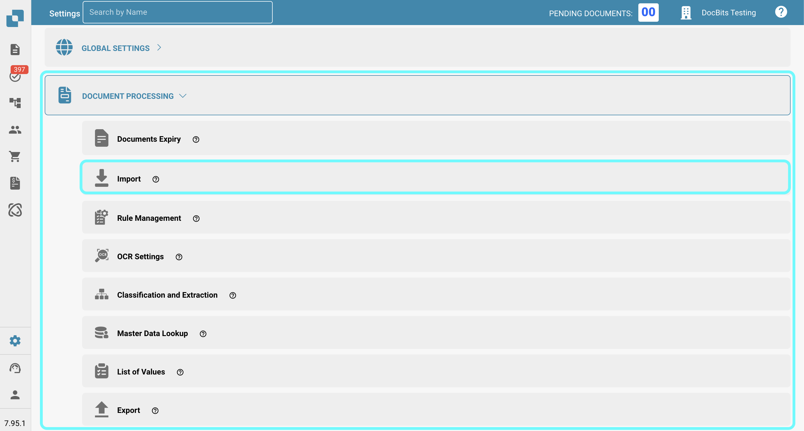
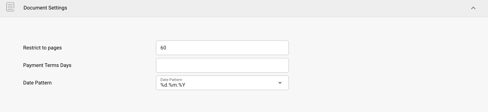
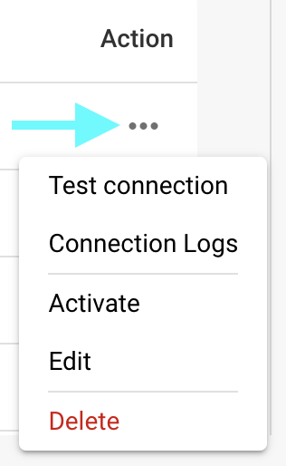

# Import

## Overview

In the **Import** settings, you can configure document-specific options for importing, or set up automated imports via FTP or email. This page provides a detailed overview of all available settings.

## How to Access

1.  Navigate to **Settings** -> **Document Processing** -> **Import**

    <figure><figcaption></figcaption></figure>

## **Document Settings**

* **Restrict to pages**: This setting allows you to limit the processing to a certain number of pages per document. The default is **60 pages**, meaning documents exceeding this limit will be trimmed to **60 pages**, and any **remaining pages will be discarded.**
* **Payment Terms Days**: Defines the default payment terms (in days) that can be applied to documents.
* **Date Pattern**: Sets the pattern for how dates should be recognized and formatted within imported documents.

<figure><figcaption></figcaption></figure>

## **FTP Import**

### Requirements

To use FTP for importing data automatically, ensure the following requirements are met:

* Correctly configured, Linux compatible FTP Server
* FTP Hostname, Username and Password
* Dedicated Import folder

### Add new connection

1. To add a new connection, click the **Add** button in the FTP section.

<figure><figcaption></figcaption></figure>

2. Enter your FTP credentials in the designated fields. The API Key field will be filled in automatically.
   * **Type:** Specifies the FTP protocol to use. You can choose between **FTP**, **FTPS**, or **SFTP**.
   * **Port:** Specifies the port number to be used for the selected FTP protocol.
   * **Server Name (required):** The address of the server from which documents will be retrieved.
   * **Username (required):** The login name used to access the FTP server.
   * **Password (required):** The password associated with the username for accessing the FTP server.
   * **File name matching patterns:** To specify which files to import based on their names.
   * **Sub-Organizations:** Select which sub-organization the FTP import should apply to.
   * **API Key (required):** This field will be automatically filled based on the organization you are logged into.
   * **Primary Directory:** Specifies the directory on the FTP server from which files will be imported.
   * **Import Directory:** Allows you to specify a subdirectory within the primary directory from which files will be imported.
   * **Archive After Import:** Allows you to archive files after import. Once activated, you can specify the directory where files should be moved after a successful import.
   * **Include Subfolder Files:** When enabled, subdirectories within the main directory will also be searched for files to import.

<figure><figcaption></figcaption></figure>

3. Once you have entered all the necessary details of your FTP, click **SAVE**.
4. After saving your connection, you can activate it by clicking the three dots in the **Actions** column of your connection, then selecting **Activate**.

### Actions for FTP

You can click the three dots in the **Actions** column to access the following options for your connection:

<figure><figcaption></figcaption></figure>

* **Test Connection:** Tests the connection to your FTP server.
* **Connection Logs:** Opens the logs for your FTP connection, including error messages if any issues occur.
* **Activate/Deactivate:** Activates/deactivates your connection.
* **Edit:** Allows you to make changes to your connection.
* **Delete:** Deletes your connection.

## **Email Import**

You can set up an email import that automatically imports documents from your inbox as soon as they arrive. You can choose to configure either an IMAP or an OAuth connection

### Add new IMAP connection

1.  To add a new IMAP connection, click the **Add** button in the **Email Import** section.

    <figure><figcaption></figcaption></figure>
2. Select IMAP as the protocol.
3. Enter your email credentials in the designated fields. The API Key field will be filled automatically.
   * **Encryption:** Select the type of encryption to use — either **SSL** or **TLS**.
   * **Server name:** The address of the email server.
   * **Username:** The identifier used for your mail import configuration in DocBits.
   * **E-mail:** The email address used for importing documents into the system.
   * **Password:** The password associated with the provided email address.
   * **Sub-Organizations:** Select the sub-organization to which the email import should apply.
   * **API Key:** This field will be automatically filled based on the organization you are logged into.
   * **Send Import Error Notice to this Email Address:** Specify an email address to receive error notifications if something goes wrong during the import process.
   * **Port:** Specifies the port number to be used for the selected email import configuration.
   *   **Folder:** Select a folder from which the documents will be imported.

       <mark style="color:red;">**Note:**</mark> The **Folder** option becomes available only after you have successfully created an IMAP connection. To add a folder after creation, click the three dots in the **Actions** column, then select **Edit**. The option should now be available.
   * **Move Emails to Other Folder:** When enabled, allows you to specify a folder where emails will be moved after a successful import.\
     <mark style="color:red;">**Note:**</mark> The **Move Emails to Other Folder** option becomes available only after you have successfully created an IMAP connection. To activate this setting, click the three dots in the **Actions** column, then select **Edit**. The option should now be available.
   * **Merge Attached Documents:** Combines multiple attached documents into a single document.
   * **Send Email to Sender after Import:** Sends a confirmation email to the original sender after the import is complete. Once activated, you can specify the subject and body of the email.
   * **Block Duplicate Filename Import:** Prevents import if a document with the same name already exists.
4. After saving your connection, you can activate it by clicking the three dots in the **Actions** column of your connection, then selecting **Activate**.

### Actions for IMAP

You can click the three dots in the **Actions** column to access the following options for your connection:

<figure><figcaption></figcaption></figure>

* **Test Connection:** Tests the connection to your IMAP client.
* **Connection Logs:** Opens the logs for your email connection, including any error messages that occur during the process.
* **Import Log:** Opens the logs of past imports for the respective connection, including any error messages that occurred during the process.
* **Activate/Deactivate:** Activates/deactivates your connection.
* **Edit:** Allows you to make changes to your connection.
* **Delete:** Deletes your connection.

### Add new OAuth Office365 connection

1.  To add a new OAuth Office365 connection, click the **Add** button in the **Email Import** section.

    <figure><figcaption></figcaption></figure>
2.  Select **OAuth Office365** as the protocol, then click on "Authenticate."

    <figure><figcaption></figcaption></figure>
3.  You will be redirected to a Microsoft page where you’ll be asked to enter a code. To retrieve this code, return to DocBits—the code will be displayed there, as shown below. Copy the code and enter it on the Microsoft page. Afterward, you will be prompted to enter your Microsoft credentials.

    <figure><figcaption></figcaption></figure>
4. Follow the steps on the Microsoft page. Once you're done, return to DocBits and click **Finish Authentication**.
5.  You can now configure the following settings:

    * **Sub-Organizations:** Select the sub-organization to which the email import should apply.
    * **Use Folder:** Select a folder from which the documents will be imported.
    * **Use Shared Mailbox:** Specify the shared email address from which documents should be imported.
    * **Move Email to other folder:** Specify a folder to which emails should be moved after a successful import.
    * **Send Import Error Notice to this Email-Address:** Specify an email address to receive error notifications if something goes wrong during the import process.

    <figure><figcaption></figcaption></figure>
6. Once you’ve configured the desired behavior, you can either start importing emails by clicking **Import** or save your changes by clicking **Save**.
7.  After saving your connection, you can activate it by clicking the three dots in the **Actions** column of your connection, then selecting **Activate**.

### Actions for OAuth Office365

You can click the three dots in the **Actions** column to access the following options for your connection:

<figure><figcaption></figcaption></figure>

* **Connection Logs:** Opens the logs for your email connection, including any error messages that occur during the process.
* **Import Log:** Opens the logs of past imports for the respective connection, including any error messages that occurred during the process.
* **Activate/Deactivate:** Activates/deactivates your connection.
* **Edit:** Allows you to make changes to your connection.
* **Delete:** Deletes your connection.

### Import Log

You can view the import log of all created email connections, including any error messages that occurred during the process, by clicking the **Import Log** button in the top-right corner of the Email Import section.

<figure><figcaption></figcaption></figure>

You can filter the logs by subject or sender, sort columns in ascending or descending order by clicking the column headers, and rearrange columns using drag-and-drop.
