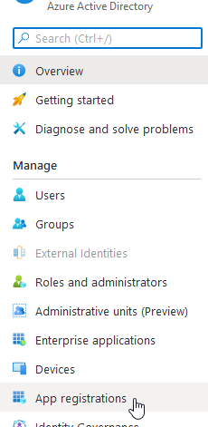
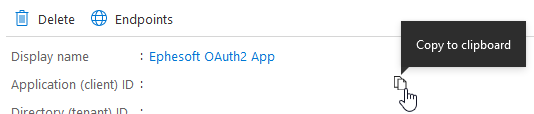
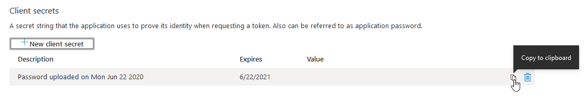
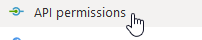
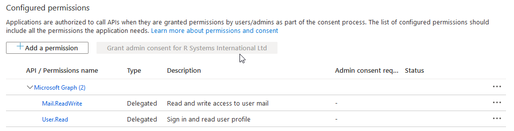

# O365 Tenant

## Register App on Azure AD

<mark style="color:red;">**Note**</mark>: The permissions may require authorization from an administrator.

1. Sign in to the [Azure Portal](https://portal.azure.com/) using your credentials.
2. From Azure services, locate and open Azure Active Directory (also known as Azure AD).

<figure><figcaption></figcaption></figure>

3. Under the **Manage** section, select **App registrations**.

<figure><figcaption></figcaption></figure>

4. In the App registrations screen, click **+ New registration**.

<figure><figcaption></figcaption></figure>

5. The **Register an application** screen displays. Enter the user-facing display name for the App in **Name**.

<figure><figcaption></figcaption></figure>

6. Select one of the following account types depending on your needs:

* **Accounts in any organizational directory (Any Azure AD directory Multitenant) and personal Microsoft accounts (e.g. Skype, Xbox)**
* **Accounts in any organizational directory (Any Azure AD directory Multitenant)**

<figure><figcaption></figcaption></figure>

7. Leave the option **Redirect URI (optional)** as is.

<figure><figcaption></figcaption></figure>

8. Click **Register** to complete the App registration. This will return you to the screen for the new App.
9. In the App screen, locate the **Application (client) ID**. Copy it to be used when configuring email import for **DocBits**.

<figure><figcaption></figcaption></figure>

10. From left panel, select **Certificates & secrets**:

<figure><figcaption></figcaption></figure>

11. In the **Certificates & secrets** screen, click on **+ New client secret** button under **Client secrets** section:

<figure><figcaption></figcaption></figure>

12. In the **Add a client secret** dialog box, click the **Add** button:

<figure><figcaption></figcaption></figure>

It is recommended to fill in a description to identify this secret among many (as of now the limit is 2 secrets per App).

<figure><figcaption></figcaption></figure>

<mark style="color:red;">**Note**</mark>: Select this expiration date according to your company policy. Once expired, a new client secret will need to be created and specified for each email configuration where it was used previously.

13. The newly generated client secret will be visible. Copy this client secret to be used when configuring email import for DocBits

<figure><figcaption></figcaption></figure>

**Important:** Ensure that you have copied the client secret as the client secret will not display again once it is closed.

14. Select **Authentication** on the left panel. This will present the **Authentication** screen on the right-hand side.

<figure><figcaption></figcaption></figure>

15. In the **Advanced settings** section, click **Yes** for **Default client type**.

<figure><figcaption></figcaption></figure>

16. Click **Save** to confirm changes.

<figure><figcaption></figcaption></figure>

17. Select **API permissions** on the left panel. This will present the API permissions screen.

<figure><figcaption></figcaption></figure>

18. By default the **User.Read** permission from **Microsoft Graph** is present, leave this as is.

<figure><figcaption></figcaption></figure>

<mark style="color:red;">**Note**</mark>: This is a required permission. If this permission is not available, then add the permission with the steps mentioned below for **Mail.ReadWrite** permission.

19. Click **+ Add a permission**.This will open the **Request API permissions** panel.

<figure><figcaption></figcaption></figure>

20. Click **Microsoft Graph**.

<figure><figcaption></figcaption></figure>

21. From the two sub-categories, select **Delegated permissions**.

<figure><figcaption></figcaption></figure>

22. Type **Mail.ReadWrite** in the search box. Select the **Mail.ReadWrite** checkbox for the permission.

<figure><figcaption></figcaption></figure>

23. This will enable the **Add permissions** button at the bottom of the panel. Click **Add permissions**.

<figure><figcaption></figcaption></figure>

24. This will add the **Mail.ReadWrite** permission to the list of **Configured permissions** for the App.

<mark style="color:red;">**Note**</mark>: Administrator permissions may be required. The administrator will have to authorize the App for using these permissions. Once authorized the granted status will be indicated as follows:

<figure><figcaption></figcaption></figure>
