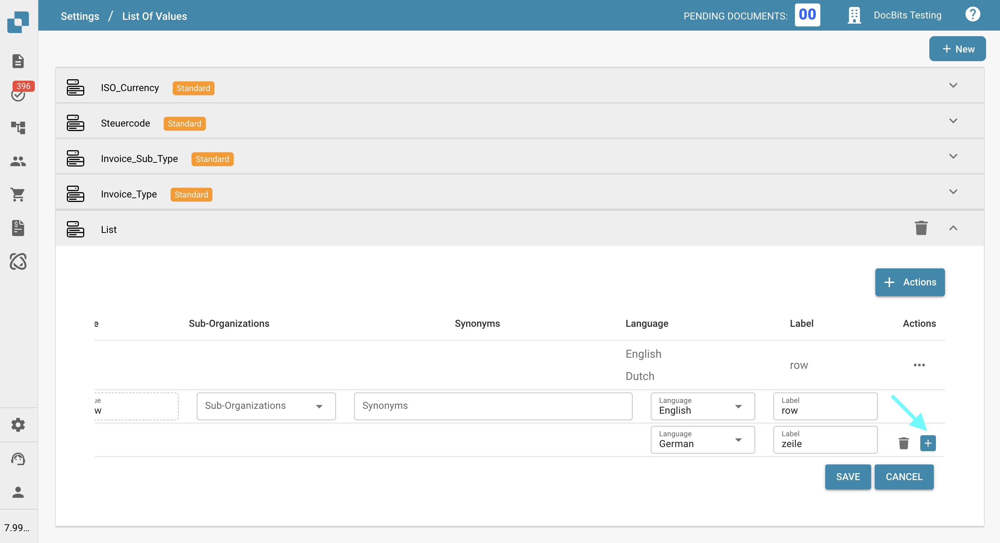

# Değer Listesi

## Genel Bakış

**Değer Listesi** özelliği, önceden tanımlanmış değer kümeleri oluşturmanıza ve yönetmenize olanak tanır. Bu, özellikle [**Alanlar**](../global-settings/document-types/fields/) bölümündeki açılır menüleri yapılandırmak için yararlıdır ve bu menüler daha sonra **Alan Doğrulaması**nda kullanılabilir.

Bu listeler farklı alt organizasyonlar için özelleştirilebilir ve birden fazla dili destekleyerek **DocBits** genelinde esneklik sağlar.

## Nasıl Erişilir?

**Değer Listesi**ne **Ayarlar → Belge İşleme → Değer Listesi** yolunu izleyerek erişebilirsiniz.

<figure><figcaption></figcaption></figure>

## Liste Ekleme veya Silme

### Yeni Bir Değer Listesi Oluştur

1. Ekranın sağ üst köşesindeki **Yeni**'ye tıklayın.

    <figure><figcaption></figcaption></figure>
2. Listeniz için bir **Ad** girin.
3. _(İsteğe Bağlı)_ Listenin aktif olması gereken bir **Alt Organizasyon** seçin.
4. Listeyi oluşturmak için **Kaydet**'e tıklayın.

    <figure><figcaption></figcaption></figure>

### Bir Listeyi Nasıl Silerim?

Bir listeyi silmek için, ilgili listenin yanındaki çöp kutusu simgesine tıklayın.

<figure><figcaption></figcaption></figure>

<mark style="color:red;">**Not**</mark>: Liste derhal silinecektir. [**Standart**](list-of-values.md#system-defined-lists-and-rows) etiketiyle işaretlenmiş listeler silinemez.

## Mevcut Bir Listeden Değer Ekleme, Düzenleme veya Kaldırma

Aşağıdaki yöntemlerden birini kullanarak mevcut bir **Değer Listesi**ndeki değerleri yönetebilirsiniz:

* [**Değerleri manuel olarak ekle**](list-of-values.md#manually-add-values) – Değerleri arayüz üzerinden tek tek girin.
* [**Değerleri bir CSV dosyasından içe aktar**](list-of-values.md#import-values-from-a-csv-file) – Aynı anda birden fazla değer eklemek için bir CSV dosyası yükleyin.

### Değerleri Manuel Olarak Ekle

1. Değiştirmek istediğiniz listeye tıklayın.

    <figure><figcaption></figcaption></figure>
2. **Eylemler**'e tıklayın.

    <figure><figcaption></figcaption></figure>
3. **Satır Ekle**'ye tıklayın.

    <figure><figcaption></figcaption></figure>

Şimdi her giriş için birden fazla özellik belirtebilirsiniz:

<figure><figcaption></figcaption></figure>

**Değer**: Bu, öğenin **DocBits** içinde dahili olarak nasıl saklanacağıdır. Tüm dillerde aynı kalır ve seçilen dil için bir etiket belirtilmemişse alan doğrulaması sırasında varsayılan görüntüleme metni olarak da hizmet eder.

**Etiket**: Bu, seçilen dile göre doğrulama ekranında görüntülenen metindir. DocBits'teki aktif dil için bir etiket mevcut değilse, sistem varsayılan olarak **Değer**i görüntüler.

**Dil**: Etiketin görüntüleneceği dili belirtir.
Daha ayrıntılı bir açıklama [burada](list-of-values.md#add-translations-to-your-values) bulunabilir.

**Alt Organizasyonlar**: Satırın hangi **alt organizasyon** için aktif olması gerektiğini belirtir. Boş bırakılırsa, satır tüm organizasyonlar için kullanılabilir olacaktır.

**Eş Anlamlılar**: Burada belgenizi eğitmenize yardımcı olacak ek değerler belirtebilirsiniz.
Örneğin, **EUR** birincil **değeriniz** ise, EURO ve €'yu **eş anlamlılar** olarak ekleyebilirsiniz. Belge bu **eş anlamlılardan** herhangi biri kullanılarak eğitildiğinde, **DocBits** listenizden ilgili değer olarak EUR'yu otomatik olarak tanıyacak ve seçecektir.
<mark style="color:red;">**Not**</mark>: Her eş anlamlıyı listeye eklemek için **Enter** tuşuna basarak onaylamanız gerekir.

4. İstenen tüm özellikleri girdikten sonra, satırı eklemek için **Kaydet** düğmesine tıklayın.

    <figure><figcaption></figcaption></figure>

### Değerleri Bir CSV Dosyasından İçe Aktar

CSV içe aktarma yoluyla aynı anda birden fazla değer eklemek için:

1. Güncellemek istediğiniz listeye tıklayın.

    <figure><figcaption></figcaption></figure>
2. **Eylemler**'e tıklayın.

    <figure><figcaption></figcaption></figure>
3. **CSV Yükle**'ye tıklayın.

    <figure><figcaption></figcaption></figure>
4. Yüklemek istediğiniz CSV dosyasını göz atıp seçmek için **Dosya**'ya tıklayın.
5. CSV dosyasında kullanılan uygun **Ayırıcı**yı seçin (`;` veya `,`).
6. Değerleri içe aktarmak için **Yükle**'ye tıklayın.

    <figure><figcaption></figcaption></figure>

### Mevcut Değerleri Düzenle

1. Düzenlemek istediğiniz satırı bulun.
2. **Eylemler** sütunundaki üç noktaya tıklayın.
3. Açılır menüden **Düzenle**'yi seçin.

    <figure><figcaption></figcaption></figure>
4. Gerekli değişiklikleri yapın.
5. Değişikliklerinizi uygulamak için **Kaydet**'e tıklayın.

    <figure><figcaption></figcaption></figure>

### Değerleri Sil

1. Silmek istediğiniz satırı bulun.
2. **Eylemler** sütunundaki üç noktaya tıklayın.
3. Açılır menüden **Sil**'i seçin.

    <figure><figcaption></figcaption></figure>

<mark style="color:red;">**Not**</mark>: Satır derhal silinecektir. [**Varsayılan**](list-of-values.md#system-defined-lists-and-rows) etiketiyle işaretlenmiş satırlar silinemez.

## Değerlerinize Çeviriler Ekleyin

**DocBits**'te desteklenen dil sayısı kadar çeviri ekleyebilirsiniz.

Bir çeviri eklemek için:

1. Artı (+) simgesine tıklayın.

    <figure><figcaption></figcaption></figure>
2. Açılır menüden bir dil seçin.

    <figure><figcaption></figcaption></figure>
3. İstenen çeviriyi **Etiket** alanına girin.

    <figure><figcaption></figcaption></figure>
4. Başka bir çeviri eklemek için tekrar artı (+) simgesine tıklayın.

    <figure><figcaption></figcaption></figure>
5. Bir çeviriyi kaldırmak için çöp kutusu simgesine tıklayın.

    <figure><figcaption></figcaption></figure>
6. İşiniz bittiğinde, çevirilerinizi kaydetmek için **Kaydet** düğmesine tıklayın.

    <figure><figcaption></figcaption></figure>

<mark style="color:red;">**Not**</mark>: Aktif dil için bir **Etiket** mevcut değilse, DocBits varsayılan olarak **Değer**i görüntüler.

## Sistem Tanımlı Listeler ve Satırlar

Bazı listeler sistem tarafından önceden oluşturulmuştur ve **Standart** etiketiyle işaretlenmiştir. Bu listeler silinemez, ancak bunlara yeni satırlar ekleyebilir ve gerekirse bu yeni eklenen satırları kaldırabilirsiniz.

<figure><figcaption></figcaption></figure>

Bu standart listeler içinde, belirli satırlar **Varsayılan** etiketiyle işaretlenmiştir—bunlar sistem tanımlı girişlerdir. Farklı dillerde yeni **etiketler** ekleyebilirsiniz, ancak bu varsayılan satırlar silinemez.

<figure><figcaption></figcaption></figure>