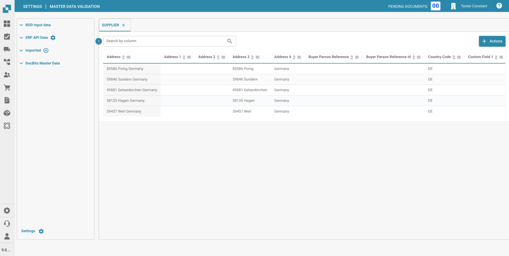
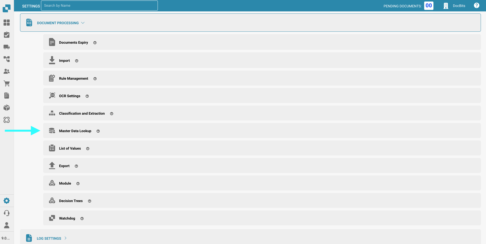
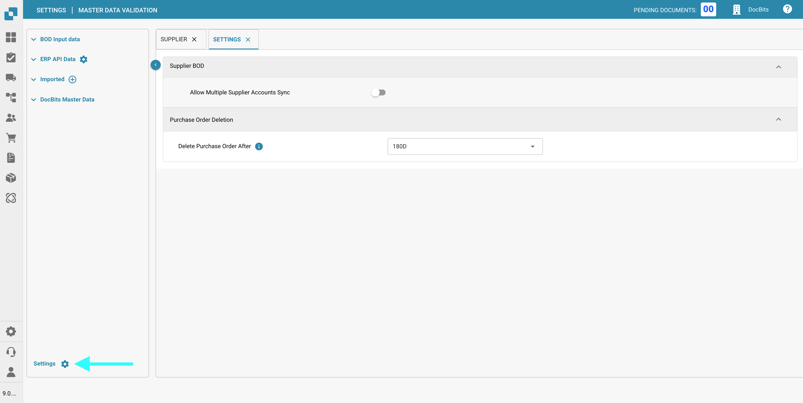
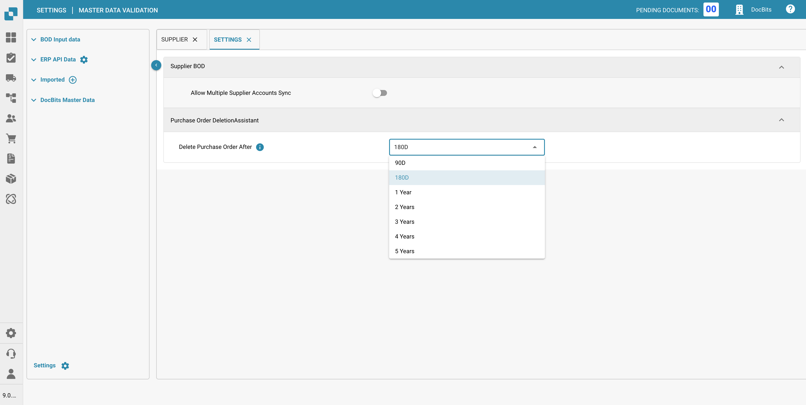

# Master Data Lookup

## Overview




The "Master Data Lookup" in your document processing settings allows for a comprehensive and integrated approach to managing and validating your document data by syncing it with your Infor ERP system. Here’s how it helps streamline the validation and enhancement of document processing within your ERP environment:

1. **Centralized Data Management**: This feature acts as a central repository where data from various sources like suppliers, customer addresses, tax codes, and more can be stored and managed. It provides a single point of reference for all master data, ensuring consistency and accuracy across your organization.
2. **Validation Against ERP Data**: By syncing master data such as supplier information from Infor to DocBits, you can automatically validate the data extracted from documents against your ERP data. This ensures that the information processed (like supplier names, addresses, and tax codes) matches the data held in your ERP system, minimizing errors and discrepancies.
3. **Facilitates Automation**: Having a robust master data lookup system helps in automating the processing of incoming documents. For instance, purchase orders or invoices can be automatically checked for supplier data correctness, approved if they match, or flagged for review if discrepancies are found.
4. **Enhances Data Integrity**: Regular updates from your ERP system to the master data lookup ensure that the data used for document processing is up-to-date. This reduces the risk of processing documents based on outdated information, thus enhancing the overall integrity of business transactions.
5. **Efficiency in Document Processing**: With master data directly linked and constantly refreshed, document processing becomes more efficient. Documents can be automatically classified and routed based on the specific criteria set in the master data, such as specific supplier terms or tax regulations applicable to different types of transactions.


See here how to [Import Master Data](../../../infor-integration-and-configuration/importing-customer-master-data/)


<figure><figcaption></figcaption></figure>

## **Accessing Master Data Lookup**

To access the **Master Data Lookup** section, navigate to:\
**Settings → Document Processing → Master Data Lookup**

<figure><figcaption></figcaption></figure>

## **Settings**

To access the settings for the **Master Data Lookup**, click **Settings** located in the lower-left corner of the **Master Data Lookup** screen.\
The following configuration options are available:

<figure><figcaption></figcaption></figure>

### **Supplier BOD**

* **Allow Multiple Supplier Accounts Sync**:
  * **Enabled**:\
    A single supplier may have multiple `<FinancialParty>` elements in the BOD (Business Object Document), often due to multiple associated IBANs or financial accounts. When this setting is enabled, all `<FinancialParty>` entries for the supplier will be extracted and saved to the supplier table, allowing multiple financial attributes to be stored.
  * **Disabled**:\
    Only the last `<FinancialParty>` element found for the supplier in the BOD will be extracted. Any previous financial attributes (e.g., additional IBANs) will be ignored, and only the data from the last occurrence will be saved to the supplier table.

### **Purchase Order Deletion**

*   **Delete Purchase Orders After**: Specify when closed Purchase Orders should be deleted. After the selected time span, the records will be removed automatically.

    <figure><figcaption></figcaption></figure>
