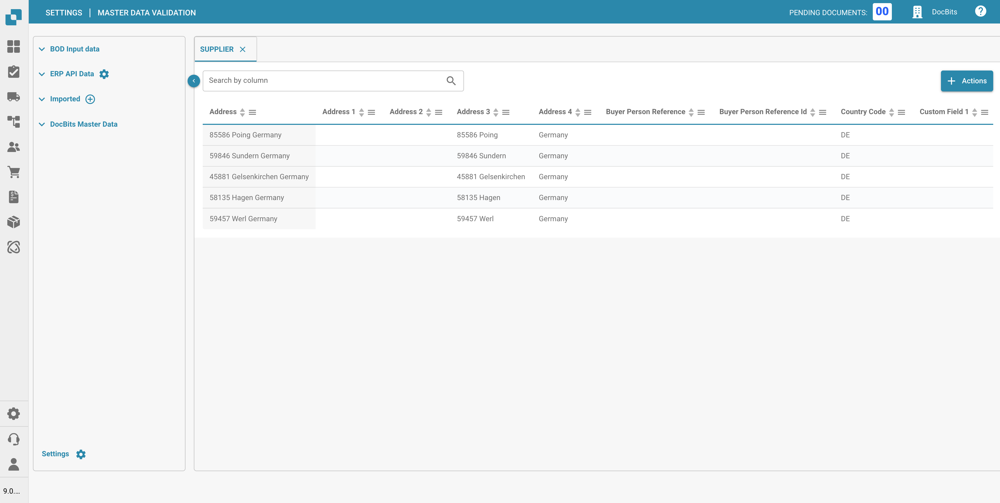
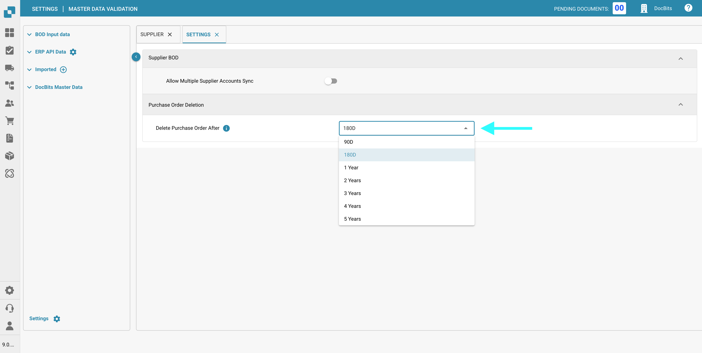

# Ana Veri Arama

## Genel Bakış

Belge işleme ayarlarınızdaki "Ana Veri Arama", belge verilerinizi Infor ERP sisteminizle senkronize ederek yönetmek ve doğrulamak için kapsamlı ve entegre bir yaklaşım sağlar. ERP ortamınızda belge işlemenin doğrulanmasını ve iyileştirilmesini nasıl kolaylaştırdığı aşağıda açıklanmıştır:

1. **Merkezi Veri Yönetimi**: Bu özellik, tedarikçiler, müşteri adresleri, vergi kodları ve daha fazlası gibi çeşitli kaynaklardan gelen verilerin depolanabileceği ve yönetilebileceği merkezi bir havuz görevi görür. Tüm ana veriler için tek bir referans noktası sağlayarak kuruluşunuz genelinde tutarlılık ve doğruluk sağlar.
2. **ERP Verilerine Karşı Doğrulama**: Tedarikçi bilgileri gibi ana verileri Infor'dan DocBits'e senkronize ederek, belgelerden çıkarılan verileri ERP verilerinize karşı otomatik olarak doğrulayabilirsiniz. Bu, işlenen bilgilerin (tedarikçi adları, adresleri ve vergi kodları gibi) ERP sisteminizde tutulan verilerle eşleşmesini sağlayarak hataları ve tutarsızlıkları en aza indirir.
3. **Otomasyonu Kolaylaştırır**: Sağlam bir ana veri arama sistemine sahip olmak, gelen belgelerin işlenmesini otomatikleştirmeye yardımcı olur. Örneğin, satın alma siparişleri veya faturalar tedarikçi verilerinin doğruluğu açısından otomatik olarak kontrol edilebilir, eşleşiyorlarsa onaylanabilir veya tutarsızlıklar bulunursa incelenmek üzere işaretlenebilir.
4. **Veri Bütünlüğünü Artırır**: ERP sisteminizden ana veri aramasına yapılan düzenli güncellemeler, belge işleme için kullanılan verilerin güncel olmasını sağlar. Bu, belgelerin eski bilgilere dayanarak işlenmesi riskini azaltır ve böylece iş işlemlerinin genel bütünlüğünü artırır.
5. **Belge İşlemede Verimlilik**: Doğrudan bağlantılı ve sürekli yenilenen ana verilerle belge işleme daha verimli hale gelir. Belgeler, belirli tedarikçi koşulları veya farklı işlem türleri için geçerli vergi düzenlemeleri gibi ana verilerde belirlenen belirli kriterlere göre otomatik olarak sınıflandırılabilir ve yönlendirilebilir.


Buradan [Ana Verileri Nasıl İçe Aktaracağınızı](../../../infor-integration-and-configuration/importing-customer-master-data/) görün


<figure><figcaption></figcaption></figure>

## **Ana Veri Aramasına Erişim**

**Ana Veri Arama** bölümüne erişmek için şuraya gidin:
**Ayarlar → Belge İşleme → Ana Veri Arama**

<figure><figcaption></figcaption></figure>

## **Ayarlar**

**Ana Veri Arama** ayarlarına erişmek için **Ana Veri Arama** ekranının sol alt köşesindeki **Ayarlar**'a tıklayın.
Aşağıdaki yapılandırma seçenekleri mevcuttur:

<figure><figcaption></figcaption></figure>

### **Tedarikçi BOD**

* **Birden Fazla Tedarikçi Hesabı Senkronizasyonuna İzin Ver**:
  * **Etkin**:
    Tek bir tedarikçinin BOD'de (İş Nesnesi Belgesi) birden fazla `<FinancialParty>` öğesi olabilir, bu genellikle birden fazla ilişkili IBAN veya finansal hesaptan kaynaklanır. Bu ayar etkinleştirildiğinde, tedarikçi için tüm `<FinancialParty>` girişleri çıkarılacak ve tedarikçi tablosuna kaydedilecek, böylece birden fazla finansal özellik saklanabilecektir.
  * **Devre Dışı**:
    BOD'de tedarikçi için bulunan yalnızca son `<FinancialParty>` öğesi çıkarılacaktır. Önceki finansal özellikler (örneğin, ek IBAN'lar) yok sayılacak ve yalnızca son oluşumdan gelen veriler tedarikçi tablosuna kaydedilecektir.

### **Satın Alma Siparişi Silme**

* **Satın Alma Siparişlerini Şu Süreden Sonra Sil**: Kapatılan Satın Alma Siparişlerinin ne zaman silineceğini belirtin. Seçilen zaman aralığından sonra kayıtlar otomatik olarak kaldırılacaktır.

    <figure><figcaption></figcaption></figure>
