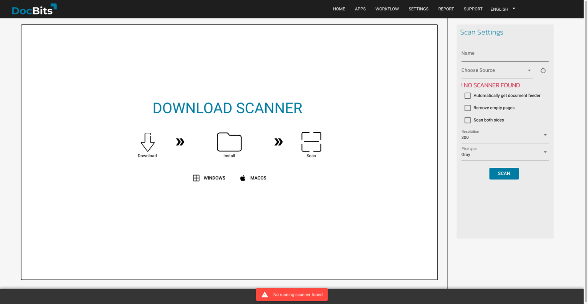

# Module

<figure><figcaption></figcaption></figure>

* **M3 Integration**: Integration with M3, an ERP software solution, allowing seamless interaction between DocBits and M3 for enhanced document management and processing.
* **PO Dashboard**: A centralized dashboard within DocBits specifically designed to manage and monitor purchase orders, providing insights and analytics for efficient tracking and decision-making.
* **Shipment Order Dashboard**: Similar to the PO Dashboard, this feature focuses on managing and monitoring shipment orders, facilitating smooth logistics operations.

<figure><figcaption></figcaption></figure>

<figure><figcaption></figcaption></figure>

* **Auto Accounting**: DocBits offers automated accounting functionality, streamlining the process of handling financial transactions associated with purchase orders (POs) and other documents.

<figure><figcaption></figcaption></figure>

* **Advance Shipment Dashboard**: A specialized dashboard for advanced monitoring and management of shipment-related activities, offering deeper insights and functionalities.
* **Invoice Dashboard:** A specialized dashboard for advanced monitoring and management of invoices-related activities, offering deeper insights and functionalities.

<figure><figcaption></figcaption></figure>

* **Dashboards v2**: An updated version of the dashboard interface, likely with improved user experience and additional features for enhanced usability.
* [**SQL Direct access:** A direct access to the Database.](how-to-create-database-access-for-a-specific-organization-user/)

<figure><figcaption></figcaption></figure>

<figure><figcaption></figcaption></figure>

* **Supplier Portal**: A portal within DocBits dedicated to suppliers, enabling them to interact and collaborate with the system, enhancing communication and efficiency in the supply chain.
* **Workflow Builder**: A tool for creating and customizing workflows within DocBits, allowing users to define specific processes and automate document handling according to their unique business requirements.

**Watch: Enabling Workflow Builder**



* **Run Workflows in Celery:** This feature lets you run workflows in Celery.
* **Layout Builder**: Enables users to design and customize the layout of documents within DocBits, ensuring alignment with branding and usability standards.
* **Inbound Emails:** This feature gives you the ability to handle your Inbound Emails.
* **Annotation Mode**: A feature that allows users to annotate and mark up documents directly within the DocBits interface, facilitating collaboration and feedback.
* **Show report**: Functionality to generate and display reports within DocBits, providing insights and analytics on various aspects of document processing and management.
* **Models & Labels**: Tools for defining and configuring document recognition models and labels within DocBits, enhancing accuracy and efficiency in document processing.
* **Document script**: Likely a feature for scripting and automating specific actions or processes related to document handling within DocBits.
* **Document scan**: Capability to scan physical documents and import them into DocBits for digital processing and management.
* **QR-Code extraction**: A feature for extracting information from QR codes embedded in documents, enabling automated data capture and processing.
* **Custom Master Data**: Allows users to define and manage custom master data fields and attributes within DocBits, tailoring the system to their specific business needs.
* **Tasks & Notifications**: Functionality for managing tasks and receiving notifications within DocBitsGBT, ensuring timely action and communication regarding document processing activities.
* **IDM ACL Updater**: This module likely deals with updating and managing access control lists (ACLs) within DocBits, ensuring proper permissions and security for document access and handling.