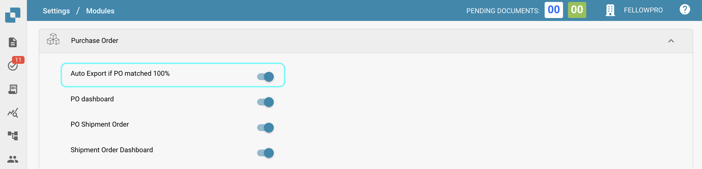

# (Português)

# Auto Export if PO Matched 100%

### Overview

The **Auto Export if PO matched 100%** setting is a feature within the Purchase Order (PO) module that automates the export process when a purchase order matches perfectly with its expected criteria. This functionality is designed to streamline the workflow by reducing manual intervention in the export process, ensuring that perfectly matched purchase orders are handled efficiently.

### What Does It Do?

When this setting is enabled, the system automatically exports the purchase order as soon as it matches 100% with the expected data. This means that if all items, quantities, prices, and other relevant details in the purchase order align with the predefined criteria, the order is immediately processed and exported without requiring additional steps from the user.

### Benefits

* **Efficiency**: By automating the export of perfectly matched POs, this feature saves time and reduces the workload on administrators and users.
* **Accuracy**: Ensures that only those POs which have been verified to match 100% with the expected criteria are exported, reducing the risk of errors.
* **Speed**: The immediate processing of matching POs allows for faster order handling and reduces delays in the supply chain.

### How to Use

1. **Enable the Feature**:
   * Go to Settings
   * Select **Document Processing**.
   * Select **Module**.
   * Navigate to the **Purchase Order**.
   * Activate the **Auto Export if PO matched 100%** by enabling the corresponding slider

<figure><figcaption></figcaption></figure>

1. **Monitoring**:
   * Once enabled, the system will automatically export POs that match 100% with their expected criteria.
   * You can monitor the export activity through the PO dashboard or other related monitoring tools.
2. **Considerations**:
   * Ensure that your PO criteria are correctly defined and accurate to avoid any unwanted exports.
   * Regularly review the POs processed through this feature to ensure that the automation is functioning as expected.

### When to Use This Feature

* **High Volume Processing**: Ideal for environments where a large number of POs are processed regularly, and there is a high confidence in the data matching.
* **Routine Orders**: Useful for standard or routine orders where variations are minimal and accuracy is consistent.
* **Time-Sensitive Orders**: Beneficial when time is of the essence, and you need to expedite the processing of matching POs.
