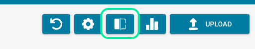
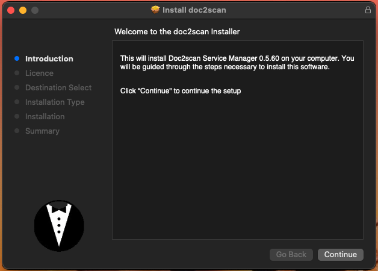

--- 
description: Doc Scan offers very easy Document creation via your local Scanner.
---

# Doc Scan

### Download Scanner Software

Click Scan Document on the DocBits Dashboard

<figure><figcaption></figcaption></figure>

As your scanner is not installed yet, you

<figure><figcaption></figcaption></figure>

Depending on which operating system you use, press the appropriate button to download.

Open the installation file and you will see the following

<figure><figcaption></figcaption></figure>

Click on `Continue`, accept the Software License Agreement with `Agree` and continue to install the software.

Installing this software requires 33,6 MB of space. You can change the install location before clicking `Install` in the next step.

As soon as the following screen is displayed you

<figure><figcaption></figcaption></figure>

Open web browser to test if the app works by entering: https://local.polydocs.io:12500/ If you see this message on the screen, you must first configure some settings in your FritzBox network settings if you are using one.

<figure><figcaption></figcaption></figure>

When you see this screen you are ready to click on DocBits.

<figure><figcaption></figcaption></figure>

You will be redirected to the DocBits login page where you can enter your credentials to access your dashboard.

<figure><figcaption></figcaption></figure>

All you have to do now is activate Doc Scan in the settings under Modules.

<figure><figcaption></figcaption></figure>

### FritzBox network settings

If you get the following error after installing and calling up the url https://local.polydocs.io:12500/, here are the reasons:– DNS resolution of private IP addresses not possible.– DNS resolution for domain names that refer to private IP addresses in the FRITZ!Box home network is not possible via the FRITZ!Box. This means that server services in the FRITZ!Box home network cannot be accessed via the domain name.
You may see one of the following error messages:“DNS timed out”“DNS request timed out”
*Caused*
For security reasons, the FRITZ!Box suppresses DNS responses that refer to IP addresses in your own home network. This is a security feature of the FRITZ!Box to protect against so-called DNS rebinding attacks.
If you use a FritzBox, you must first make the following settings in the FritzBox menu:


1. In the FRITZ!Box user interface, click on `Heimnetz`.
2. `Heimnetz` Click in the menu `Netzwerk`.
3. Click on the tab `Netzwerkeinstellungen`.


In the Hostname exceptions `DNS-Rebind-Schutz section`, enter local.polydocs.io for which DNS rebind protection should not apply. Confirm with .`Übernehmen`

### Uninstall Doc2Scan Service Manager

Run the following command to uninstall Doc2Scan Manager:

```javascript
sudo bash /Library/doc2scan/uninstall.sh
```

Copy

### Scanner Compatability

**Legend:**

* Yes – device works perfectly
* No – protocol not supported by device
* ? – device works with sane-airscan, but protocol is not reported by user
* Space – author has no information on this mode/device combination

**Definitions:**

* eSCL stands for Airscan is a SANE WebScan frontend that supports Apple
* WSD stands for 

| Device                            | eSCL mode | WSD mode |
| --------------------------------- | --------- | -------- |
| Brother ADS-2700W                 | No        | Yes      |
| Brother DCP-7055W                 | No        | Yes      |
| Brother DCP-9020CDW               | No        | Yes      |
| Brother DCP-J552DW                | No        | Yes      |
| Brother DCP-L2540DW               | No        | Yes      |
| Brother DCP-L2550DN / DCP-L2550DW | Yes       |          |
| Brother HL-L2380DW series         | No        | Yes      |
| Brother HL-L2395DW series         | Yes       |          |
| Brother MFC-7360N                 | No        | Yes      |
| Brother MFC-8710DW                | No        | Yes      |

Showing 1 to 10 of 151 entriesPreviousNext