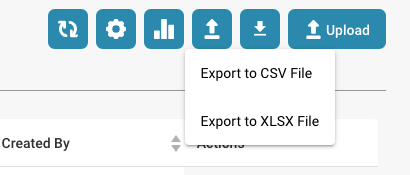

# Export Dashboard Data

1.  **Navigate to Settings**: Go to **Settings → Module**.\

    <figure><figcaption></figcaption></figure>
2.  **Enable Export Dashboard Data**: Locate and activate the **Export Dashboard Data** option.\

    <figure><figcaption></figcaption></figure>
3. **Export Dashboard**: Once enabled, a button will appear on the dashboard, allowing you to export the data as a CSV file.

<figure><figcaption></figcaption></figure>

<figure><figcaption></figcaption></figure>