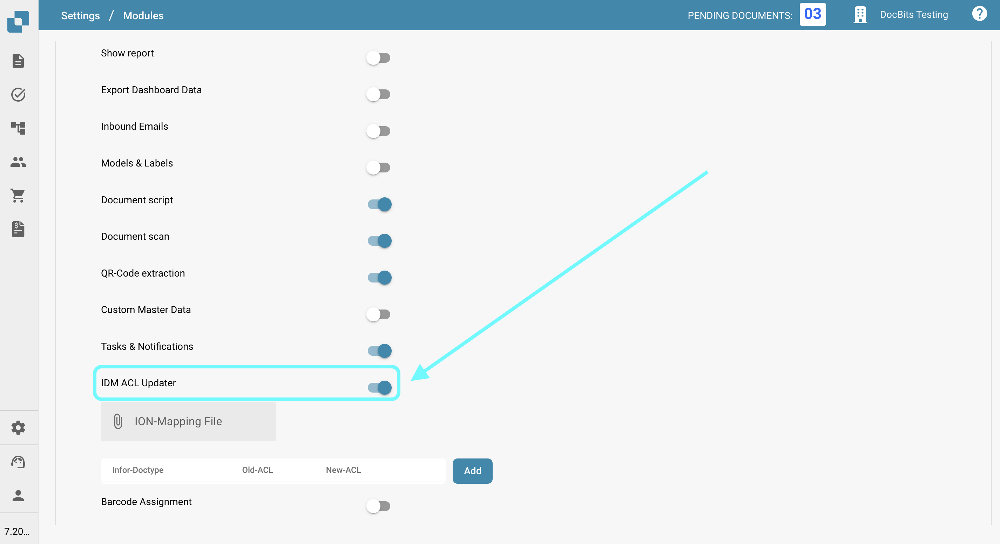
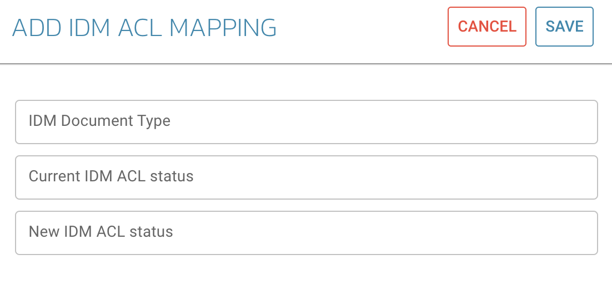

# IDM ACL Updater

## Przegląd

Moduł ACL-Updater jest odpowiedzialny za aktualizację i zarządzanie Listami Kontroli Dostępu (ACL) w DocBits. Zapewnia to, że odpowiednie uprawnienia i środki bezpieczeństwa są wdrożone w celu dostępu do dokumentów i ich obsługi.

## Instrukcje aktywacji

Aby aktywować moduł ACL-Updater, wykonaj następujące kroki:

1. Przejdź do **Ustawienia**.
2. Wybierz **Przetwarzanie dokumentów**.
3. Wybierz **Moduł**.
4. Przejdź do **Typ dokumentu**.
5. Aktywuj **IDM ACL-Updater**, włączając odpowiedni suwak.

Po aktywacji modułu możesz wybrać **Plik mapowania ION**, który chcesz użyć.

<figure><figcaption></figcaption></figure>

### Dodawanie informacji o ACL

Aby dodać informacje o ACL, kliknij przycisk **Dodaj**. Następnie możesz określić następujące szczegóły:

* **Typ dokumentu IDM**
* **Aktualny status ACL IDM**
* **Nowy status ACL IDM**

<figure><figcaption></figcaption></figure>
