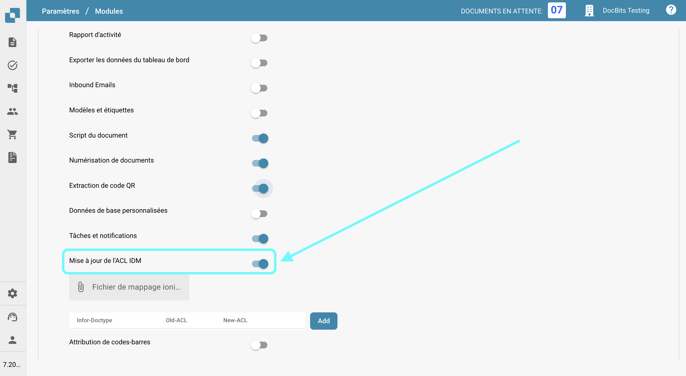
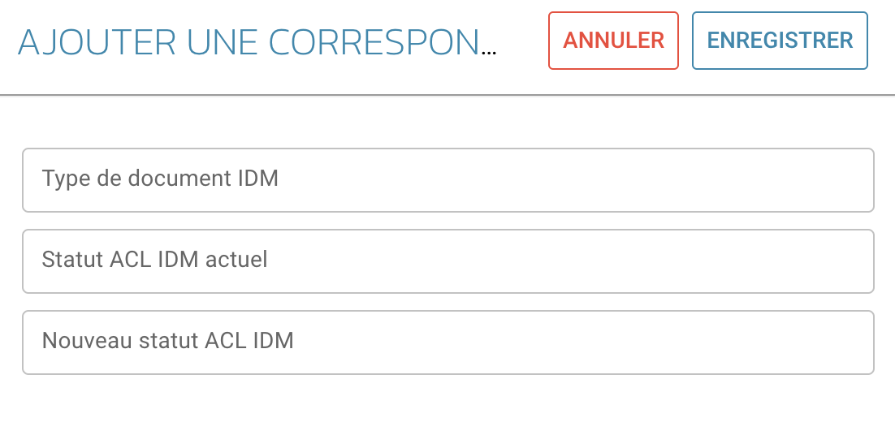

# Mise à jour de l'ACL IDM

## Aperçu

Le module ACL-Updater est responsable de la mise à jour et de la gestion des listes de contrôle d'accès (ACL) au sein de DocBits. Cela garantit que les autorisations appropriées et les mesures de sécurité sont en place pour l'accès et le traitement des documents.

## Instructions d'activation

Pour activer le module ACL-Updater, suivez ces étapes :

1. Accédez à **Paramètres**.
2. Sélectionnez **Traitement des documents**.
3. Sélectionnez **Module**.
4. Allez à **Type de document**.
5. Activez le **Mise à jour de l'ACL IDM** en activant le curseur correspondant.

Une fois le module activé, vous pouvez sélectionner un **Fichier de mappage ION** à utiliser.

<figure><figcaption></figcaption></figure>

### Ajout d'informations ACL

Pour ajouter des informations ACL, cliquez sur le bouton **Ajouter**. Vous pouvez ensuite spécifier les détails suivants :

* **Type de document IDM**
* **Statut ACL IDM actuel**
* **Nouveau statut ACL IDM**

<figure><figcaption></figcaption></figure>
