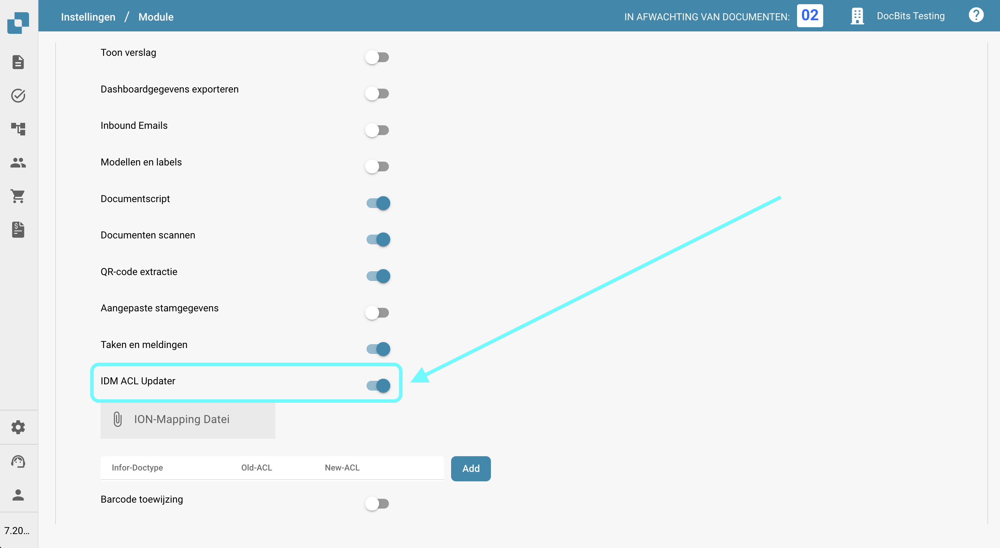

# IDM ACL Updater

## Overzicht

De ACL-Updater module is verantwoordelijk voor het bijwerken en beheren van Access Control Lists (ACL's) binnen DocBits. Dit zorgt ervoor dat de juiste machtigingen en beveiligingsmaatregelen aanwezig zijn voor documenttoegang en -verwerking.

## Activatie-instructies

Om de ACL-Updater module te activeren, volg je deze stappen:

1. Navigeer naar **Instellingen**.
2. Selecteer **Documentverwerking**.
3. Selecteer **Module**.
4. Ga naar **Documenttype**.
5. Activeer de **IDM ACL-Updater** door de bijbehorende schuifregelaar in te schakelen.

Zodra de module is geactiveerd, kun je een **ION Mapping File** selecteren om te gebruiken.

<figure><figcaption></figcaption></figure>

### ACL-informatie toevoegen

Om ACL-informatie toe te voegen, klik je op de **Toevoegen** knop. Je kunt vervolgens de volgende details opgeven:

* **IDM Document Type**
* **Current IDM ACL status**
* **New IDM ACL status**

<figure><figcaption></figcaption></figure>
