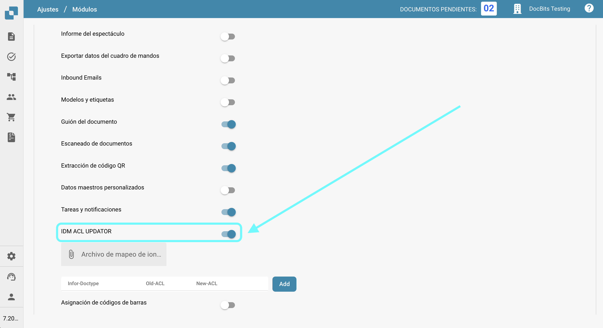
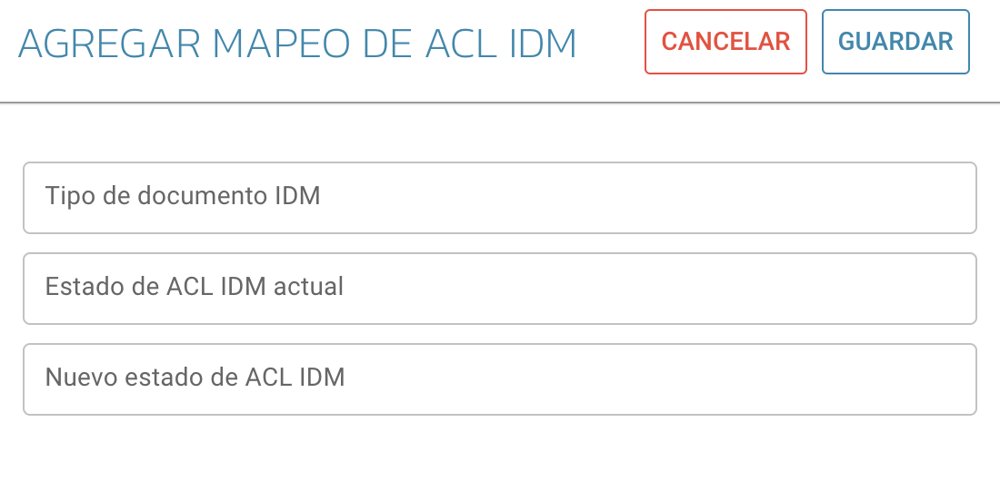

# IDM ACL Updater

## Descripción general

El módulo ACL-Updater es responsable de actualizar y gestionar las Listas de Control de Acceso (ACL) dentro de DocBits. Esto asegura que se implementen los permisos y medidas de seguridad apropiados para el acceso y manejo de documentos.

## Instrucciones de activación

Para activar el módulo ACL-Updater, sigue estos pasos:

1. Navega a **Ajustes**.
2. Selecciona **Procesamiento de Documentos**.
3. Selecciona **Módulo**.
4. Ve a **Tipo de Documento**.
5. Activa el **IDM ACL-UPDATOR** habilitando el control deslizante correspondiente.

Una vez que el módulo esté activado, puedes seleccionar un **Archivo de Mapeo ION** para usar.

<figure><figcaption></figcaption></figure>

### Agregar información de ACL

Para agregar información de ACL, haz clic en el botón **Agregar**. Luego puedes especificar los siguientes detalles:

* **Tipo de documento IDM**
* **Estado de ACL IDM actual**
* **Nuevo estado de ACL IDM**

<figure><figcaption></figcaption></figure>
