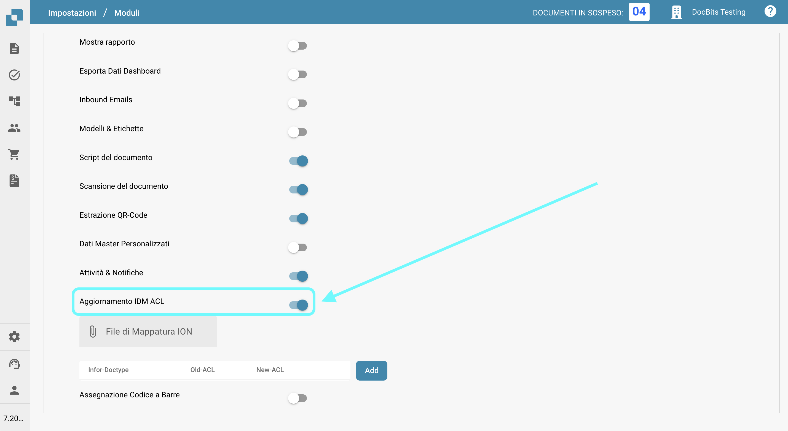
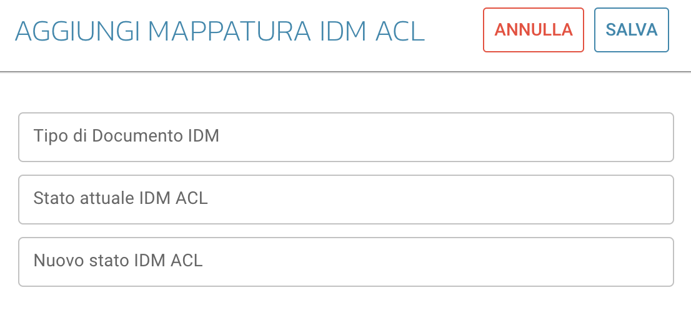

# Aggiornamento IDM ACL

## Panoramica

Il modulo ACL-Updater è responsabile dell'aggiornamento e della gestione delle Liste di Controllo degli Accessi (ACL) all'interno di DocBits. Questo garantisce che siano in atto le autorizzazioni appropriate e le misure di sicurezza per l'accesso e la gestione dei documenti.

## Istruzioni per l'attivazione

Per attivare il modulo ACL-Updater, segui questi passaggi:

1. Naviga su **Impostazioni**.
2. Seleziona **Elaborazione Documenti**.
3. Seleziona **Modulo**.
4. Vai su **Tipo di Documento**.
5. Attiva l'**Aggiornamento IDM ACL** abilitando il cursore corrispondente.

Una volta attivato il modulo, puoi selezionare un **File di Mappatura ION** da utilizzare.

<figure><figcaption></figcaption></figure>

### Aggiunta di informazioni ACL

Per aggiungere informazioni ACL, fai clic sul pulsante **Aggiungi**. Puoi quindi specificare i seguenti dettagli:

* **Tipo di Documento IDM**
* **Stato attuale IDM ACL**
* **Nuovo stato IDM ACL**

<figure><figcaption></figcaption></figure>
