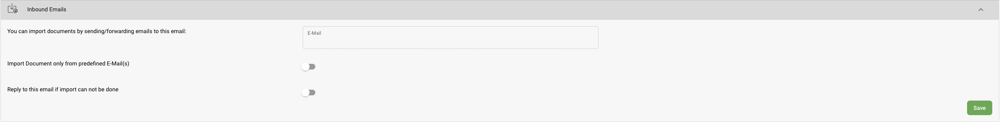
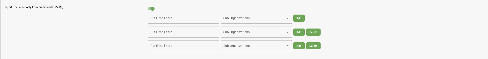

# Gelen E-postalar

## Belge İşleme için Gelen E-postayı Aktive Etme

Belge işleme için gelen e-postayı kullanmaya başlamak için şu adımları izleyin:

1. **Ayarlar'a Gidin**: Uygulamanın **Ayarlar** menüsüne giderek başlayın.
2. **Belge İşleme'yi Seçin**: Ayarlar altında, ilgili yapılandırma seçeneklerine erişmek için **Belge İşleme**'yi seçin.
3. **Modülleri Açın**: Belge İşleme bölümünde **Modüller**'e tıklayın.
4. **Belge Türü'ne Gelin**: **Belge Türü**'nü bulana kadar aşağı kaydırın.
5. **Gelen E-postayı Aktive Edin**: **Gelen E-posta**'yı bulun ve düğmeyi kaydırarak aktive edin.

<figure><figcaption></figcaption></figure>

## Belge İçe Aktarımı için Gelen E-postayı Yapılandırma

<figure><figcaption></figcaption></figure>

Gelen e-postayı aktive ettikten sonra, belgelerin nasıl içe aktarılacağını kontrol etmek için ayarları yapılandırın. İşte nasıl yapılacağı:

1. **Belge İşleme'ye Geri Dönün**: Ayarlarda **Belge İşleme**'ye gidin.
2. **İçe Aktar'ı Seçin**: Gelen e-posta ayarlarına erişmek için **İçe Aktar**'ı (Import) seçin.

    Şu seçenekleri göreceksiniz:

    * **E-posta Alanı**: Bu alan, kuruluş kimliğinize dayalı, sistem tarafından oluşturulan benzersiz bir e-posta adresini görüntüler. Biçim şöyledir: `org_id@environment.inbound.docbits.com`. Otomatik içe aktarım için belgelerin bulunduğu e-postaları bu adrese gönderin veya yönlendirin.
    * **Belgeyi Yalnızca Önceden Tanımlanmış E-postalardan İçe Aktar**: İçe aktarımları yalnızca belirli, önceden tanımlanmış adreslerden alınan e-postalarla kısıtlamak için bu seçeneği açın.
    * **İçe Aktarım Yapılamazsa Bu E-postaya Yanıt Ver**: İçe aktarma girişimi başarısız olduğunda sistemin otomatik olarak yanıt vermesini istiyorsanız bu seçeneği açın.
3. **Ayarları Kaydet**: Bu seçenekleri yapılandırdıktan sonra, uygulamak için **Kaydet**'e tıklayın.

## Önceden Tanımlanmış E-postalar

<figure><figcaption></figcaption></figure>

**Belgeyi Yalnızca Önceden Tanımlanmış E-postalardan İçe Aktar** seçeneği etkinleştirildiğinde, gelen e-postaya belge göndermeye hangi e-postaların yetkili olduğunu yönetebilirsiniz.

1. **Yetkili E-postaları Girin**: **E-postayı buraya yazın** alanına yetkilendirmek istediğiniz her bir e-posta adresini yazın.
2. **Alt Kuruluşa Ata (İsteğe Bağlı)**:
   * Herhangi bir alt kuruluş seçilmezse, belge ana kuruluşa atanacaktır.
   * Bir alt kuruluş seçilirse, belge yalnızca o alt kuruluşa yönlendirilecektir.
3. **E-posta Ekle**: Her bir e-postayı yetkili adresler listesine kaydetmek için **Ekle**'ye tıklayın.
4. **E-posta Sil**: Yetkili bir e-postayı kaldırmak için e-posta girişinin yanındaki **Sil**'e tıklayın.

Bu kurulumla, yetkisiz e-posta adreslerinden gelen belgeler yoksayılacak ve içe aktarım için yalnızca belirli kaynakların belge gönderebilmesi sağlanacaktır.

## **İçe aktarım yapılamazsa bu e-postaya yanıt ver**

<figure><figcaption></figcaption></figure>

**İçe aktarım yapılamazsa bu e-postaya yanıt ver** seçeneğini etkinleştirirseniz, e-posta adresi girebileceğiniz ek bir alan görünür. Bu e-posta adresi, herhangi bir belge içe aktarma girişimi başarısız olursa bildirim alacak ve içe aktarma sürecindeki sorunlardan haberdar olmanızı sağlayacaktır.

1. **Hata Bildirimini Etkinleştir**: **İçe aktarım yapılamazsa bu e-postaya yanıt ver** seçeneğini açın.
2. **Bildirim E-postasını Girin**: Yeni alana, hata bildirimlerini almak istediğiniz e-posta adresini girin.

Bu özellik etkinleştirildiğinde, başarısız olan tüm içe aktarma girişimleri belirtilen e-postaya otomatik bir yanıt göndererek içe aktarma sorunlarını hızlı bir şekilde çözmenize yardımcı olacaktır.

**Tüm ayarları yapılandırdıktan sonra, değişikliklerinizi uygulamak için Kaydet'e tıklamayı unutmayın.**
