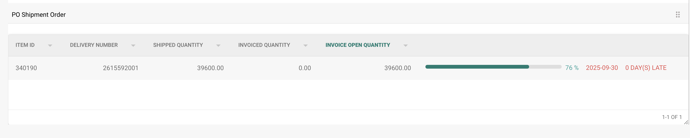

# Satın Alma Siparişi Sevkiyat Siparişi Ayarı

## **Genel Bakış**

**PO Sevkiyat Siparişi** bölümü, eşleşen Satın Alma Siparişi (PO) kalemleri için teslimat ve faturalama durumunun bir dökümünü sağlar. Bu özellik etkinleştirildiğinde, **Satın Alma Siparişi Eşleştirme** ekranında bu bölüm görünür.

## **Nasıl Etkinleştirilir**

Bu özelliği aktive etmek için:

1. **Ayarlar** → **Belge İşleme** → **Modül**'e gidin.
2. **Satın Alma Siparişi**'ni (Purchase Order) seçin.
3. **PO Sevkiyat Siparişi** (PO Shipment Order) seçeneğini etkinleştirin.

    
    
<figure><figcaption></figcaption></figure>

## **Nerede Görünür**

Etkinleştirildiğinde, PO Sevkiyat Siparişi bölümü Satın Alma Siparişi Eşleştirme arayüzünde görünür hale gelir.

<figure><figcaption></figcaption></figure>

### **PO Sevkiyat Siparişi – Alan Açıklamaları**

* **Kalem Kimliği** (Item ID)
    Satın alma siparişindeki belirli kalemi tanımlar.
* **Teslimat Numarası** (Delivery Number)
    Sevkiyat veya teslimat için referans numarası.
* **Sevk Edilen Miktar** (Shipped Quantity)
    Teslim edilen veya alınan miktar.
* **Faturalanan Miktar** (Invoiced Quantity)
    Zaten faturalanmış olan miktar.
* **Fatura Açık Miktarı** (Invoice Open Quantity)
    Hala faturalanmayı bekleyen miktar (_Sevk Edilen Miktar – Faturalanan Miktar_ olarak hesaplanır).
* **İlerleme Çubuğu ve Yüzde**
    * Sevk edilen miktarın ne kadarının faturalarla eşleştiğini gösterir.
    * Yeni PO'lar için %0'dan başlar.
    * Birden fazla fatura genelinde kümülatif olarak güncellenir.
    * Faturalanan kalemlerin sevk edilen kalemlere göre toplam ilerlemesini yansıtır.
* **Söz Verilen Teslim Tarihi** (Promised Delivery Date)
    PO kalemi için beklenen teslimat tarihi.
*   **Gecikme Göstergesi** (Late Indicator)

    **Söz Verilen Teslim Tarihi**'ne göre teslimatın geciktiği gün sayısını görüntüler.
