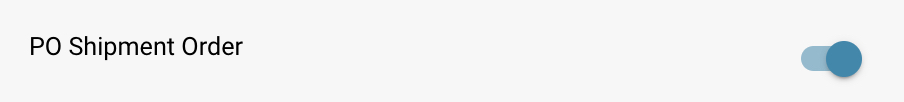

# PO Shipment Order Setting

## **Overview**

The **PO Shipment Order** section provides a breakdown of delivery and invoicing status for matched Purchase Order items. This section appears within the **Purchase Order Matching** screen when the feature is enabled.

## **How to Enable**

To activate this feature:

1. Go to **Settings** → **Document Processing** → **Module**.
2. Select **Purchase Order**.
3.  Enable the **PO Shipment Order** option.\
    \

    
<figure><figcaption></figcaption></figure>

## **Where It Appears**

Once enabled, the PO Shipment Order section becomes visible in the Purchase Order Matching interface.

<figure><figcaption></figcaption></figure>

### **PO Shipment Order – Field Descriptions**

* **Item ID**\
  Identifies the specific item in the purchase order.
* **Delivery Number**\
  Reference number for the shipment or delivery.
* **Shipped Quantity**\
  Quantity that has been delivered or received.
* **Invoiced Quantity**\
  Quantity that has already been invoiced.
* **Invoice Open Quantity**\
  Quantity still open for invoicing (calculated as _Shipped Quantity – Invoiced Quantity_).
* **Progress Bar and Percentage**
  * Shows how much of the shipped quantity has been matched with invoices.
  * Starts at 0% for new POs.
  * Updates cumulatively across multiple invoices.
  * Reflects total progress of invoiced vs. shipped items.
* **Promised Delivery Date**\
  The expected delivery date for the PO item.
*   **Late Indicator**

    Displays the number of days the delivery is late based on the **Promised Delivery Date**.
