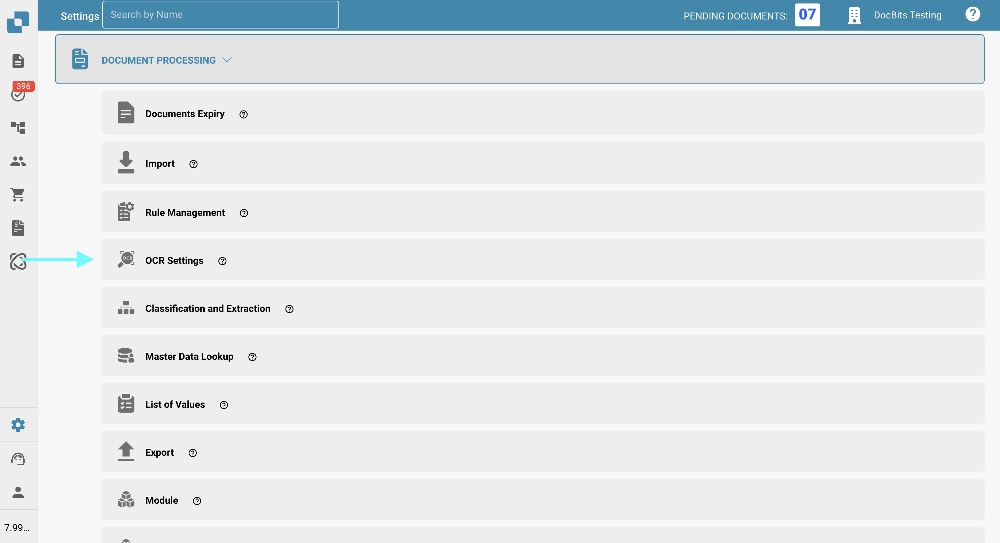
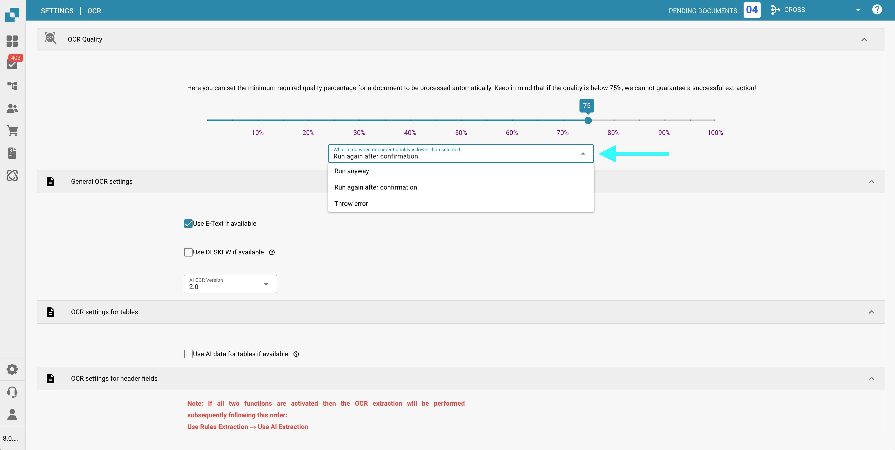
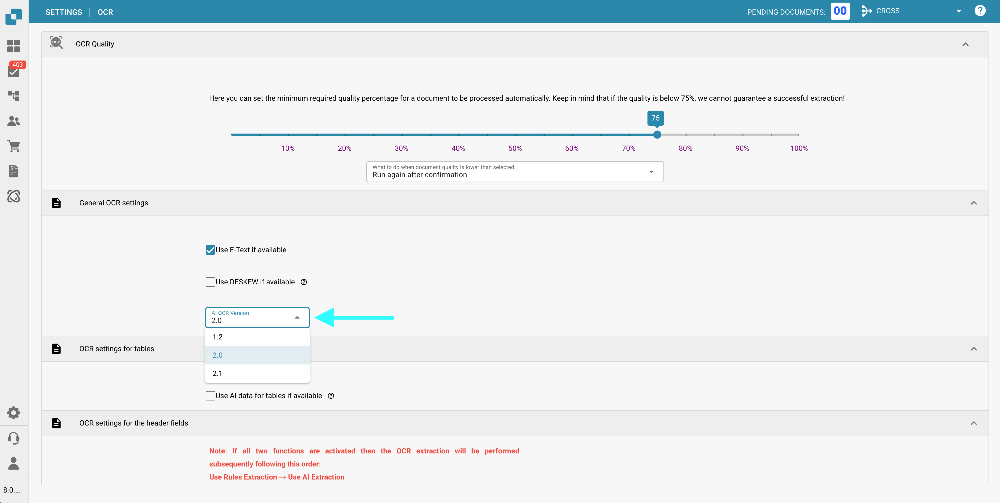

# (Français)

# OCR Settings

## Overview

In the **OCR (Optical Character Recognition)** settings, you can configure how OCR is applied during document processing. This includes specifying the minimum required quality, choosing whether to use embedded text (e-text), selecting the OCR version, and more. This page provides a detailed explanation of all available settings.

## How to Access OCR Settings

To access the OCR settings:

*   Navigate to: **Settings** → **Document Processing** → **OCR Settings**

    <figure><figcaption></figcaption></figure>

## OCR Quality

In this section, you can set the minimum document quality required for OCR processing by adjusting the quality slider. Move the slider left or right to decrease or increase the quality threshold, respectively.

If a document does not meet the defined quality level, DocBits provides three options for handling it:

* **Run Anyway**\
  The document will be processed regardless of its quality.
* **Run Again After Confirmation**\
  **DocBits** will pause and prompt you to confirm whether to proceed with processing.
* **Throw Error**\
  Document processing will stop entirely, and an error message will be displayed, indicating that the document did not meet the required quality threshold.

<figure><figcaption></figcaption></figure>

## General OCR Settings

* **Use E-Text if Available**\
  When enabled, **DocBits** will use embedded electronic text (e.g., from PDFs) instead of performing OCR. This improves both speed and accuracy, as the text is extracted directly without requiring OCR processing.
* **Use DESKEW if Available**\
  This option automatically corrects the alignment of scanned documents. Straightening skewed images helps improve OCR accuracy.
*   **AI OCR Version**\
    Allows you to select a specific version of the AI-based OCR engine.\
    This can be useful if:

    * You are not achieving the desired results with the currently selected version.
    * You are troubleshooting issues related to OCR performance or accuracy.

    <figure><figcaption></figcaption></figure>

## OCR Settings for Tables

* **Use AI Data for Tables if Available**\
  When enabled, DocBits will use OCR data for tables instead of embedded electronic text (E-Text) — even if the **Use E-Text if Available** setting is turned on.

## OCR Settings for Header Fields

* **Use Rules Extraction**\
  DocBits will apply your predefined extraction rules for identifying header fields.
* **Use AI Extraction**\
  DocBits will use AI to automatically detect and extract header fields.

**Execution Order:**\
If both options are enabled, **DocBits** will perform extraction in the following order:\
**Rules Extraction → AI Extraction**\
\
<mark style="color:red;">**Note**</mark>: For best results and consistent behavior, enable both options. This allows **DocBits** to use both rule-based and AI-based methods in combination during header extraction.
