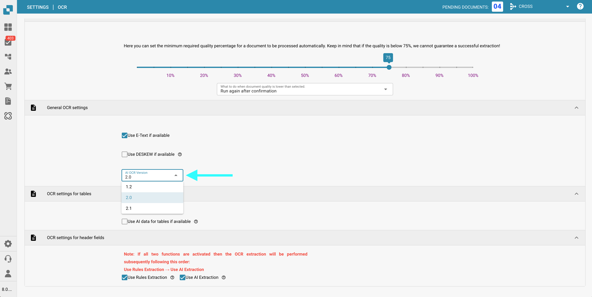

# OCR Ayarları

## Genel Bakış

**OCR (Optik Karakter Tanıma)** ayarlarında, belge işleme sırasında OCR'nin nasıl uygulanacağını yapılandırabilirsiniz. Bu, gerekli minimum kaliteyi belirtmeyi, gömülü metnin (e-text) kullanılıp kullanılmayacağını seçmeyi, OCR sürümünü seçmeyi ve daha fazlasını içerir. Bu sayfa, mevcut tüm ayarların ayrıntılı bir açıklamasını sağlar.

## OCR Ayarlarına Nasıl Erişilir

OCR ayarlarına erişmek için:

*   Şuraya gidin: **Ayarlar** → **Belge İşleme** → **OCR Ayarları**

    <figure><figcaption></figcaption></figure>

## OCR Kalitesi

Bu bölümde, kalite kaydırıcısını ayarlayarak OCR işlemi için gereken minimum belge kalitesini belirleyebilirsiniz. Kalite eşiğini sırasıyla azaltmak veya artırmak için kaydırıcıyı sola veya sağa hareket ettirin.

Bir belge belirlenen kalite seviyesini karşılamıyorsa, DocBits bunu işlemek için üç seçenek sunar:

* **Yine de Çalıştır** (Run Anyway)
  Belge, kalitesine bakılmaksızın işlenecektir.
* **Onaydan Sonra Tekrar Çalıştır** (Run Again After Confirmation)
  **DocBits** duraklayacak ve işleme devam edip etmeyeceğinizi onaylamanızı isteyecektir.
* **Hata Ver** (Throw Error)
  Belge işleme tamamen duracak ve belgenin gerekli kalite eşiğini karşılamadığını belirten bir hata mesajı görüntülenecektir.

<figure><figcaption></figcaption></figure>

## Genel OCR Ayarları

* **Varsa E-Metni Kullan** (Use E-Text if Available)
  Etkinleştirildiğinde, **DocBits** OCR gerçekleştirmek yerine gömülü elektronik metni (örneğin PDF'lerden) kullanacaktır. Bu, metin OCR işlemi gerektirmeden doğrudan çıkarıldığı için hem hızı hem de doğruluğu artırır.
* **Varsa DESKEW Kullan** (Use DESKEW if Available)
  Bu seçenek, taranmış belgelerin hizalamasını otomatik olarak düzeltir. Eğik görüntülerin düzeltilmesi OCR doğruluğunu artırmaya yardımcı olur.
*   **AI OCR Sürümü** (AI OCR Version)
    AI tabanlı OCR motorunun belirli bir sürümünü seçmenize olanak tanır.
    Bu şu durumlarda yararlı olabilir:

    * Şu anda seçili olan sürümle istenen sonuçları elde edemiyorsanız.
    * OCR performansı veya doğruluğu ile ilgili sorunları gideriyorsanız.

    <figure><figcaption></figcaption></figure>

## Tablolar için OCR Ayarları

* **Tablolar için Varsa AI Verilerini Kullan** (Use AI Data for Tables if Available)
  Etkinleştirildiğinde, DocBits tablolar için gömülü elektronik metin (E-Metin) yerine OCR verilerini kullanacaktır — **Varsa E-Metni Kullan** ayarı açık olsa bile.

## Başlık Alanları için OCR Ayarları

* **Kural Çıkarımını Kullan** (Use Rules Extraction)
  DocBits, başlık alanlarını tanımlamak için önceden tanımlanmış çıkarım kurallarınızı uygulayacaktır.
* **AI Çıkarımını Kullan** (Use AI Extraction)
  DocBits, başlık alanlarını otomatik olarak algılamak ve çıkarmak için AI kullanacaktır.

**Yürütme Sırası:**
Her iki seçenek de etkinse, **DocBits** çıkarımı şu sırayla gerçekleştirecektir:
**Kural Çıkarımı → AI Çıkarımı**

<mark style="color:red;">**Not**</mark>: En iyi sonuçlar ve tutarlı davranış için her iki seçeneği de etkinleştirin. Bu, **DocBits**'in başlık çıkarımı sırasında hem kural tabanlı hem de AI tabanlı yöntemleri kombinasyon halinde kullanmasına olanak tanır.
