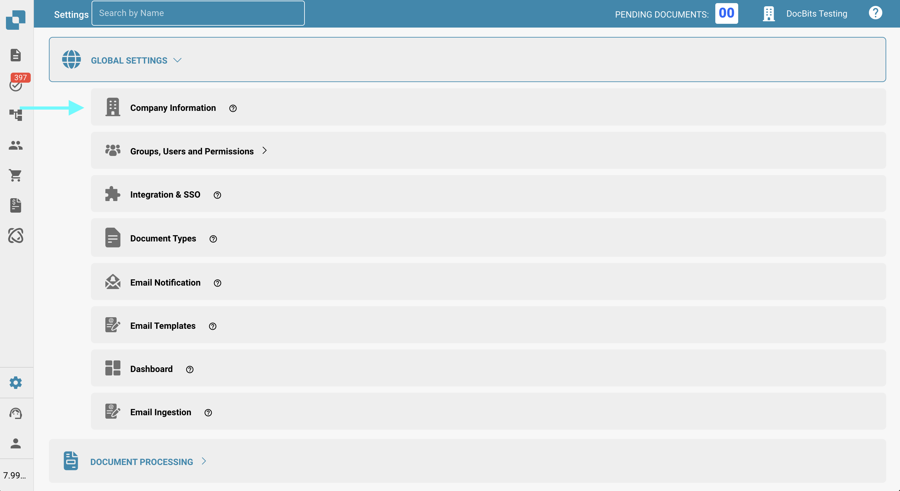
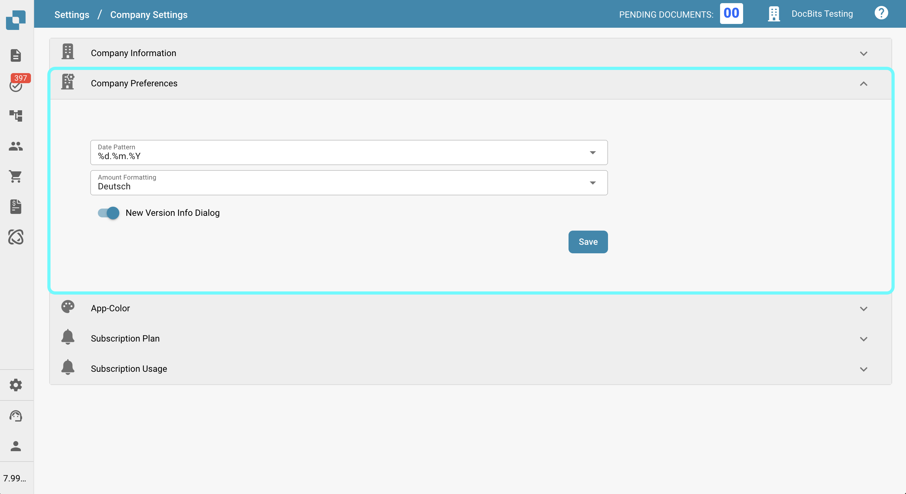
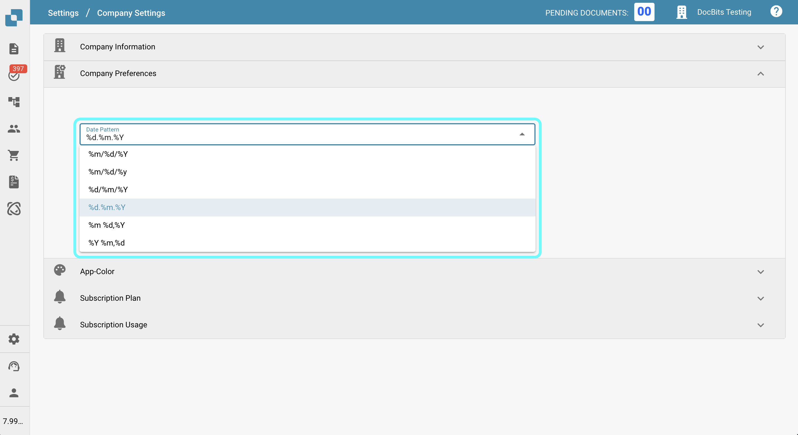
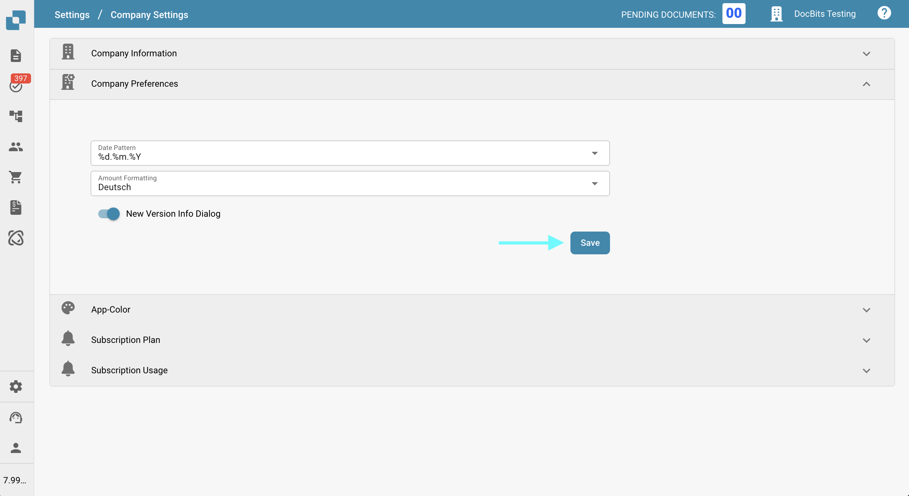
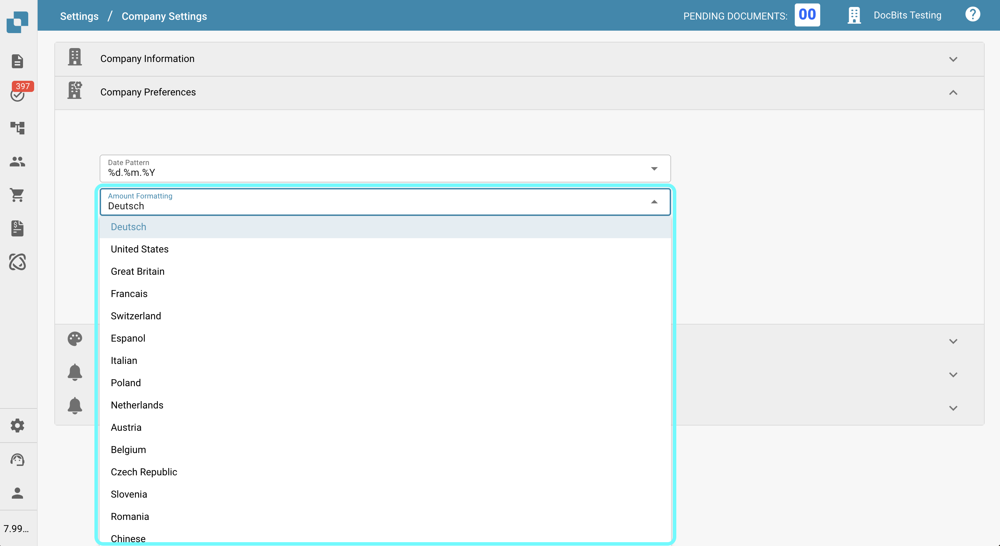
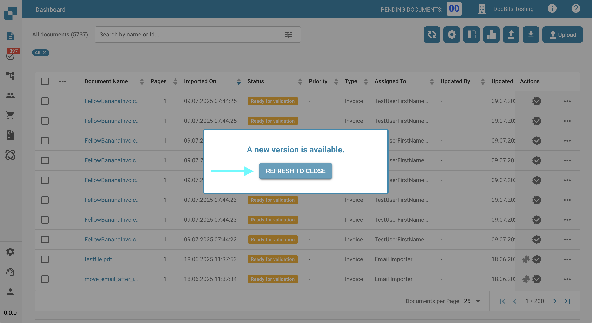

# Company Preferences

## Overview



In the **Company Preferences**, you can configure key formatting and notification settings for the application. These include:

* Choosing the **date pattern** to be used throughout the application
* Setting the **amount formatting** (e.g., decimal separators, digit grouping)
* Enabling or disabling push-up notifications when a new update is available

## How to Access

To access the **Company Preferences**:

1.  Navigate to **Settings** → **Global Settings** → **Company Information**

    <figure><figcaption></figcaption></figure>
2.  Scroll to the **Company Preferences** section

    <figure><figcaption></figcaption></figure>

## Date Pattern

In this setting, you can choose the **date format** to be used throughout **DocBits**. Several formatting options are available, allowing you to customize how dates are displayed.

<figure><figcaption></figcaption></figure>

The following placeholders are used in the date pattern:

* `%d` – Day (e.g., 07)
* `%m` – Month (e.g., 07)
* `%Y` – Full year (e.g., 2025)
* `%y` – Two-digit year (e.g., 25)

#### **Example formats:**

* `%d.%m.%Y` → 07.07.2025
* `%m/%d/%y` → 07/07/25

Select the format that best fits your organizational or regional requirements.

After making your changes, click the **Save** button in the bottom-right corner to apply them.

<figure><figcaption></figcaption></figure>

## Amount Formatting

This setting allows you to define how amounts are formatted throughout the application—for example, whether to use a comma ( , ) or period ( . ) as the decimal separator.

#### **Example formats:**

* `1,000.00` (US format)
* `1.000,00` (European format)

<figure><figcaption></figcaption></figure>

After making your changes, click the **Save** button in the bottom-right corner to apply them.

<figure><figcaption></figcaption></figure>

<mark style="color:red;">**Note**</mark>: This setting controls how amounts are displayed throughout **DocBits**. The **amount format** in the **Field Validation screen** is determined by the document’s **origin** setting.

## New Version Info Dialog

This setting allows you to enable a popup notification when a new version of the application is released. When activated, a dialog will automatically appear if an update is available. To apply the update:

<figure><figcaption></figcaption></figure>

Click **Refresh to Close** in the dialog window. **DocBits** will reload and open with the most recent version. This ensures users are always working with the latest features, improvements, and bug fixes.

After toggling the setting on or off, click the **Save** button in the bottom-right corner to apply your changes.

<figure><figcaption></figcaption></figure>
