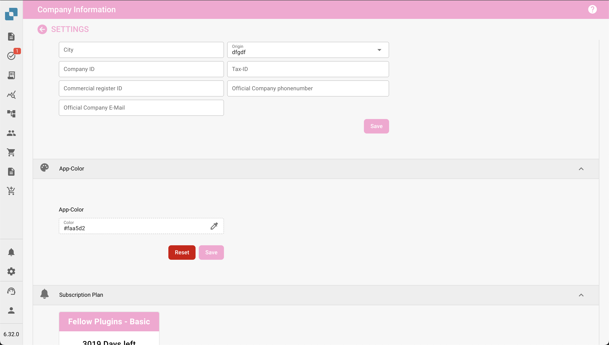

# Definir el Color de la Aplicación en la Configuración de la Empresa

## Descripción General

La configuración de **Color de la Aplicación** permite a los administradores definir el esquema de color de la interfaz de la aplicación. Esta función es particularmente útil para distinguir entre diferentes entornos como pruebas, sandbox y producción. Al asignar colores distintos a cada entorno, los usuarios pueden identificar fácilmente en qué entorno están trabajando, reduciendo el riesgo de realizar acciones críticas en el entorno equivocado.

<figure><figcaption></figcaption></figure>

## Acceder a la Configuración de Color de la Aplicación

1. **Navegar a la Configuración de la Empresa**:
   * Desde el menú principal, haga clic en la sección **Información de la Empresa**.
2. **Localizar la Sección de Color de la Aplicación**:
   * Desplácese hacia abajo hasta la sección **Color de la Aplicación** dentro de la configuración de Información de la Empresa.

## Establecer el Color de la Aplicación

1. **Elegir un Color**:
   * Haga clic en el cuadro de color o ingrese un código hexadecimal directamente en el campo de texto.
   * Aparecerá un selector de color, permitiéndole seleccionar el color deseado.
   * Puede ingresar un código hexadecimal específico si tiene un color predeterminado para el entorno.
2. **Guardar el Color**:
   * Una vez que haya seleccionado el color, haga clic en el botón **Guardar** para aplicar el cambio.
   * La interfaz de la aplicación se actualizará inmediatamente para reflejar el nuevo color.
3. **Restablecer a Predeterminado**:
   * Si desea volver al color predeterminado, haga clic en el botón **Restablecer**.

## Mejores Prácticas para Colores de Entorno

Para evitar confusiones, se recomienda establecer un esquema de color estándar para cada entorno:

* **Producción**: Use un color neutral o predeterminado, como **#FFFFFF** (blanco) o **#f0f0f0** (gris claro), para indicar el entorno en vivo.
* **Pruebas**: Use un color brillante o de alerta, como **#ffcc00** (amarillo) o **#ffa500** (naranja), para indicar un entorno de pruebas.
* **Sandbox**: Use un color distinto, como **#007bff** (azul) o **#6c757d** (gris), para indicar un entorno de sandbox o desarrollo.

## Aviso del Plan de Suscripción

Debajo de la sección de Color de la Aplicación, los administradores también verán información relacionada con el **Plan de Suscripción**. Esto incluye el plan actual, su estado y los días restantes de suscripción.

## Importancia del Color de la Aplicación

La configuración de Color de la Aplicación es una herramienta simple pero efectiva para ayudar a los usuarios a reconocer rápidamente el entorno en el que están trabajando. Al seleccionar y gestionar cuidadosamente estos colores, las organizaciones pueden minimizar errores y mejorar la eficiencia del flujo de trabajo.
