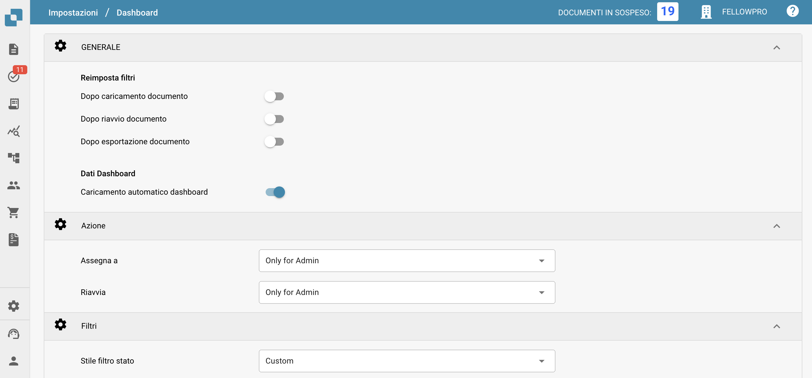
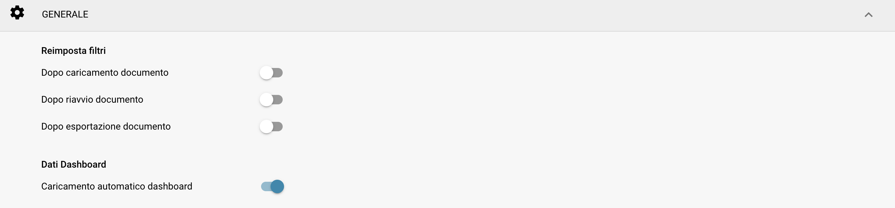
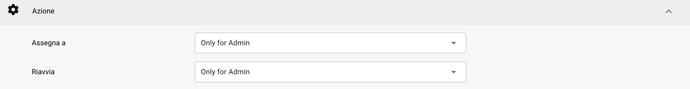
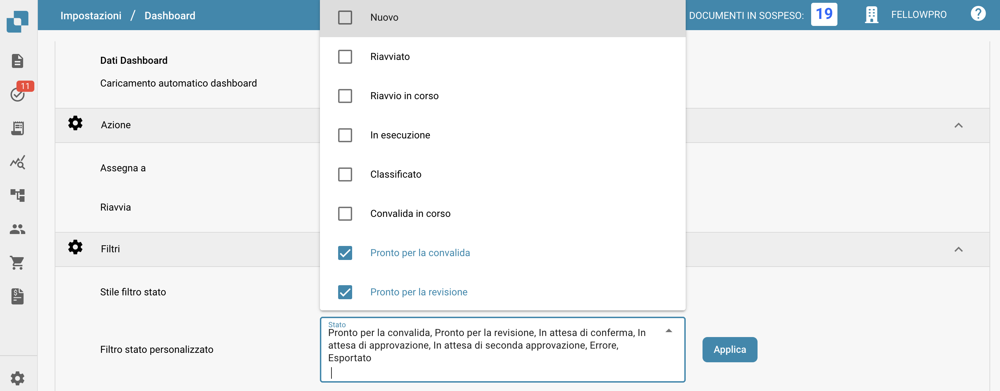
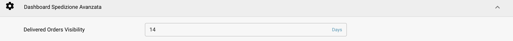

# Dashboard

## Panoramica

Le impostazioni del Dashboard sono progettate per aiutare gli amministratori a controllare la presentazione dei dati e l'interazione all'interno del dashboard di DocBits. Queste impostazioni determinano quali informazioni sono immediatamente disponibili al momento del login, garantendo che gli utenti abbiano un accesso rapido ai dati più rilevanti per i loro compiti.

<figure><figcaption></figcaption></figure>

## Caratteristiche e Opzioni Chiave

### **Impostazioni Generali del Dashboard**:

* **Reimposta filtri:** Consente di configurare quando i filtri del dashboard devono essere ripristinati, ad esempio dopo il caricamento di un documento, il riavvio del documento o l'esportazione del documento. Questo aiuta a mantenere una visualizzazione dei dati pulita in base a specifiche fasi del flusso di lavoro.
* **Dati dashboard**: Controlla se il dashboard deve caricare automaticamente i dati all'accesso dell'utente, il che può aiutare a ridurre i tempi di caricamento e migliorare l'esperienza dell'utente caricando solo i dati quando necessario.

<figure><figcaption></figcaption></figure>

### **Azione:**

* **Assegna a:** Questa funzione consente agli utenti di definire i permessi per l'assegnazione dei documenti
  * **Only for Admin:** Solo gli utenti amministratori possono assegnare documenti, indipendentemente dai permessi concessi agli utenti non amministratori.
  * **All Users**: Tutti gli utenti a cui sono stati concessi i necessari [permessi](groups-users-and-permissions/groups-and-permissions/activating-permissions.md) possono assegnare documenti.
* **Riavvia:** Questa funzione consente agli utenti di definire i permessi per il riavvio dei documenti
  * **Only for Admin**: Solo gli utenti con privilegi di Admin possono riavviare documenti, indipendentemente dai permessi concessi agli utenti non amministratori.
  * **Only Admin and Assignee**: Solo gli utenti con privilegi di Admin e l'utente assegnato possono riavviare il documento.
  * **All Users**: Tutti gli utenti a cui sono stati concessi i necessari [permessi](groups-users-and-permissions/groups-and-permissions/activating-permissions.md) possono riavviare documenti.

<figure><figcaption></figcaption></figure>

### **Filtri**:

* **Stile filtro stato:** Determina lo stile di presentazione dei filtri di stato, che può essere impostato su predefinito o personalizzato in base al focus operativo degli utenti.
* **Filtro stato personalizzato:** Consente la creazione e l'applicazione di filtri personalizzati che possono mirare a stati specifici dei documenti come "Nuovo", "In Validazione" o "In Esportazione". Questo consente agli utenti di accedere rapidamente ai documenti in specifiche fasi di elaborazione.

<figure><figcaption></figcaption></figure>

### **Dashboard Spedizione Anticipata**:

* **Delivered Orders Visibility:** Questa funzione consente all'utente di specificare la durata per la quale gli ordini consegnati saranno visibili.

<figure><figcaption></figcaption></figure>

Queste impostazioni del dashboard sono cruciali per garantire che la piattaforma DocBits sia il più reattiva e utile possibile, fornendo agli utenti uno strumento potente per monitorare e gestire le attività di elaborazione dei documenti direttamente dal dashboard.
