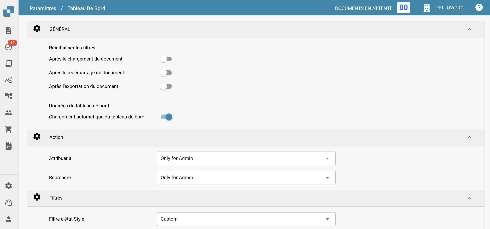
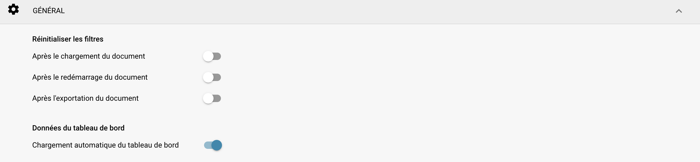
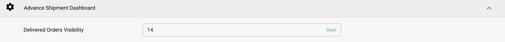

# Tableau de bord

## Aperçu

Les paramètres du tableau de bord sont conçus pour aider les administrateurs à contrôler la présentation des données et l'interaction au sein du tableau de bord DocBits. Ces paramètres déterminent quelles informations sont immédiatement disponibles lors de la connexion, garantissant que les utilisateurs ont un accès rapide aux données les plus pertinentes pour leurs tâches.

<figure><figcaption></figcaption></figure>

## Fonctionnalités et options clés

### **Paramètres généraux du tableau de bord**:

* **Réinitialiser les filtres:** Permet de configurer quand les filtres du tableau de bord doivent être réinitialisés, par exemple après le téléchargement d'un document, le redémarrage d'un document ou l'exportation d'un document. Cela aide à maintenir une vue claire des données selon les étapes spécifiques du flux de travail.
* **Données du tableau de bord:** Contrôle si le tableau de bord doit charger automatiquement les données lors de l'accès de l'utilisateur, ce qui peut aider à réduire les temps de chargement et à améliorer l'expérience utilisateur en ne chargeant les données que lorsque cela est nécessaire.

<figure><figcaption></figcaption></figure>

### **Action:**

* **Assigner à:** Cette fonctionnalité permet aux utilisateurs de définir des autorisations pour l'assignation de documents
  * **Only for Admin:** Seuls les utilisateurs administrateurs peuvent assigner des documents, indépendamment des autorisations accordées aux utilisateurs non administrateurs.
  * **All Users:** Tous les utilisateurs qui ont reçu les [autorisations](../groups-users-and-permissions/groups-and-permissions/activating-permissions.md) nécessaires peuvent assigner des documents.
* **Redémarrer:** Cette fonctionnalité permet aux utilisateurs de définir des autorisations pour redémarrer des documents
  * **Only for Admin:** Seuls les utilisateurs avec des privilèges d'administrateur peuvent redémarrer des documents, indépendamment des autorisations accordées aux utilisateurs non administrateurs.
  * **Only Admin and Assignee:** Seuls les utilisateurs avec des privilèges d'administrateur et l'utilisateur assigné peuvent redémarrer le document.
  * **All Users:** Tous les utilisateurs qui ont reçu les [autorisations](../groups-users-and-permissions/groups-and-permissions/activating-permissions.md) nécessaires peuvent redémarrer des documents.

<figure><figcaption></figcaption></figure>

### **Filtres**:

* **Filtre d'état Style:** Détermine le style de présentation des filtres de statut, qui peut être défini par défaut ou personnalisé en fonction de l'orientation opérationnelle des utilisateurs.
* **Filtre d'état personnalisé:** Permet la création et l'application de filtres personnalisés qui peuvent cibler des statuts de documents spécifiques comme "Nouveau", "Validation" ou "Exportation". Cela permet aux utilisateurs d'accéder rapidement aux documents dans des étapes spécifiques de traitement.

<figure><figcaption></figcaption></figure>

### Advance Shipment Dashboard:

* **Delivered Orders Visibility:** Cette fonctionnalité permet à l'utilisateur de spécifier la durée pendant laquelle les commandes livrées seront visibles.

<figure><figcaption></figcaption></figure>

Ces paramètres de tableau de bord sont cruciaux pour garantir que la plateforme DocBits soit aussi réactive et utile que possible, fournissant aux utilisateurs un outil puissant pour surveiller et gérer les activités de traitement des documents directement depuis le tableau de bord.
