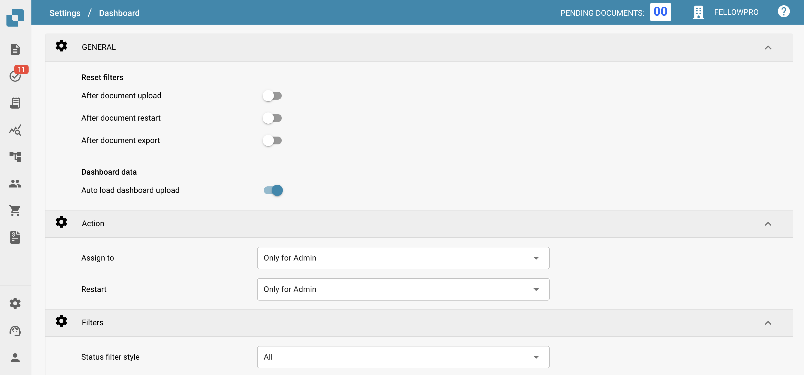
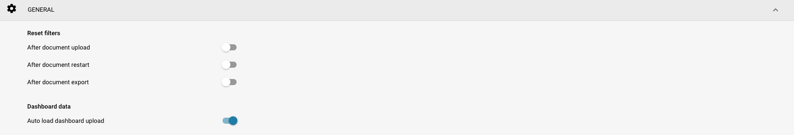
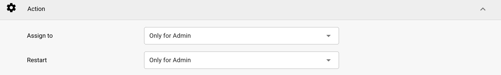
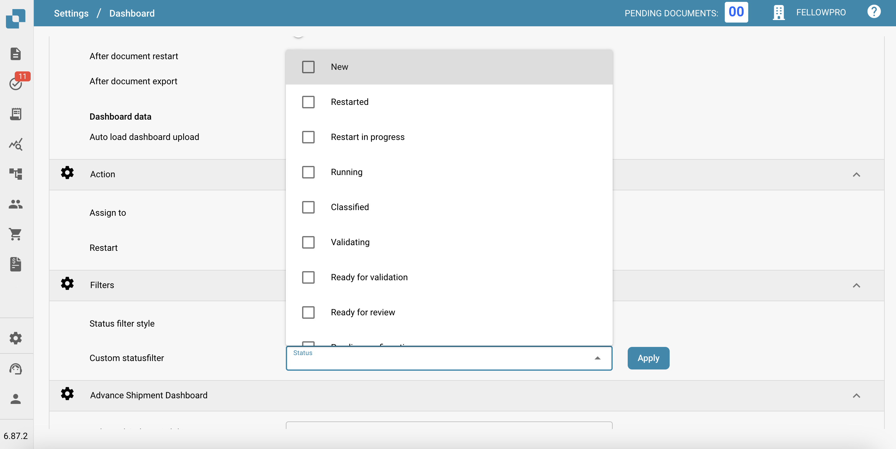

# Painel de Controle

## Visão Geral

As configurações do Painel são projetadas para ajudar os administradores a controlar a apresentação e a interação dos dados dentro do painel do DocBits. Essas configurações determinam quais informações estão imediatamente disponíveis ao fazer login, garantindo que os usuários tenham acesso rápido aos dados mais relevantes para suas tarefas.

<figure><figcaption></figcaption></figure>

## Principais Recursos e Opções

### **Configurações Gerais do Painel**:

* **Redefinir filtros**: Permite a configuração de quando os filtros do painel devem ser redefinidos, como após o upload de documentos, reinício de documentos ou exportação de documentos. Isso ajuda a manter uma tela limpa para visualização de dados de acordo com estágios específicos do fluxo de trabalho.
* **Dados do painel**: Controla se o painel deve carregar automaticamente os dados ao acessar o usuário, o que pode ajudar a reduzir os tempos de carregamento e melhorar a experiência do usuário, carregando dados apenas quando necessário.

<figure><figcaption></figcaption></figure>

### **Ação:**

* **Atribuir a:** Este recurso permite que os usuários definam permissões para a atribuição de documentos
  * **Apenas para Admin:** Apenas usuários administradores podem atribuir documentos, independentemente das permissões concedidas a usuários não administradores.
  * **Todos os Usuários**: Todos os usuários que receberam as [permissões](../groups-users-and-permissions/groups-and-permissions/activating-permissions.md) necessárias podem atribuir documentos.
* **Reiniciar:** Este recurso permite que os usuários definam permissões para reiniciar documentos
  * **Apenas para Admin**: Apenas usuários com privilégios de Admin podem reiniciar documentos, independentemente das permissões concedidas a usuários não administradores.
  * **Apenas Admin e Atribuído**: Apenas usuários com privilégios de Admin e o usuário atribuído podem reiniciar o documento.
  * **Todos os Usuários**: Todos os usuários que receberam as [permissões](../groups-users-and-permissions/groups-and-permissions/activating-permissions.md) necessárias podem reiniciar documentos.

<figure><figcaption></figcaption></figure>

### **Filtros**:

* **Estilo do filtro de status**: Determina o estilo de apresentação dos filtros de status, que pode ser definido como padrão ou personalizado de acordo com o foco operacional dos usuários.
* **Filtro de status personalizado**: Permite a criação e aplicação de filtros personalizados que podem direcionar status de documentos específicos, como "Novo", "Validando" ou "Exportando". Isso permite que os usuários acessem rapidamente documentos em estágios específicos de processamento.

<figure><figcaption></figcaption></figure>

### **Painel de Envio Antecipado**:

* **Visibilidade de Pedidos Entregues:** Este recurso permite que o usuário especifique a duração pela qual os pedidos entregues estarão visíveis.

<figure><figcaption></figcaption></figure>

Essas configurações do painel são cruciais para garantir que a plataforma DocBits seja o mais responsiva e útil possível, fornecendo aos usuários uma ferramenta poderosa para monitorar e gerenciar atividades de processamento de documentos diretamente do painel.
