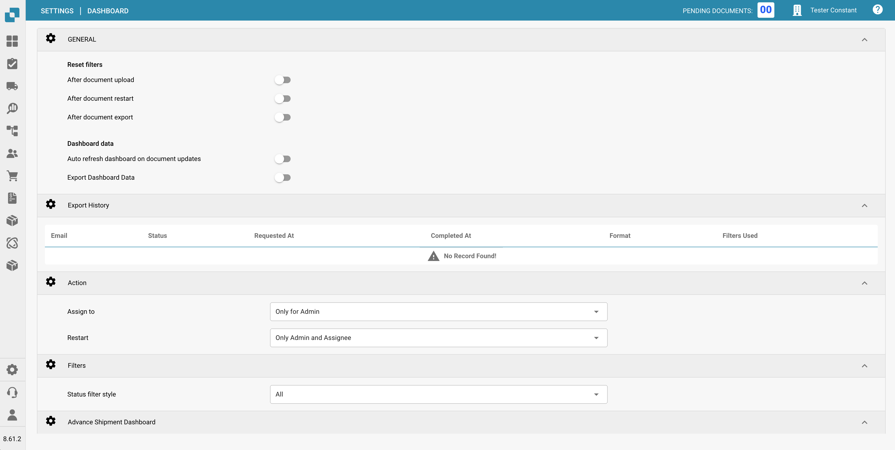
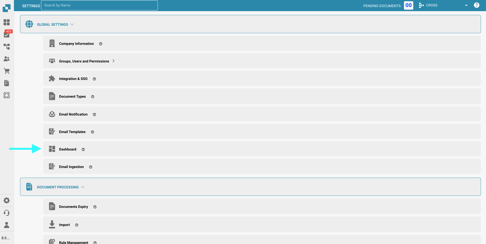
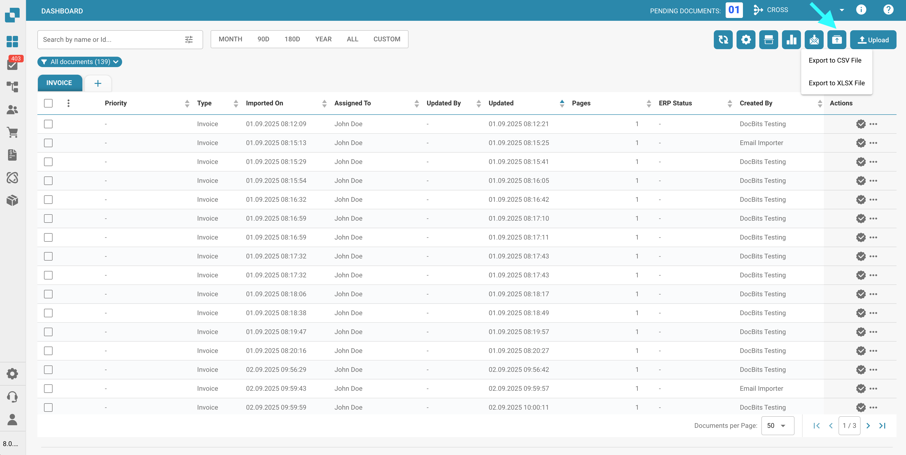
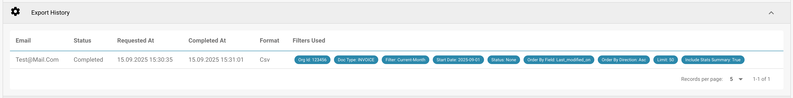
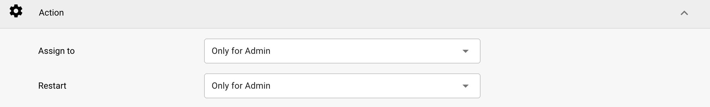
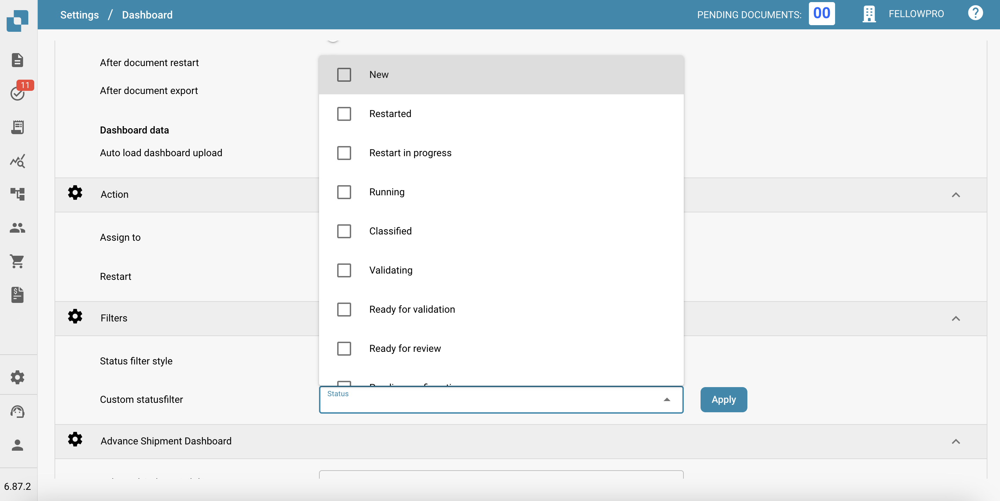
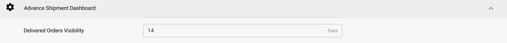

# Dashboard

## Panoramica

Le impostazioni della Dashboard sono progettate per aiutare gli amministratori a controllare la presentazione dei dati e l'interazione all'interno della dashboard di DocBits. Queste impostazioni determinano quali informazioni sono immediatamente disponibili al momento dell'accesso, garantendo che gli utenti abbiano un accesso rapido ai dati più rilevanti per le loro attività.

<figure><figcaption></figcaption></figure>

## Accedere alle Impostazioni della Dashboard

Per accedere alle impostazioni della dashboard, vai a:
**Impostazioni → Impostazioni Globali → Dashboard**

<figure><figcaption></figcaption></figure>

## **Generale**

* **Reimposta filtri**: Consente di configurare quando i filtri della dashboard devono essere reimpostati, ad esempio dopo il caricamento del documento, il riavvio del documento o l'esportazione del documento. Questo aiuta a mantenere una visione pulita dei dati in base a specifiche fasi del flusso di lavoro.
* **Dati dashboard**:
  * **Caricamento automatico upload dashboard**: Controlla se la dashboard deve caricare automaticamente i dati all'accesso dell'utente, il che può aiutare a ridurre i tempi di caricamento e migliorare l'esperienza utente caricando i dati solo quando necessario.
  * **Esporta Dati Dashboard**: Questa funzione aggiunge un nuovo pulsante **Esporta** alla barra degli strumenti della dashboard, consentendoti di esportare la vista corrente della dashboard come file **.csv** o **.xlsx**.

      <figure><figcaption></figcaption></figure>

## **Cronologia Esportazioni**

Nella **Cronologia Esportazioni**, vedrai una tabella che elenca tutte le esportazioni passate insieme alle informazioni chiave su ogni richiesta.

<figure><figcaption></figcaption></figure>

Sono inclusi i seguenti dettagli:

* **Email**: L'indirizzo email da cui è stata richiesta l'esportazione.
* **Stato**: Lo stato corrente dell'esportazione (In attesa, Completata).
* **Richiesto il**: La data e l'ora in cui l'esportazione è stata avviata.
* **Completato il**: La data e l'ora in cui l'esportazione è stata completata.
* **Formato**: Il formato del file utilizzato per l'esportazione (CSV, XLSX).
* **Filtri Usati**: Eventuali filtri applicati alla dashboard al momento dell'esportazione.

<mark style="color:red;">**Nota**</mark>: Per esportare le tabelle, l'opzione Esporta Dati Dashboard nella sezione [Generale](./#general) deve essere attiva.

## **Azione**

* **Assegna a**: Questa funzione consente agli utenti di definire le autorizzazioni per l'assegnazione dei documenti
  * **Solo per Admin**: Solo gli utenti admin possono assegnare documenti, indipendentemente dalle autorizzazioni concesse agli utenti non admin.
  * **Tutti gli Utenti**: Tutti gli utenti a cui sono state concesse le necessarie [autorizzazioni](../groups-users-and-permissions/groups-and-permissions/activating-permissions.md) possono assegnare documenti.
* **Riavvia**: Questa funzione consente agli utenti di definire le autorizzazioni per il riavvio dei documenti
  * **Solo per Admin**: Solo gli utenti con privilegi di Admin possono riavviare i documenti, indipendentemente dalle autorizzazioni concesse agli utenti non admin.
  * **Solo Admin e Assegnatario**: Solo gli utenti con privilegi di Admin e l'utente assegnato possono riavviare il documento.
  * **Tutti gli Utenti**: Tutti gli utenti a cui sono state concesse le necessarie [autorizzazioni](../groups-users-and-permissions/groups-and-permissions/activating-permissions.md) possono riavviare i documenti.

<figure><figcaption></figcaption></figure>

## **Filtri**

* **Stile filtro stato**: Determina lo stile di presentazione dei filtri di stato, che può essere impostato su predefinito o personalizzato in base al focus operativo degli utenti.
* **Filtro stato personalizzato**: Abilita la creazione e l'applicazione di filtri personalizzati che possono mirare a specifici stati del documento come "Nuovo", "In convalida" o "In esportazione". Ciò consente agli utenti di accedere rapidamente ai documenti in specifiche fasi di elaborazione.

<figure><figcaption></figcaption></figure>

## Dashboard Spedizioni Anticipate

* **Visibilità Ordini Consegnati**: Questa funzione consente all'utente di specificare la durata per la quale gli ordini consegnati saranno visibili.

<figure><figcaption></figcaption></figure>

Queste impostazioni della dashboard sono cruciali per garantire che la piattaforma DocBits sia il più reattiva e utile possibile, fornendo agli utenti uno strumento potente per monitorare e gestire le attività di elaborazione dei documenti direttamente dalla dashboard.
