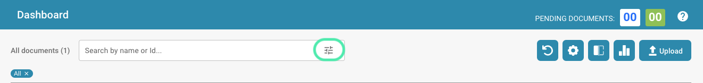
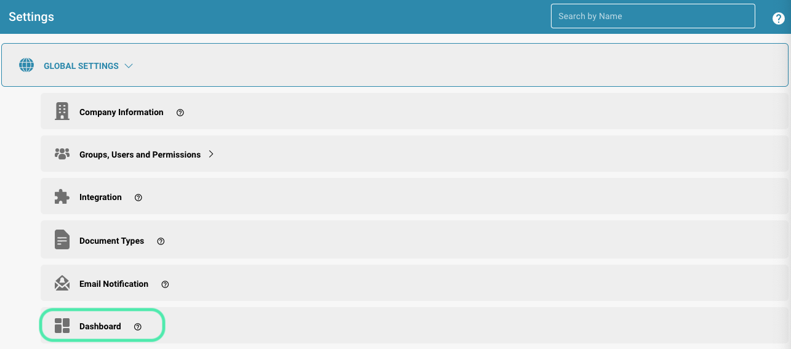
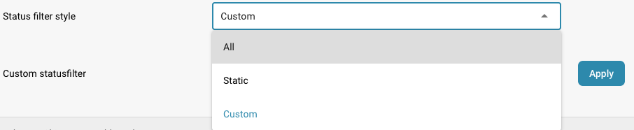
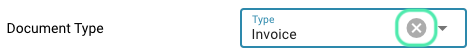
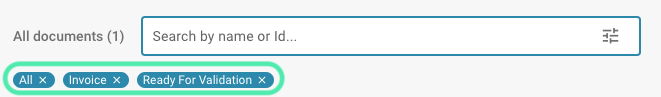

# Personalizzare i Filtri

Se stai cercando uno o più documenti specifici, sono disponibili le seguenti opzioni. All'interno della barra di ricerca, ti abbiamo fornito vari strumenti per aiutarti a trovare il documento che stai cercando. Per accedervi, seleziona l'icona seguente.

<figure><figcaption></figcaption></figure>

L'uso dei filtri consente agli utenti di trovare rapidamente informazioni rilevanti e ridurre la quantità di dati all'essenziale.

## Come personalizzare e applicare i filtri in DocBits

**Accedere alle impostazioni dei filtri Aprire la dashboard:**

* Accedi a DocBits e apri la dashboard che contiene i dati che desideri filtrare.

**Accedere al menu dei filtri:**

* Clicca sull'icona del filtro o sul campo di ricerca.

<figure><figcaption></figcaption></figure>

### Personalizzare i filtri

#### **Usare filtri predefiniti**

* Apri il menu dei filtri.
* Scegli tra le opzioni di filtro predefinite (ad es. Data, Tipo di Documento, Persona Assegnata).
* Regola i criteri di filtro selezionando o inserendo i valori appropriati (ad es. intervallo di date, tipo di documento specifico).

#### **Creare i propri filtri**

* Apri il menu dei filtri nelle impostazioni sotto Dashboard e clicca su "Filtri".

<figure><figcaption></figcaption></figure>

* Seleziona il campo da filtrare (ad es. Stato).

<figure><figcaption></figcaption></figure>

* Definisci i criteri di filtro, ad es.: Stile filtro stato.

<figure><figcaption></figcaption></figure>

* Menu a discesa: Scegli tra le opzioni predefinite.

<figure><figcaption></figcaption></figure>

* Salva il filtro personalizzato cliccando su "Applica".

<figure><figcaption></figcaption></figure>

#### **Usare filtri combinati**

* Apri il menu dei filtri e seleziona più criteri di filtro contemporaneamente.
* Combina i criteri di filtro.
* **Esempio:** Documenti creati sia dall'autore "Max Mustermann" E creati nell'ultimo mese.
* Una volta selezionato un filtro, verrà applicato automaticamente.

#### **Applicare e Gestire i Filtri**

**Applicare i Filtri**

* Dopo aver selezionato e regolato i filtri desiderati, i filtri vengono applicati automaticamente.

**Rimuovere i Filtri**

* Apri il menu Filtri.
* Passaggio 2: Cancella o rimuovi i filtri applicati cliccando su "Cancella Filtri", l'icona X accanto al filtro selezionato sia nel menu Filtri che sotto la barra dei Filtri.

<figure><figcaption></figcaption></figure>

<figure><figcaption></figcaption></figure>

<figure><figcaption></figcaption></figure>

* I dati vengono visualizzati nuovamente senza i criteri di filtro precedenti.
