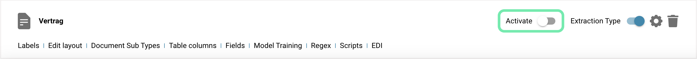

# Activation

## Activer ou désactiver des types de documents dans un système de gestion de documents comme Docbits permet à une organisation de ne garder actifs que les types de documents dont elle a besoin pour assurer une gestion efficace et claire.

### Voici les étapes pour activer et désactiver des types de documents, ainsi qu'une explication de la fonction de basculement dans l'interface utilisateur :

#### **Accéder à la Gestion des Types de Documents**

* Se connecter : Connectez-vous à DocBits avec des droits d'administrateur.
* Naviguer : Allez dans Paramètres.
* Types de Documents : Trouvez la section Types de Documents.

**Accéder à la Liste des Types de Documents**

* Accédez à la liste des types de documents existants. Cette liste montre tous les types de documents définis, à la fois actifs et inactifs.

<figure><figcaption></figcaption></figure>

**Activer ou désactiver un type de document Sélectionner le Type de Document :**

* Sélectionnez le type de document que vous souhaitez activer ou désactiver.&#x20;

<figure><figcaption></figcaption></figure>

**Utiliser la fonction de basculement :**

* Dans l'interface utilisateur, il y a un interrupteur à côté de chaque type de document qui permet l'activation et la désactivation.&#x20;

**Activation :**

* Si le type de document est actuellement désactivé, l'interrupteur peut montrer une position grise ou éteinte.&#x20;
* Cliquez sur l'interrupteur pour activer le type de document. L'interrupteur change de position et de couleur pour indiquer l'activation.

<figure><figcaption></figcaption></figure>

**Désactivation :**

* Si le type de document est actuellement activé, l'interrupteur montre une position colorée ou allumée.&#x20;
* Cliquez sur l'interrupteur pour désactiver le type de document. L'interrupteur change de position et de couleur pour indiquer la désactivation.

<figure><figcaption></figcaption></figure>

**Enregistrer :**&#x20;

* Assurez-vous que toutes les modifications sont enregistrées. Certains systèmes enregistrent les modifications automatiquement, tandis que d'autres nécessitent une confirmation explicite.

### Notification et documentation

**Informer les utilisateurs :**&#x20;

* Informez les utilisateurs de l'activation ou de la désactivation du type de document, surtout si cela impacte leurs processus de travail.

**Mettre à jour la documentation :**&#x20;

* Mettez à jour la documentation du système pour refléter le statut actuel des types de documents.

Conclusion La capacité d'activer ou de désactiver des types de documents en fonction des besoins de l'organisation est un outil utile pour gérer le traitement des documents dans Docbits. En utilisant simplement la fonction de basculement dans l'interface utilisateur, les administrateurs peuvent réagir de manière flexible et efficace et s'assurer que le système est aligné de manière optimale avec les besoins actuels de l'entreprise.
