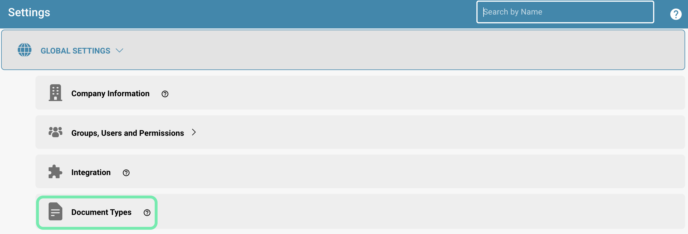
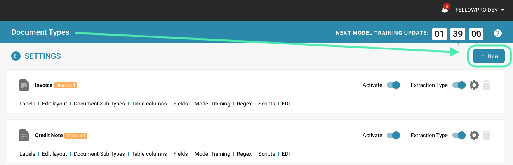

# Dodawanie/Edycja Typów Dokumentów


DocBits Document Types Explained: Create, Configure & Assign Processing Settings


## Dodawanie lub edycja typów dokumentów w DocBits obejmuje kilka kroków. Kroki te obejmują definiowanie układów, pól i reguł ekstrakcji.

### Oto szczegółowy przewodnik:

#### Uzyskiwanie Dostępu do Zarządzania Typami Dokumentów

* **Zaloguj się:** Zaloguj się do DocBits ze swoimi uprawnieniami administratora.
* **Nawiguj:** Przejdź do Ustawień.
* **Typy Dokumentów:** Znajdź sekcję "Typy Dokumentów".

<figure><figcaption>
Ustawienia
</figcaption></figure>

### Dodawanie nowego typu dokumentu

**Utwórz nowy typ dokumentu:**

* Kliknij przycisk "+ Nowy".

<figure><figcaption></figcaption></figure>

**Podstawowe informacje:**

* Wprowadź nazwę nowego typu dokumentu (np. "Faktura", "Umowa", "Raport").
* Dodaj opis wyjaśniający cel i zastosowanie typu dokumentu.

<figure><figcaption></figcaption></figure>

**Format kwoty i daty**

* Wprowadź format kwoty i daty

<figure><figcaption></figcaption></figure>

**Importuj Przykładowe Dokumenty**

* Prześlij przykładowe dokumenty metodą przeciągnij i upuść
* Do szkolenia należy przesłać co najmniej 10 dokumentów

<figure><figcaption>
Prześlij i Szkol
</figcaption></figure>

**Dodaj Grupy**

* Kliknij przycisk "Dodaj" i wprowadź nazwę grupy.
* Możesz również sklonować istniejący typ dokumentu.

<figure><figcaption>
Pola i Grupy
</figcaption></figure>

<figure><figcaption>
Utwórz Nową Grupę
</figcaption></figure>

**Dodaj pola:**

* Dodaj nowe pola, klikając "Dodaj".
* Wprowadź nazwę pola (np. "Numer faktury", "Data", "Kwota") i typ danych (np. Tekst, Liczba, Data).

<figure><figcaption>
Pola i Grupy
</figcaption></figure>

<figure><figcaption>
Utwórz Nowe Pole
</figcaption></figure>

**Zakończ**

* Po wprowadzeniu wszystkich szczegółów kliknij "Zakończ", a nowy typ dokumentu zostanie utworzony

<figure><figcaption></figcaption></figure>

### Edytuj istniejący typ dokumentu

**Wybierz typ dokumentu:**

* Wybierz typ dokumentu, który chcesz edytować, z listy istniejących typów dokumentów.
* Pod typem dokumentu znajdziesz różne opcje edycji, na przykład edycję układu, pól, kolumn tabeli itp.

<figure><figcaption></figcaption></figure>

**Więcej Ustawień:**

* Kliknij przycisk Edytuj obok typu dokumentu.

<figure><figcaption>
Więcej Ustawień
</figcaption></figure>

* Tutaj możesz wprowadzić dalsze ustawienia dla typu dokumentu, takie jak szablon projektu, czy dokument musi zostać zatwierdzony przed eksportem i wiele innych szczegółów.

<figure><figcaption></figcaption></figure>

### Zdefiniuj reguły ekstrakcji

**Zdefiniuj reguły:**

* Przejdź do sekcji Reguły Ekstrakcji.
* Utwórz reguły określające sposób wyodrębniania danych z dokumentów. Może to obejmować użycie wyrażeń regularnych lub innych technik rozpoznawania wzorców.

**Testuj reguły:**

* Przetestuj reguły ekstrakcji na przykładowych dokumentach, aby upewnić się, że dane są poprawnie rozpoznawane i wyodrębniane.

**Dostrajanie:**

* Dostosuj reguły ekstrakcji na podstawie wyników testów, aby poprawić dokładność i wydajność.

### Szkolenie i Dokumentacja

**Poinformuj użytkowników:**

* Poinformuj użytkowników o nowym lub zmienionym typie dokumentu i w razie potrzeby zapewnij szkolenie.

**Dokumentacja:**

Zaktualizuj dokumentację systemu, aby opisać nowe lub zmienione typy dokumentów i ich zastosowanie. Starannie konfigurując i zarządzając typami dokumentów w DocBits, możesz zapewnić, że dokumenty są poprawnie klasyfikowane i wydajnie przetwarzane. Poprawia to ogólną wydajność systemu zarządzania dokumentami i przyczynia się do dokładności i produktywności Twojej organizacji.
