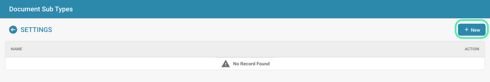

# Creating a new Sub Type

## Here are step-by-step instructions to create a new subtype:

* **Navigate to the Settings area:** Log in to DocBits as an administrator and navigate to the Document Type Management area.

<figure><figcaption></figcaption></figure>

* **Select the option to add a subtype:** Click the “+ New” button to add a new subtype.

<figure><figcaption></figcaption></figure>

* **Name the subtype:** Enter a descriptive name for the new subtype. This name should clearly describe the purpose of the subtype so that users can easily understand what type of documents it represents.

<figure><figcaption></figcaption></figure>

<figure><figcaption></figcaption></figure>

* **Configure initial settings:** Set the initial settings for the new subtype, including the default fields, options, and templates to use for this subtype. This can include adding specific metadata fields, specifying approval workflows, or configuring user permissions.
* **Make optional configurations:** Depending on your company's requirements or the nature of the documents, you can make additional configurations to customize the new subtype to your specific needs. This may include setting default values, validation rules, or custom actions.

<figure><figcaption>
Action
</figcaption></figure>

* **Save the new subtype:** Once you have entered all the required information, save the new subtype to create it in the document management system.

After the new subtype is created, users can add and manage documents of that type according to the initial settings you specified. Make sure you inform users about the new subtype and provide training or guidance, if necessary, to help them use it effectively.
