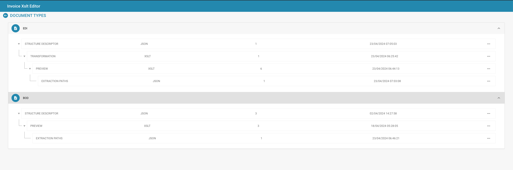

# E-Dokumente (e-docs)


DocBits E-Invoice Tutorial: Process XRechnung / ZUGFeRD (Factur-X), Validate Data & Automate Workflows


<figure><figcaption></figcaption></figure>

#### Übersicht

In Docbits bieten die EDI-Einstellungen Tools zum Definieren und Verwalten der Struktur und des Formats von EDI-Nachrichten, die verschiedenen Dokumenttypen wie Rechnungen oder Bestellungen entsprechen. Die Einstellungen ermöglichen die Anpassung von EDI-Nachrichten an die Standards und Anforderungen verschiedener Handelspartner und Branchen.

#### Hauptfunktionen und Optionen

1. **EDI-Konfigurationselemente**:
   * **Strukturdeskriptor**: Definiert die grundlegende Struktur des EDI-Dokuments, einschließlich Segmentreihenfolge, Pflichtfelder und Qualifizierer, die für die Gültigkeit des EDI-Dokuments erforderlich sind.
   * **Transformation**: Gibt die Transformationen an, die angewendet werden, um die Dokumentdaten in eine EDI-formatierte Nachricht zu konvertieren. Dies beinhaltet typischerweise die Angabe von Zuordnungen von Dokumentfeldern zu EDI-Segmenten und -Elementen.
   * **Vorschau**: Ermöglicht Administratoren, zu sehen, wie die EDI-Nachricht nach der Transformation aussehen wird, um die Genauigkeit vor der Übertragung sicherzustellen.
   * **Extraktionspfade**: Zeigt die Pfade an, die zum Extrahieren von Werten aus dem Dokument verwendet werden, die dann zum Auffüllen der EDI-Nachricht verwendet werden.
2. **XSLT-Editor**:
   * Wird zum Bearbeiten und Validieren der XSLT (eXtensible Stylesheet Language Transformations) verwendet, die im Transformationsprozess verwendet wird. XSLT ist eine leistungsstarke Sprache, die für die Transformation von XML-Dokumenten in andere XML-Dokumente oder andere Formate wie HTML, Text oder sogar andere XML-Strukturen entwickelt wurde.

<figure><figcaption></figcaption></figure>