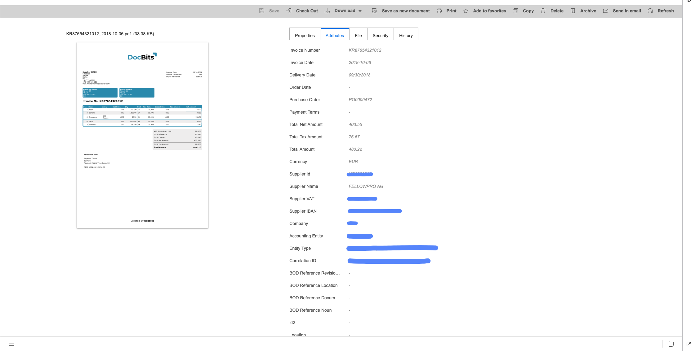
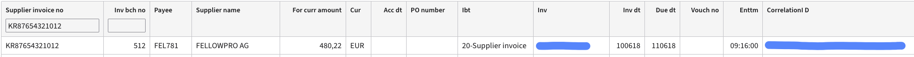
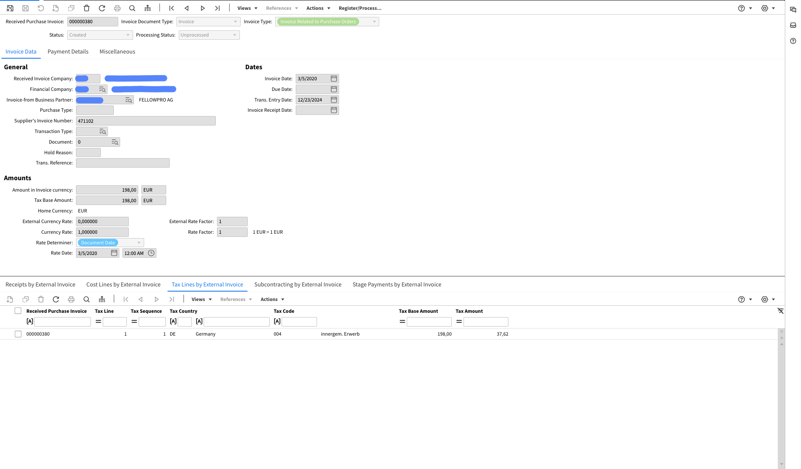
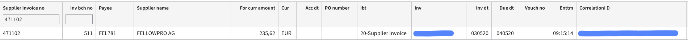

# FacturX

### **Extended:**

Exports to the document management system (IDM):

<figure><figcaption></figcaption></figure>

Exported to Infor LN:

<figure><figcaption></figcaption></figure>

Exported to Infor M3:

<figure><figcaption></figcaption></figure>

### **Basic:**

Exports to the document management system (IDM):

<figure><figcaption></figcaption></figure>

Exported to Infor LN:

<figure><figcaption></figcaption></figure>

Exported to Infor M3:

<figure><figcaption></figcaption></figure>