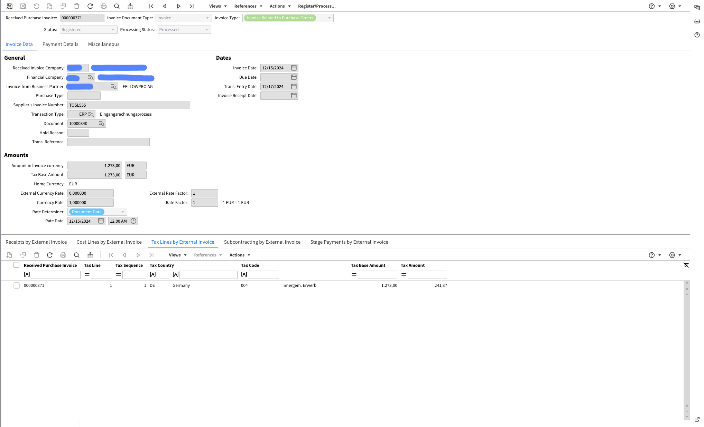

# XRechnung 2.1

Exportações para o sistema de gerenciamento de documentos (IDM):

<figure><figcaption></figcaption></figure>

Exportado para Infor LN:

<figure><figcaption></figcaption></figure>

Exportado para Infor M3:

<figure><figcaption></figcaption></figure>
