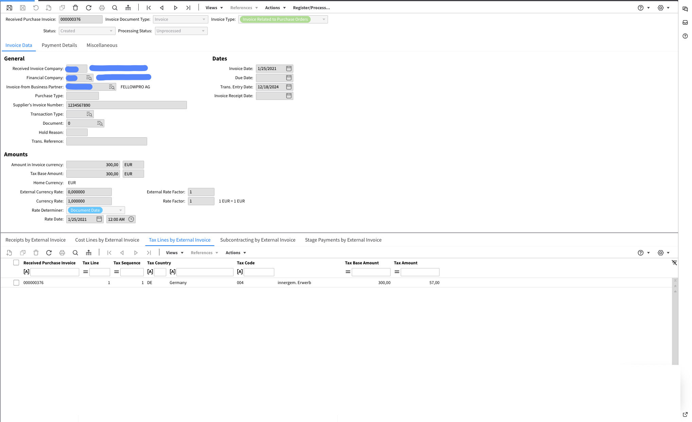

# XRechnung 2.2

Eksport do systemu zarządzania dokumentami (IDM):

<figure><figcaption></figcaption></figure>

Eksportowany do Infor LN:

<figure><figcaption></figcaption></figure>

Eksportowany do Infor M3:

<figure><figcaption></figcaption></figure>
