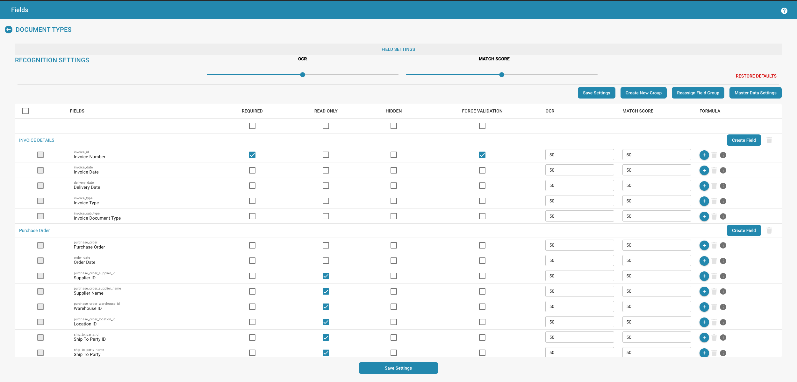

# Velden

<figure><figcaption></figcaption></figure>

## Overzicht

De instellingen voor Velden bieden een gebruikersinterface waar beheerders de eigenschappen en het gedrag van individuele gegevensvelden die aan een documenttype zijn gekoppeld, kunnen beheren. Elk veld kan worden aangepast om de nauwkeurigheid en efficiëntie van gegevensinvoer en validatie te optimaliseren.

## Belangrijkste Kenmerken en Opties

1. **Configuratie van Velden**:
   * **Veldnamen**: Lijst met de namen van de velden, die doorgaans overeenkomen met de gegevenselementen binnen het document, zoals "Factuurnummer" of "Inkoopordernummer".
   * **Verplicht**: Beheerders kunnen velden als verplicht markeren, zodat ervoor gezorgd wordt dat gegevens moeten worden ingevoerd of vastgelegd voor deze velden om de documentverwerking te voltooien.
   * **Alleen-lezen**: Velden kunnen als alleen-lezen worden ingesteld om wijziging na gegevensinvoer of tijdens bepaalde fasen van documentverwerking te voorkomen.
   * **Verborgen**: Velden kunnen uit het zicht in de gebruikersinterface worden verborgen, nuttig voor gevoelige informatie of om gebruikersworkflows te vereenvoudigen.
2. **Geavanceerde Instellingen**:
   * **Dwing Validatie af**: Zorgt ervoor dat gegevens die in een veld worden ingevoerd voldoen aan bepaalde validatieregels voordat ze worden geaccepteerd.
   * **OCR (Optische Karakterherkenning)**: Deze schakelaar kan worden ingeschakeld om OCR-verwerking voor een specifiek veld mogelijk te maken, nuttig voor geautomatiseerde gegevensextractie uit gescande of digitale documenten.
   * **Overeenkomstscores**: Beheerders kunnen een overeenkomstscores definiëren, een drempel die wordt gebruikt om het vertrouwensniveau van gegevensherkenning of -overeenstemming te bepalen, wat van invloed is op hoe gegevensvalidatie en kwaliteitscontroles worden uitgevoerd.
3. **Actieknoppen**:
   * **Nieuw Veld Aanmaken**: Maakt het mogelijk om nieuwe velden aan het documenttype toe te voegen.
   * **Bewerkpictogrammen**: Elk veld heeft een bewerkpictogram waarmee beheerders de veldspecifieke instellingen verder kunnen configureren, zoals gegevenstype, standaardwaarden of verbonden bedrijfslogica.
   * **Instellingen Opslaan**: Bevestigt de aangebrachte wijzigingen in de veldconfiguraties.
