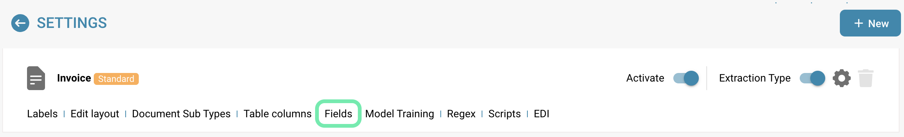
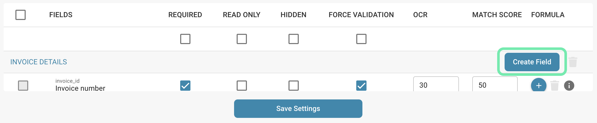
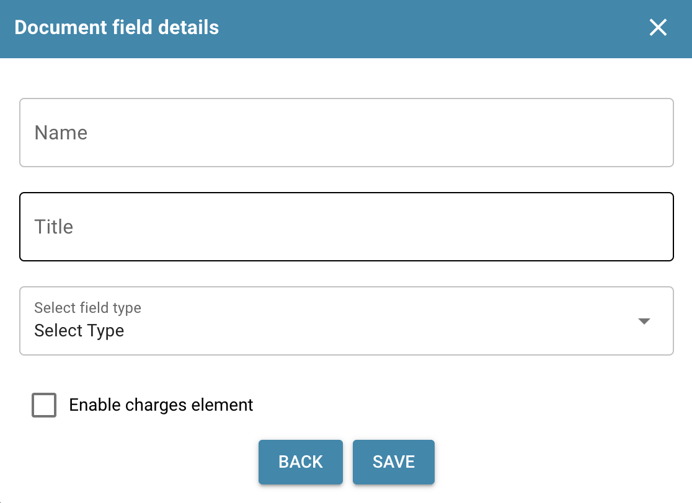
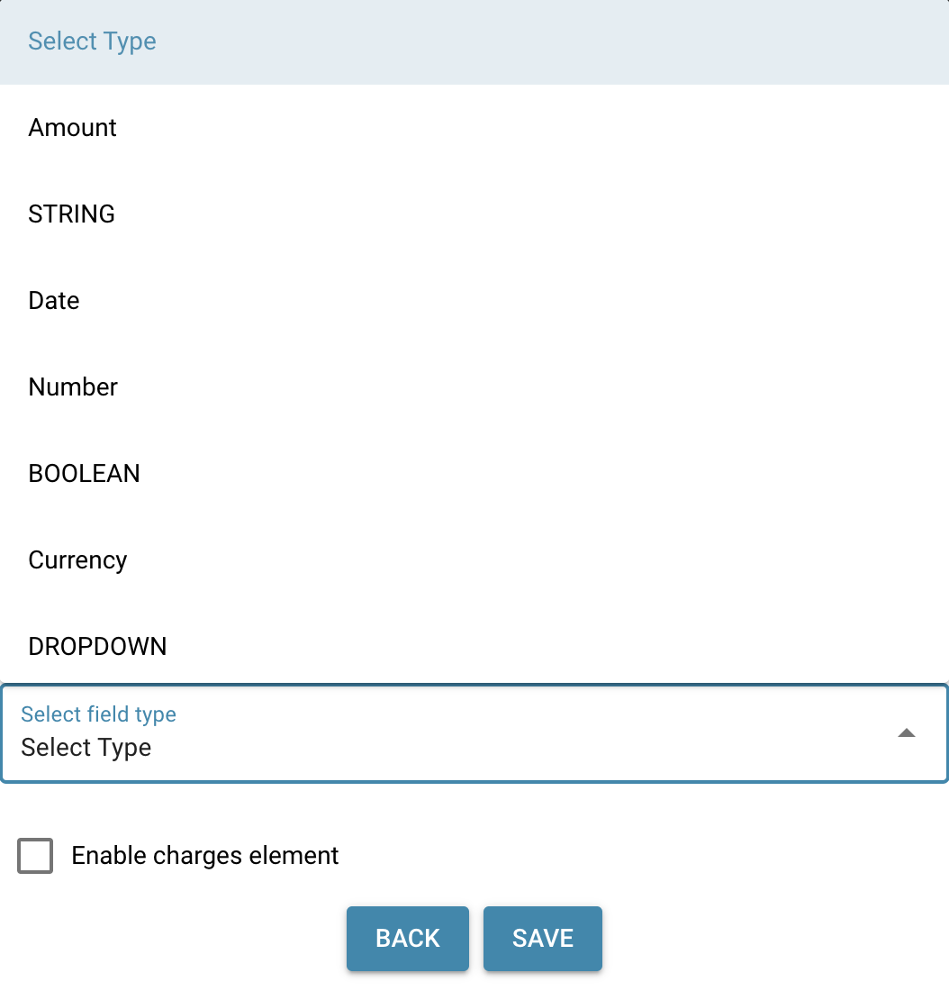

# Adding and Editing Fields

## Here are the steps to add a new field or modify existing fields in DocBits, including details on how to access advanced configuration options:

### Add a new field

* Log in and access Document Management:

<figure><figcaption>
Settings
</figcaption></figure>

<figure><figcaption>
Settings Document Types
</figcaption></figure>

**Add a new field:**

* Click the "Create Field" option.

<figure><figcaption></figcaption></figure>

**Basic Configuration:**

<figure><figcaption></figcaption></figure>

* **Name**
  * Choose a meaningful and descriptive name.
  * The name must be unique.
  * <mark style="color:red;">**Note:**</mark> **Once created, the name cannot be changed.**
* **Title**
  * This is the displayed name of the field.
  * It defines how the field appears in the user interface.
  * <mark style="color:red;">**Note:**</mark> **The title can be changed later if needed.**
*   **Select Field Type**

    * Choose the type of field from a dropdown list.
    * The available field types include various options to suit different data entry needs.
    * <mark style="color:red;">**Note:**</mark> **Once created, the Type cannot be changed.**

    <figure><figcaption></figcaption></figure>
* **Optional: Enable Charges Element**
  * A checkbox labeled **Enable Charges Element** can be selected.
  * If checked, you must select a charge element from a dropdown list.
  * **Important:** Charge elements must be configured beforehand.
    * [Charge Elements Configuration](../../../../../infor-integration-and-configuration/importing-customer-master-data/m3/table-extraction-for-costing-element.md)

**Advanced Configuration:**

* Here you can set other properties such as validation rules, match values, read-only mode, hiding, and OCR settings.

<figure><figcaption></figcaption></figure>

**Save:**

* After you have made all the necessary configurations, click "Save" or a similar button to create the new field.

<figure><figcaption></figcaption></figure>

### Edit an existing field

**Access field editing:**

* Navigate to the list of existing fields and find the field you want to edit.

<figure><figcaption></figcaption></figure>

**Select a field:**

* Click the appropriate field to access the editing options.

<figure><figcaption></figcaption></figure>

**Change the configuration:**

* Change the properties of the field as needed. This may include changing the name, the field type, adding or removing validation rules, setting match values, or adjusting other advanced settings.

<mark style="color:red;">**Note:**</mark> If you change the **Title** of a field, you must delete and re-add the field in the layout builder for the changes to take effect.

<figure><figcaption></figcaption></figure>

**Save:**

* Click "Save" to save the changes you made to the field.

<figure><figcaption>
Save Settings
</figcaption></figure>

By providing steps to add new fields and edit existing fields, as well as access to advanced configuration options, you can maximize the flexibility and adaptability of your document processing system. This allows you to structure and process your data exactly as you need it.