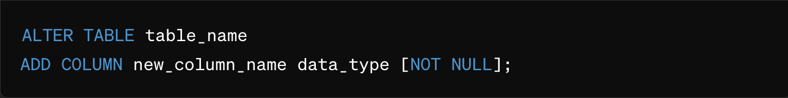

# Configuración de Propiedades de Campo

## Instrucciones detalladas sobre la configuración de propiedades como Obligatorio, Solo lectura, Oculto y OCR.

### Obligatorio (Required):

<figure><figcaption></figcaption></figure>

Si un campo está marcado como Obligatorio, significa que este campo debe completarse antes de que el documento pueda guardarse o procesarse.

**Para establecer esta propiedad:**

* Navegue a la configuración del campo en su sistema DocBits.
* Habilite la opción "Obligatorio" para el campo relevante.

**Impacto:**

* Esta configuración asegura que se capture la información importante y que no se puedan procesar documentos sin los datos requeridos.

### Solo lectura (Read Only):

<figure><figcaption></figcaption></figure>

Si un campo está marcado como Solo lectura, significa que los usuarios pueden ver el contenido de este campo, pero no pueden realizar ningún cambio en él.

**Para establecer esta propiedad:**

* Vaya a las Opciones de campo. Habilite la opción "Solo lectura" para el campo deseado.

**Impacto:**

* Esta configuración puede ser útil para proteger información sensible o para asegurar que los datos importantes no se cambien accidentalmente.

### Oculto (Hidden):

<figure><figcaption></figcaption></figure>

Si un campo está marcado como "Oculto", significa que el campo se ocultará en la interfaz de usuario y los usuarios no podrán verlo ni acceder a él.

**Para establecer esta propiedad:**

* Vaya a las opciones del campo.
* Habilite la opción "Oculto" para el campo correspondiente.

**Impacto:**

* Esta configuración se utiliza a menudo para ocultar campos internos o técnicos que son irrelevantes para el usuario final o que solo se necesitan para el procesamiento interno.

### OCR (Reconocimiento Óptico de Caracteres):

<figure><figcaption></figcaption></figure>

Si un campo está configurado para OCR, significa que el sistema intentará extraer el texto del documento e insertarlo en este campo. Esta configuración se suele utilizar para campos que se pretende que se rellenen automáticamente.

**Para configurar esto:**

* Habilite la opción OCR para el campo correspondiente.
* Si es necesario, configure los parámetros de OCR como idioma, fuente, etc.

**Impacto:**

* El uso de OCR permite que los documentos se procesen automáticamente extrayendo información de los textos e introduciéndola en los campos apropiados, reduciendo el esfuerzo manual y aumentando la eficiencia.

### Validación forzada (Forced validation):

<figure><figcaption></figcaption></figure>

Configure las reglas de validación correspondientes, como límites numéricos, expresiones regulares o relaciones con otros campos.

**Para configurar esto:**

* Guarde los cambios.

**Impacto:**

* La validación forzada comprueba los datos introducidos con los criterios especificados para asegurar que son válidos. Esto ayuda a detectar errores tempranamente y mejorar la calidad de los datos.

### Puntuación de coincidencia (Match Score):

<figure><figcaption></figcaption></figure>

Al comparar los datos de entrada con los datos de referencia, el Match Score puede ayudar a confirmar la precisión y validez de los datos. Si el Match Score supera un cierto umbral, la coincidencia se considera exitosa.

**Para configurar esto:**

* Habilite la opción Match Score y establezca el umbral deseado.
* Guarde los cambios.

**Impacto:**

* El Match Score se utiliza para evaluar la precisión de las coincidencias entre los datos de entrada y los valores de referencia. Si la puntuación obtenida supera el umbral establecido, la coincidencia se considera exitosa. Esto es especialmente útil para campos que requieren validación de datos o coincidencia de datos, como campos con un nombre, dirección de correo electrónico, etc. por ejemplo, al verificar los datos de los clientes.

<figure><figcaption></figcaption></figure>

Al configurar cuidadosamente estas propiedades de campo, puede optimizar los flujos de trabajo de procesamiento de documentos y asegurar que sus datos se capturen correctamente, se protejan y se procesen de manera eficiente.
