# Master Data Settings

## Overview

In the **Master Data Settings** section of the **Fields** settings for a specific Document Type, you can view and configure master data mappings to fields used in field validation, using data from [**Master Data Lookup**](../../../document-processing/master-data-lookup.md).

These mappings define how master data is applied to individual fields during validation. This page provides a detailed guide on how to configure and manage these mappings.

## **Accessing** Master Data Settings **Settings**

To access the **Master Data Settings** settings:

1.  Go to **Settings → Global Settings → Document Types**

    <figure>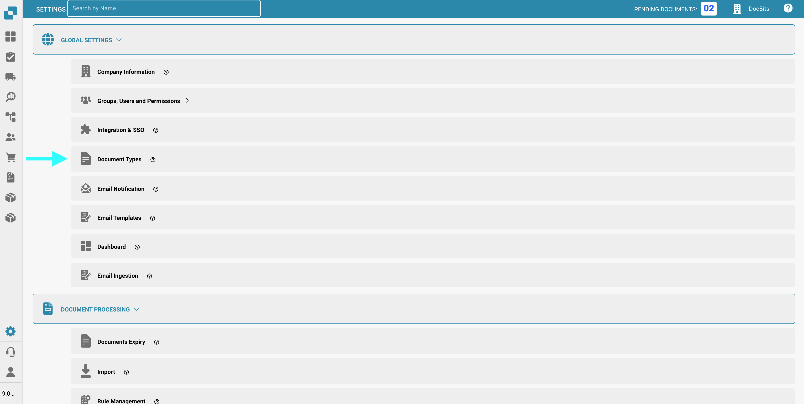<figcaption></figcaption></figure>
2.  Select the desired **Document Type** and click on **Fields**.

    <figure>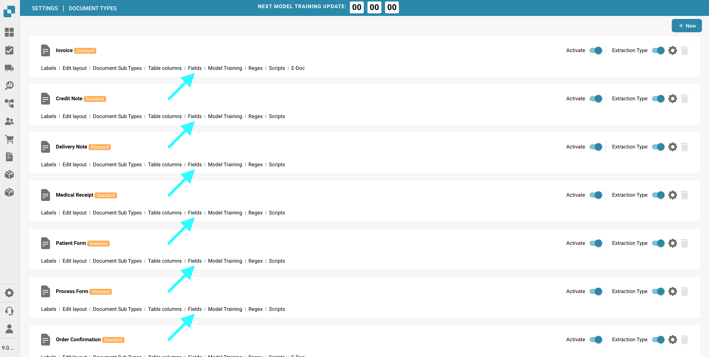<figcaption></figcaption></figure>
3.  Click on **Master Data Settings**

    <figure>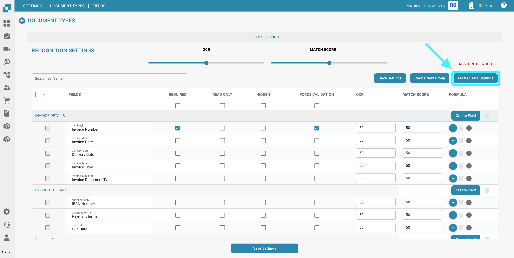<figcaption></figcaption></figure>

## Lookup Master Data

In the **Lookup Master Data** section, you can create lookup configs from your master data to use as field mappings during field validation.

### Default Entries

In the **Lookup Master Data** section, certain default entries are provided by **DocBits**. These entries:

* Cannot be edited or deleted
* Can be deactivated if not needed

Default entries are clearly marked with a **Default** tag for easy identification.

<figure>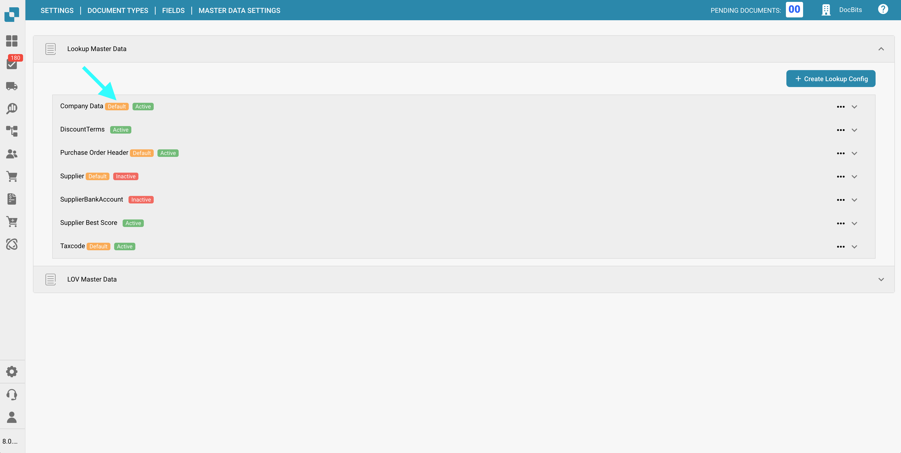<figcaption></figcaption></figure>

### **Create Lookup Config**

To create a new lookup config for Master Data:

1. Navigate to the **Lookup Master Data** section.
2.  Click **Create Lookup Config** in the top-right corner.

    <figure>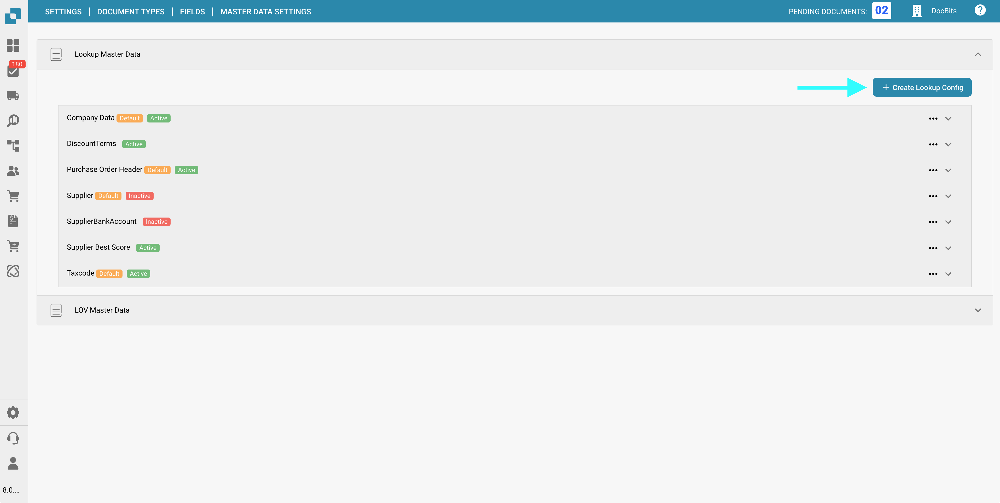<figcaption></figcaption></figure>
3. Configure the following options:
   * **Lookup Name**\
     The name of the lookup config.
   * **Lookup Dataset Name**\
     Select the dataset that should be used for this lookup config.
   * **Conflict Handler**\
     Defines how to resolve conflicts when multiple matches are found:
     * **Best Score** – Uses the entry with the highest matching score.
     * **Return None** – Leaves the field empty if there's a conflict.
     * **Return First** – Uses the first matched value.
   *   **Context Type**

       Specifies where in the document the lookup config will be applied. Choose between:

       **HEADER**

       The lookup is used in field validation. Configure the following:

       * **Match All**\
         When enabled, all fields in the lookup config must match during the search by default.

       <figure>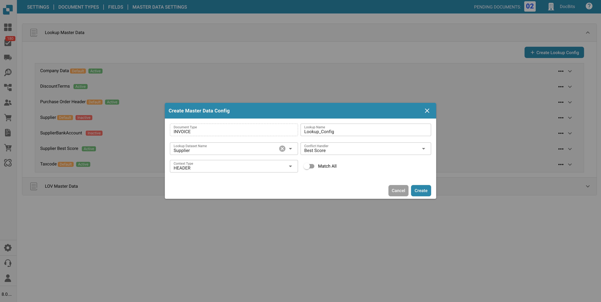<figcaption></figcaption></figure>

       \
       **LINE**

       The lookup is used within a document table. Configure the following:

       * **Context Detail**\
         Select the specific table to which the lookup should be applied.
       * **Match All**\
         When enabled, all fields in the lookup config must match during the search by default.

       <figure>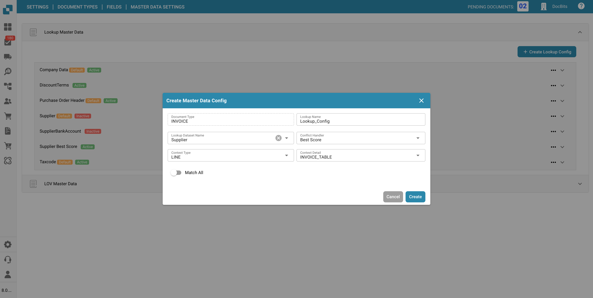<figcaption></figcaption></figure>
4.  Click **Save** to create the lookup config.

    <figure>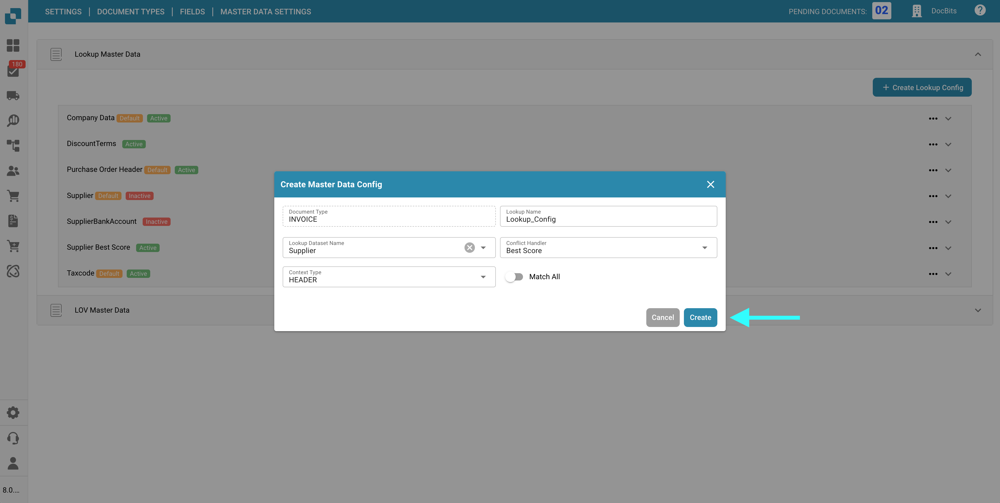<figcaption></figcaption></figure>

### Actions on Existing Lookup Config

To manage an existing lookup config, click the three dots in the top-right corner of the configuration you want to modify.

<figure>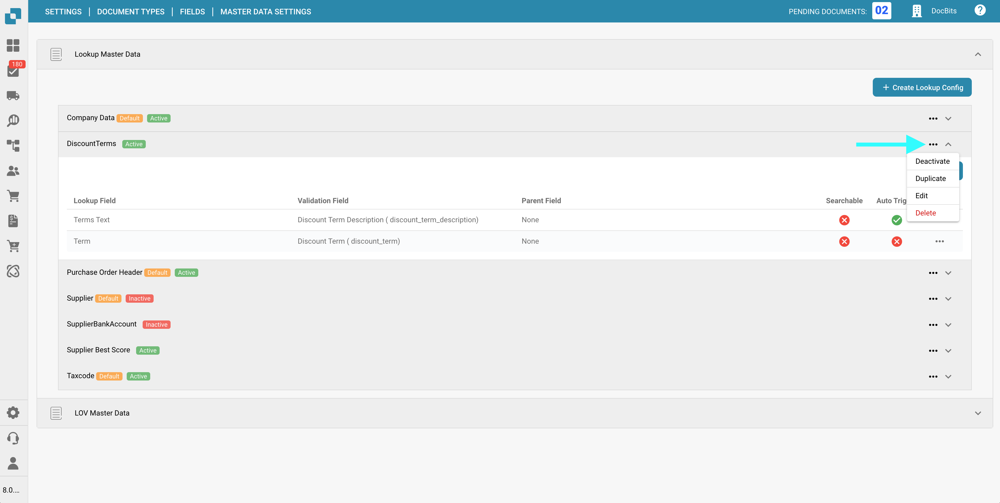<figcaption></figcaption></figure>

The following actions are available:

* **Activate / Deactivate**\
  Toggle the status of the lookup config.
  * Active configurations are marked with an **Active** tag.
  * Inactive configurations are marked with an **Inactive** tag.
*   **Duplicate**\
    After entering a name and clicking **Done**, a copy of the selected lookup config is created.

    <figure>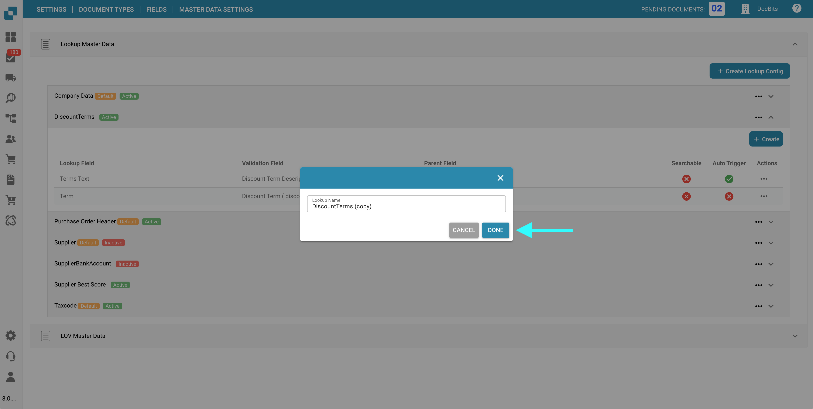<figcaption></figcaption></figure>
* **Edit/View**\
  Allows you to modify the selected lookup config.\
  After making your changes, click **Save** to apply them.\
  <mark style="color:red;">**Note**</mark>: Default lookup configs can only be viewed, not edited. The **Edit** option will be replaced by **View**.
*   **Delete**\
    Permanently deletes the selected lookup config after confirmation.\
    <mark style="color:red;">**Note**</mark>: Only configurations without the **Default** tag can be deleted.

    <figure>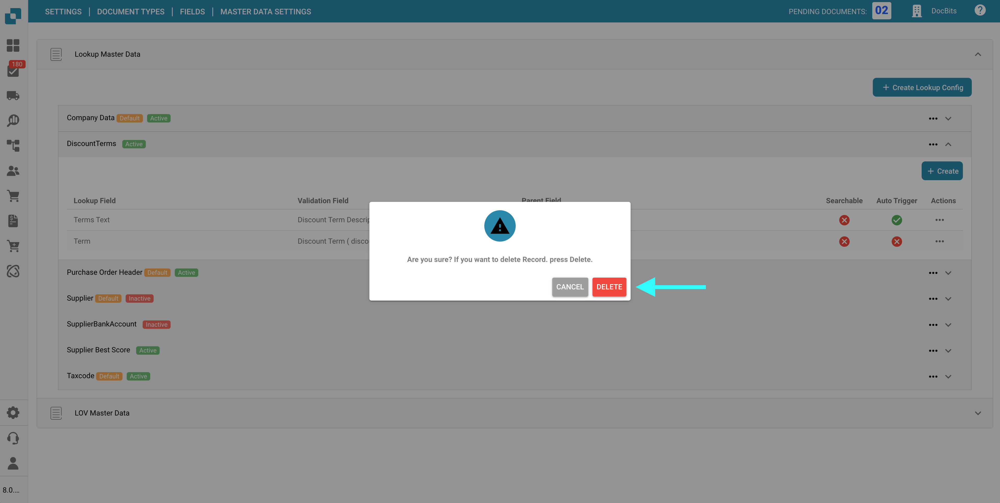<figcaption></figcaption></figure>

### Create New Field

To add a new field to your lookup config:

1. Open your desired lookup config.
2.  Click **Create** in the top-right corner.

    <figure>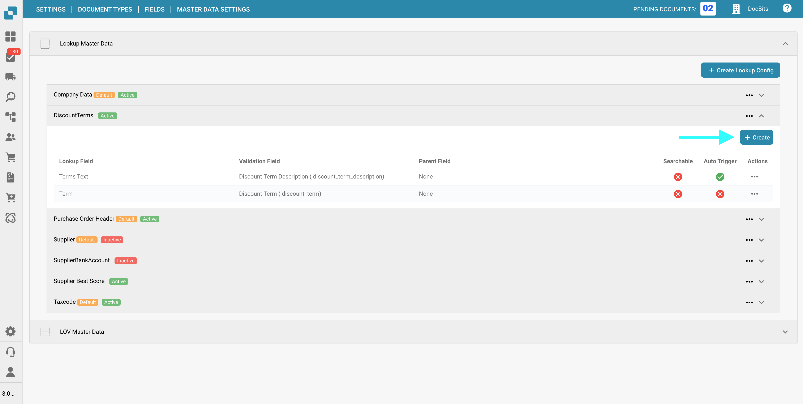<figcaption></figcaption></figure>
3. Configure the necessary options.
   * **Lookup Field**\
     The field that will be searched within the selected lookup dataset.
   * **Validation Field**\
     The field that will be displayed during field validation.
   * **Parent Field** (optional)\
     This field is used to validate the correctness of the value in the **Validation Field** by ensuring it matches the corresponding parent entry in the lookup dataset.
   * **Search Operator** (optional)\
     Choose how **DocBits** searches for matches in the lookup dataset:
     * **Smart** – _(Default)_ Removes whitespaces from the input and searches for a match.
     * **Contains** – Searches for entries that contain the exact term anywhere in the field.
     * **Ends With** – Searches for entries that end with the specified term.
     * **Exact** – Searches for an exact match of the entire value.
     * **Starts With** – Searches for entries that begin with the specified term.
   * **Auto Trigger** (optional)\
     When enabled, DocBits will automatically populate all fields in the lookup config as soon as this field is filled.
   *   **Searchable** (optional)\
       When enabled, users can manually search for master data during field validation.

       <figure><figcaption></figcaption></figure>

       <figure>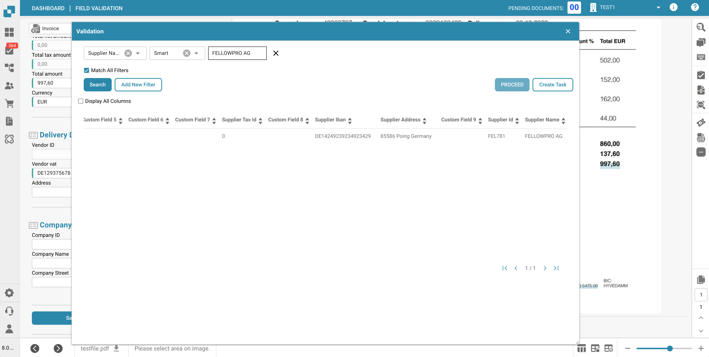<figcaption></figcaption></figure>
4.  Click **Save** to create the new field.

    <figure>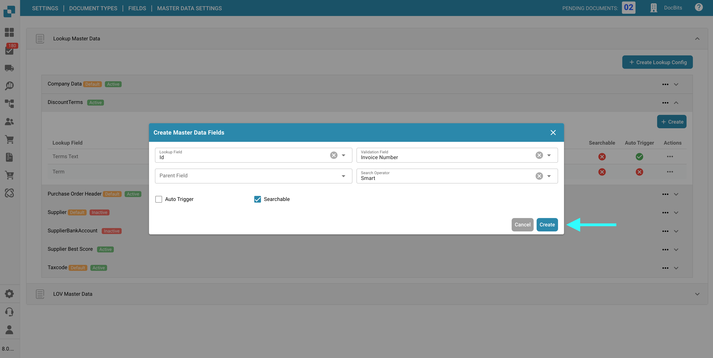<figcaption></figcaption></figure>

### Actions on Existing Field

To manage an existing field, click the three dots in the **Actions** column next to the field you want to modify.

<figure>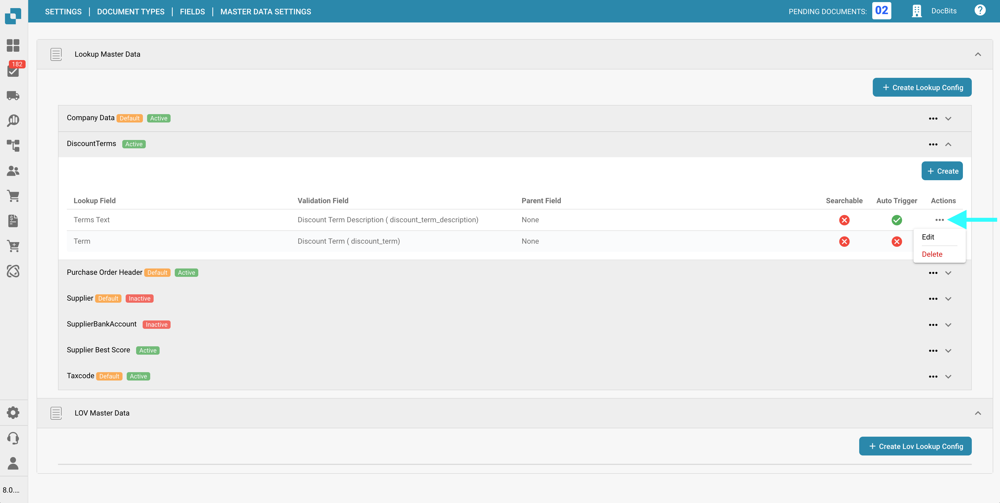<figcaption></figcaption></figure>

The following actions are available:

* **Edit/View**\
  Allows you to modify the selected field.\
  After making your changes, click **Save** to apply them.\
  <mark style="color:red;">**Note**</mark>: Default fields can only be viewed, not edited. In these cases, the **Edit** option will appear as **View**.
*   **Delete**\
    Permanently deletes the selected field after confirmation.\
    <mark style="color:red;">**Note**</mark>: Only fields without the **Default** tag can be deleted.

    <figure><figcaption></figcaption></figure>

## LOV Master Data

The **LOV Master Data** section allows you to create dropdown configurations using values from your master data. These dropdowns can be standalone or dependent on other dropdowns, enabling dynamic filtering and cascading selections during field validation.

### Create LOV Lookup Config

A lov lookup config defines how dropdown options are sourced from a master data table and how those values are displayed and populated into document fields.

**To create a new LOV Lookup Config:**

1. Navigate to the **LOV Master Data** section.
2.  Click **Create LOV Lookup Config** in the top-right corner.

    <figure>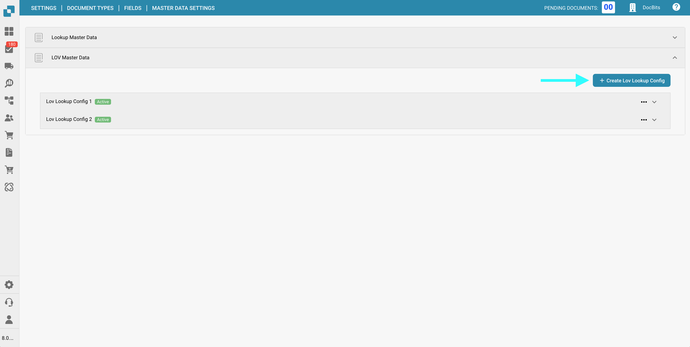<figcaption></figcaption></figure>
3. Configure the following options:
   * **Lookup Lov Name**\
     The name of the lov lookup config.
   * **Lookup Lov Dataset Name**\
     Select the master data table that should be used for this lov lookup config.
   *   **Context Type**\
       Specifies where in the document the lov lookup config will be applied:

       **HEADER**

       The lov lookup config is used in field validation. Configure the following:

       * **Lookup Label Field**\
         Select the column whose value will be displayed in the dropdown.
       * **Lookup Value Field**\
         Select the column whose value will be stored internally and used for filtering when a selection is made. This value is not displayed to the user.
       * **Out Field**\
         Defines the field in field validation that will receive the selected label from the dropdown.

       <figure>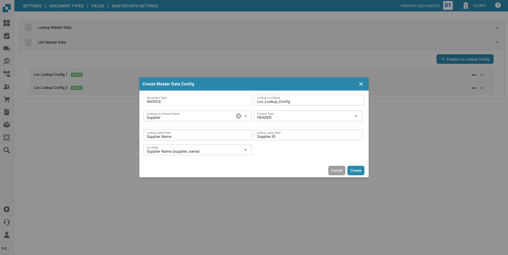<figcaption></figcaption></figure>

       \
       **LINE**

       The lov lookup config is used within a document table. Configure the following:

       * **Context Detail**\
         Select the specific table where this lov lookup config should be active.
       * **Lookup Label Field**\
         The column whose value will be displayed in the dropdown.
       * **Lookup Value Field**\
         Select the column whose value will be stored internally and used for filtering when a selection is made. This value is not displayed to the user.
       * **Out Field**\
         Specifies the target field in the table where the selected label will be populated.

       <figure>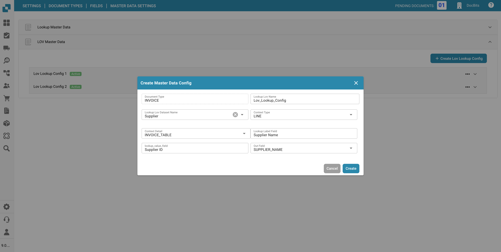<figcaption></figcaption></figure>
4.  Click **Save** to create the lov lookup configuration.

    <figure>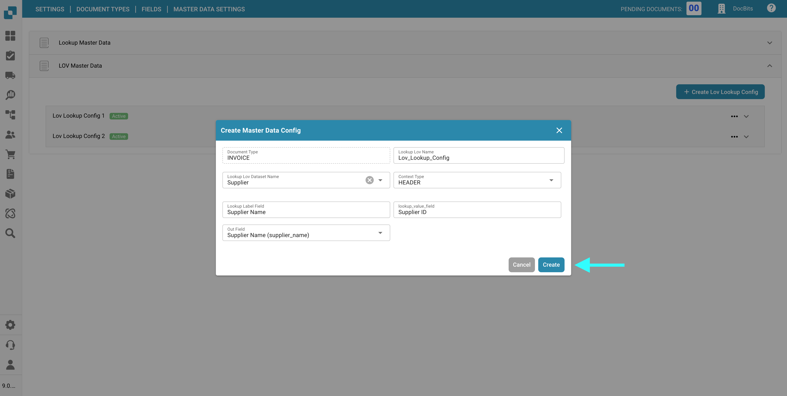<figcaption></figcaption></figure>

### Actions on Existing Lookup Config

To manage an existing lov lookup config, click the three dots in the top-right corner of the configuration.

<figure>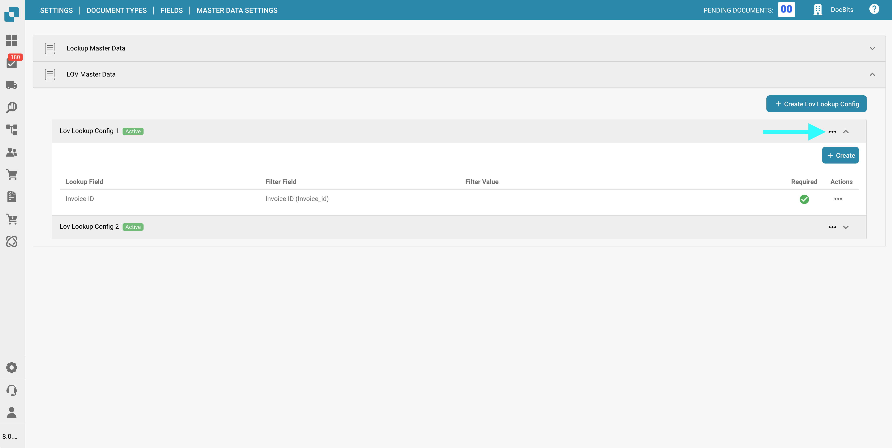<figcaption></figcaption></figure>

**Available Actions:**

* **Activate / Deactivate**\
  Toggle the status of the lov lookup config.
  * **Active** configurations are marked with an **Active** tag.
  * **Inactive** configurations are marked with an **Inactive** tag.
*   **Duplicate**\
    After entering a name and clicking **Done**, a copy of the selected lov lookup config is created.

    <figure>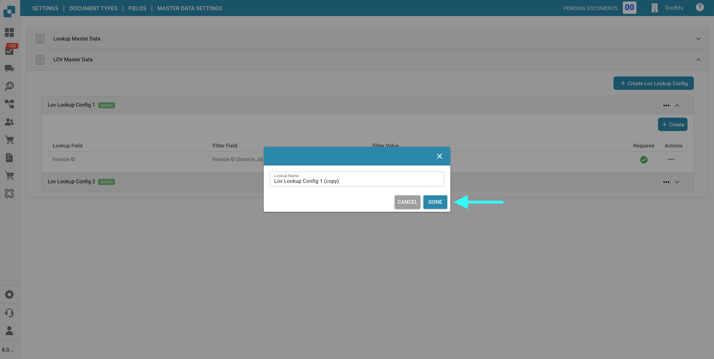<figcaption></figcaption></figure>
* **Edit / View**\
  Modify the selected config. After making changes, click **Save**.
*   **Delete**\
    Permanently deletes the config after confirmation.

    <figure>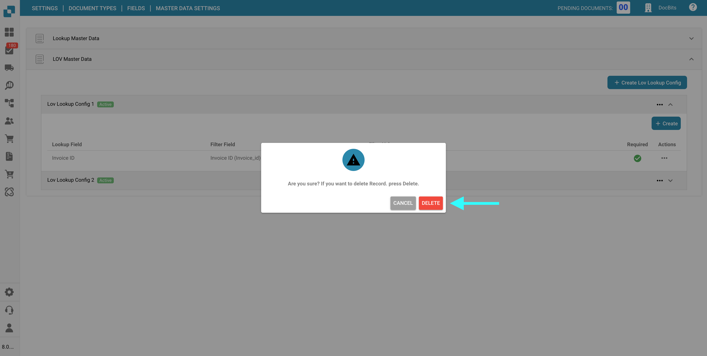<figcaption></figcaption></figure>

### Create New Field

Within each lov lookup config, you can define additional fields as dropdowns that act as pre-filters for the main lov logic.

These fields are evaluated before the main lov dropdown is loaded. Based on the values selected in these fields, the results of the main lov field are dynamically filtered—enabling dependent dropdowns.\
For example, selecting a country in a pre-filter field can narrow down the city options in the main lov dropdown.

In addition to creating new fields, you can also use existing fields as pre-filters. When configured this way, the selected value in the existing field will filter the main lov dropdown automatically.

**To add a new field:**

1. Open the desired lov lookup config.
2.  Click **Create** in the top-right corner.

    <figure><figcaption></figcaption></figure>
3.  Configure the necessary options.

    **Field Configuration Options (applies to both HEADER and LINE contexts):**

    * **Lookup Field**\
      The column to be searched in the selected dataset for dropdown values.
      * **Filter Field**\
        Specifies the field whose value is used to pre-filter the results of the lov lookup config before the main dropdown is populated.
      * **Filter Value** (optional)\
        Add static filters to further narrow down the lookup results.
      * **Required**\
        When enabled, this field must be populated before any dependent dropdowns can be filled.
4.  Click **Save** to create the new field.

    <figure>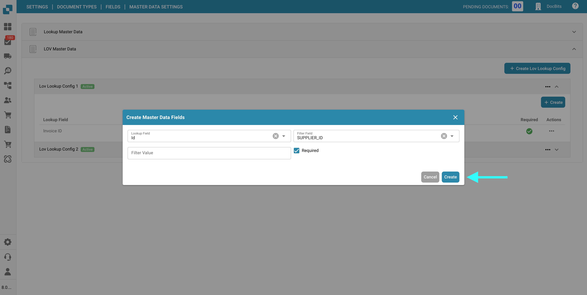<figcaption></figcaption></figure>

### Actions on Existing Field

To manage an existing field within a lov lookup config, click the three dots in the **Actions** column next to the field.

<figure><figcaption></figcaption></figure>

**Available Actions:**

* **Edit**\
  Modify the selected field. After changes, click **Save** to apply.
*   **Delete**\
    Permanently removes the field after confirmation.

    <figure><figcaption></figcaption></figure>

