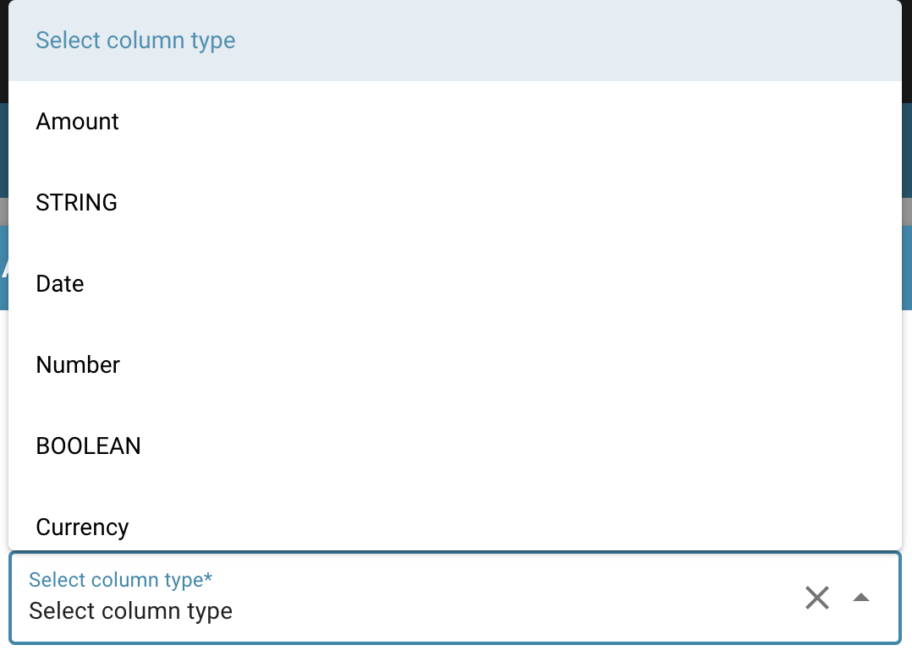
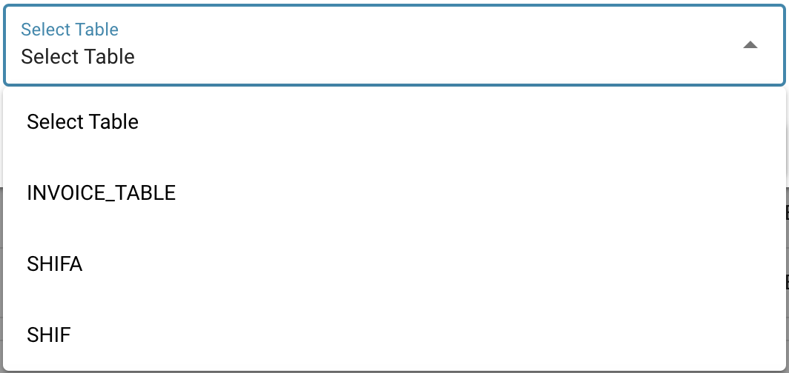

# Ustawianie Walidacji i Wyniku Dopasowania

## Instrukcje dotyczące korzystania z ustawień Wymuszonej Walidacji i Wartości Dopasowania w celu poprawy integralności danych i dokładności rozpoznawania.

Oto instrukcje dotyczące korzystania z ustawień Wymuszonej Walidacji i Wartości Dopasowania w celu poprawy integralności danych i dokładności rozpoznawania w systemie przetwarzania dokumentów:

### Wymuszona Walidacja (Force Validation):

<figure><figcaption></figcaption></figure>

To ustawienie pozwala zdefiniować reguły sprawdzające, czy wprowadzone dane spełniają określone kryteria.

**Aby to skonfigurować:**

* Przejdź do ustawień danego pola.
* Włącz opcję Wymuszona Walidacja (Force Validation).
* Zdefiniuj reguły walidacji do sprawdzenia. Mogą to być na przykład limity numeryczne, wyrażenia regularne dla pól tekstowych lub relacje z innymi polami.

<figure><figcaption></figcaption></figure>

<figure><figcaption></figcaption></figure>

**Wpływ:**

* Wymuszanie reguł walidacji pomaga wcześnie wykrywać błędy i poprawia jakość danych. Użytkownicy są proszeni o wprowadzanie poprawnych danych, co zwiększa integralność bazy danych.

### Wynik dopasowania (Match Score):

<figure><figcaption></figcaption></figure>

To ustawienie pozwala dopasować wprowadzoną wartość do predefiniowanej wartości referencyjnej.

**Aby to skonfigurować:**

* Przejdź do ustawień pola.
* Włącz opcję Wartość Dopasowania (Match Value).
* Wprowadź wartość referencyjną, z którą ma zostać porównana wprowadzona wartość.

**Wpływ:**

* Ustawienie wartości dopasowania pozwala upewnić się, że wprowadzone dane są zgodne ze znanym standardem lub predefiniowaną normą. Jest to szczególnie przydatne, gdy chcesz mieć pewność, że dane są spójne i spełniają określone kryteria.
* Korzystanie z tych ustawień może poprawić integralność danych i dokładność rozpoznawania w systemie przetwarzania dokumentów.

Zapewniasz, że przechwytywane są tylko poprawne i prawidłowe dane, co podnosi jakość bazy danych i poprawia wiarygodność analiz i raportów.
