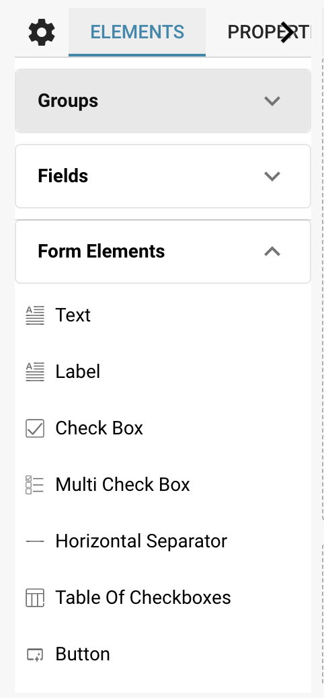
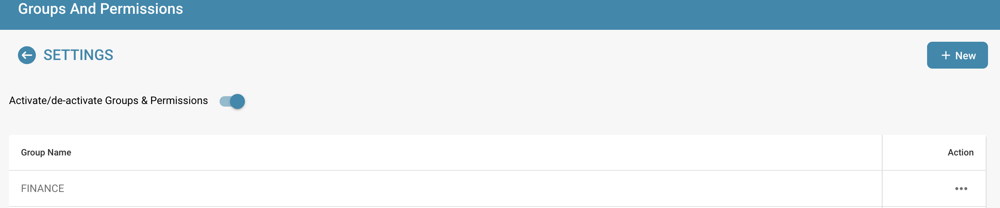
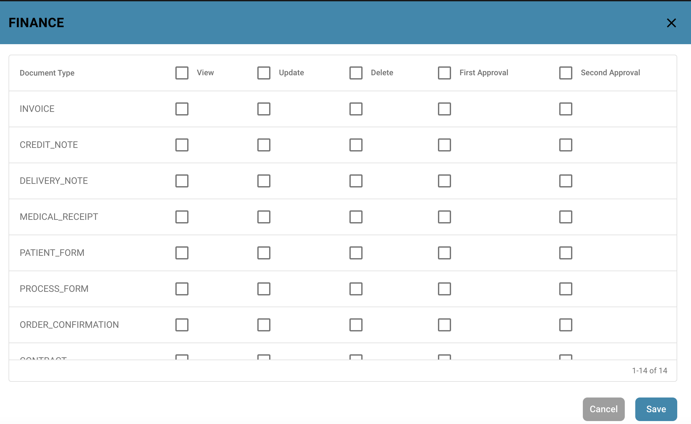

# Configuring Field Properties

## Configuring field properties is critical to ensure that the data captured in a document meets specific requirements and processing processes.

### Here are the steps to configure field properties to meet specific data processing needs:

#### Select a field type:

* Start by selecting the right field type for your data.

<figure><figcaption></figcaption></figure>

* This depends on what type of information the field will contain.

<figure><figcaption>
Properties
</figcaption></figure>

* Possible field types include text, number, date, drop-down menu, checkbox, etc.

<figure><figcaption>
Elements
</figcaption></figure>

#### Set validation and formatting:

* Set validation rules to ensure that the data entered meets the expected criteria.
* This may include checking for certain string patterns, numeric limits, date formats, or other conditions.

<figure><figcaption></figcaption></figure>

#### Define default values:

* If certain fields typically have a default value, you can set that as the default value.
* This makes data entry easier because users don't have to enter the same value every time.

<figure><figcaption></figcaption></figure>

#### Set user permissions:

* Determine which user groups should have access to the field and what type of access rights they have.

<figure><figcaption>
Settings: Groups and Permissions
</figcaption></figure>

* This can include read, write, or edit rights.

<figure><figcaption>
View Permissions
</figcaption></figure>

#### Link to other data:

* In some cases, data from one field needs to be linked to data from another field or data source.
* Configure appropriate links or relationships to ensure consistent data integration.

#### Apply visibility rules:

* Determine under what conditions a field should be visible or hidden.
* This can be useful for dynamically adapting the user interface based on certain data or user actions.

<figure><figcaption>
Setting Fields
</figcaption></figure>

#### Enable historization:

* If necessary, enable historization of fields to track changes historically.
* This allows you to track changes to the data and monitor the history of data changes.

#### Add documentation notes:

* Add notes or descriptions to explain to users how to use the field or what type of data is expected.

By following these steps and configuring the appropriate field properties, you can ensure that your documents meet specific requirements for data handling, user access, and data accuracy.
