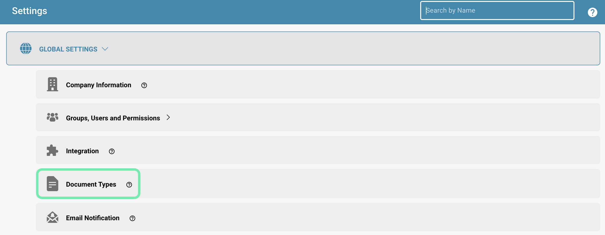
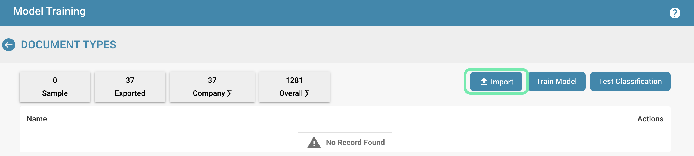

# Datenimport: Modelltraining

Detaillierte Anweisungen zum Importieren von Beispielbelegen für das Training, einschließlich des zu verwendenden Formats und der Belegtypen.

**Um Beispielbelege für das Training zu importieren, führen Sie folgende Schritte aus:**

* **Vorbereiten der Beispielbelege:** Stellen Sie sicher, dass die Beispielbelege in einem unterstützten Format vorliegen, wie z. B. PDF, Word, Excel usw. Diese Belege sollten eine Vielzahl von Typen und Formaten abdecken, die im Produktivbetrieb des Belegverarbeitungssystems auftreten können.
* **Navigieren zur Importfunktion:** Melden Sie sich im Administrationsbereich des Belegverarbeitungssystems an und navigieren Sie zu dem Bereich, in dem Sie neue Belege importieren können.

<figure><figcaption>
Globale Einstellungen
</figcaption></figure>

<figure><figcaption></figcaption></figure>

* **Auswählen der Option zum Importieren von Belegen:** Klicken Sie auf die Schaltfläche oder den Link zum Importieren von Belegen. Es kann eine Option wie "Importieren" geben.

<figure><figcaption></figcaption></figure>

* **Betrags- & Datumsformat auswählen:**

<figure><figcaption></figcaption></figure>

**Betragsformat:**

Das Betragsformat kann je nach Region variieren, aber im Allgemeinen gibt es einige gängige Konventionen:

1. Währungssymbol: Das Währungssymbol wird normalerweise vor dem Betrag angegeben, z. B. "$" für US-Dollar, "€" für Euro, "£" für britisches Pfund usw.
2. Tausendertrennzeichen: In einigen Ländern werden lange Zahlen zur besseren Lesbarkeit durch ein Tausendertrennzeichen getrennt. In den USA wird üblicherweise ein Komma verwendet (z. B. 1,000), während in vielen europäischen Ländern ein Punkt verwendet wird (z. B. 1.000).
3. Dezimaltrennzeichen: Das Dezimaltrennzeichen wird verwendet, um den ganzzahligen Teil von den Dezimalstellen zu trennen. Die meisten englischsprachigen Länder verwenden einen Punkt (z. B. 10.99), während viele europäische Länder ein Komma verwenden (z. B. 10,99).

#### Datumsformat:

Das Datumsformat variiert ebenfalls je nach Region, wobei verschiedene Länder unterschiedliche Konventionen haben. Hier sind die gängigsten Formate:

1. Tag-Monat-Jahr (TT-MM-JJ oder TT.MM.JJ): In vielen europäischen Ländern wird das Datum im Format Tag-Monat-Jahr angegeben. Beispielsweise steht "21.05.24" für den 21. Mai 2024.
2. Monat-Tag-Jahr (MM-TT-JJ oder MM/TT/JJ): In den Vereinigten Staaten wird häufig das Format Monat-Tag-Jahr verwendet. Beispielsweise steht "05/21/24" für den 21. Mai 2024.
3. Jahr-Monat-Tag (JJ-MM-TT oder JJ/MM/TT): In einigen anderen Ländern wird das Format Jahr-Monat-Tag bevorzugt. Beispielsweise steht "24/05/21" für den 21. Mai 2024.

Es ist wichtig, das spezifische Format zu beachten, um Missverständnisse zu vermeiden, insbesondere bei internationalen Mitteilungen oder Finanztransaktionen.

* **Auswählen der Beispielbelege:** Wählen Sie die Beispielbelege aus, die Sie importieren möchten. Dies kann durch Hochladen der Dateien von Ihrem lokalen Computer oder durch Auswahl von Belegen von einem bereits verbundenen Speicherort erfolgen.

<figure><figcaption></figcaption></figure>

* **Konfigurieren der Belegtypen und Untertypen (falls erforderlich):** Wenn Ihr System verschiedene Belegtypen oder Untertypen unterstützt, weisen Sie jedem importierten Beleg den entsprechenden Typ zu. Dies hilft dem System, die Belege korrekt zu kategorisieren und zu verarbeiten.
* **Starten des Importvorgangs:** Bestätigen Sie die Auswahl der Belege und starten Sie den Importvorgang. Je nach Größe und Anzahl der Belege kann dieser Vorgang einige Zeit in Anspruch nehmen.

<figure><figcaption></figcaption></figure>

* **Prüfen des Importstatus:** Überprüfen Sie den Status des Importvorgangs, um sicherzustellen, dass alle Belege erfolgreich importiert wurden. Stellen Sie sicher, dass keine Fehler aufgetreten sind und dass die Belege korrekt verarbeitet wurden.
* **Trainieren des Modells:** Nachdem die Belege importiert wurden, verwenden Sie diese, um das Modell des Belegverarbeitungssystems zu trainieren. Führen Sie das Training gemäß den Anweisungen des Systems durch, um sicherzustellen, dass es die Beispieldaten effektiv verarbeiten kann.

<figure><figcaption></figcaption></figure>

<figure><figcaption></figcaption></figure>

Durch regelmäßiges Hinzufügen von Beispielbelegen zum Training können Sie sicherstellen, dass Ihr Belegverarbeitungssystem immer auf dem neuesten Stand ist und eine genaue und effiziente Verarbeitung bietet.
