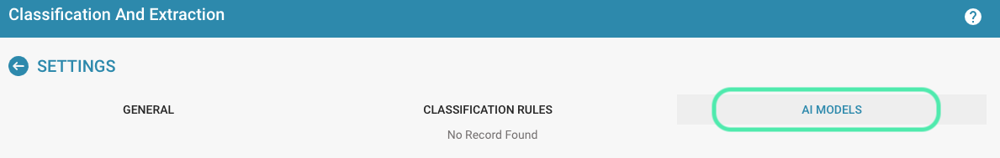

# Probando el modelo

## Pasos para ejecutar pruebas de clasificación para evaluar la precisión y la preparación operativa del modelo

Para probar el modelo entrenado y evaluar su precisión y preparación operativa, puede seguir los pasos a continuación:

**Preparación de los datos de prueba:**

* Recopile una muestra representativa de datos de prueba que cubra diferentes tipos de documentos y escenarios que el modelo manejará en el campo. Asegúrese de que los datos de prueba sean de alta calidad y estén etiquetados correctamente.

**Ejecución de las pruebas de clasificación:**

* Ejecute las pruebas de clasificación en los datos de prueba preparados.
* Alimente los datos de prueba en el modelo y deje que el modelo haga predicciones para clasificar los documentos.

<figure><figcaption>
Configuración
</figcaption></figure>

* Agregue una nueva o edite una regla de clasificación existente.

<figure><figcaption>
Configuración: Clasificación y Extracción
</figcaption></figure>

<figure><figcaption>
Configurar Regla de Clasificación
</figcaption></figure>

**Evaluación de la precisión del modelo:**

* Compare las predicciones del modelo con las clasificaciones reales de los datos de prueba. Calcule métricas como exactitud, precisión, recuperación y puntuación F1 para evaluar el rendimiento del modelo. Estas métricas brindan información sobre qué tan bien el modelo clasificó los documentos y qué tan confiable es.

<figure><figcaption></figcaption></figure>

**Analizar errores:**

* Examine los errores que cometió el modelo al clasificar los datos de prueba y analice sus causas. Identifique patrones o tendencias en los errores y, si es necesario, realice ajustes en el modelo para mejorar su rendimiento.

**Optimizar el modelo:**

* Según los resultados de las pruebas de clasificación y el análisis de errores, puede optimizar el modelo agregando datos de entrenamiento, ajustando los parámetros de entrenamiento o cambiando la arquitectura del modelo. Repita el proceso de prueba para verificar si las optimizaciones mejoraron el rendimiento del modelo.

**Documentar los resultados:**

* Documente los resultados de las pruebas de clasificación y cualquier ajuste u optimización realizado en el modelo. Esto le ayudará a realizar un seguimiento del progreso del modelo a lo largo del tiempo y garantizar que esté mejorando constantemente.

Al ejecutar regularmente pruebas de clasificación y evaluar el rendimiento de su modelo, puede asegurarse de que sea adecuado para su uso en producción y entregue resultados precisos.
